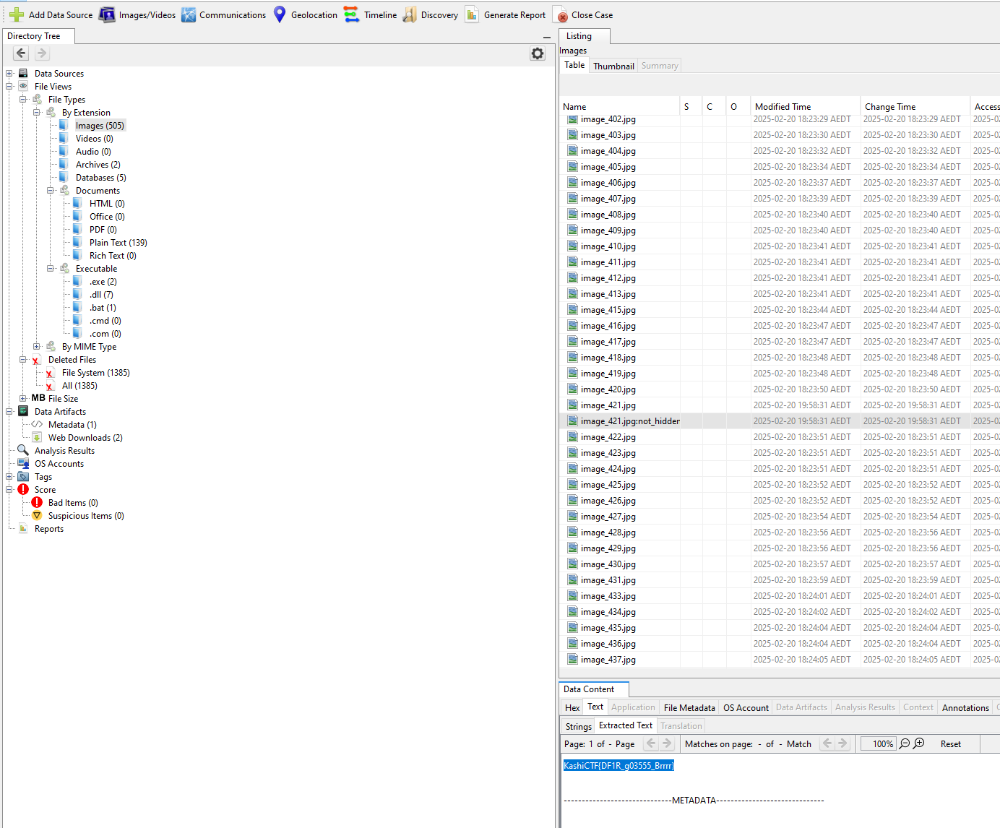

I used Autopsy on the image, looking through the 'by Extension' field, there are ALOT of images. I scroll through and notice one has an out of place file name that contained the flag.

Flag: `KashiCTF{DF1R_g03555_Brrrr}`
