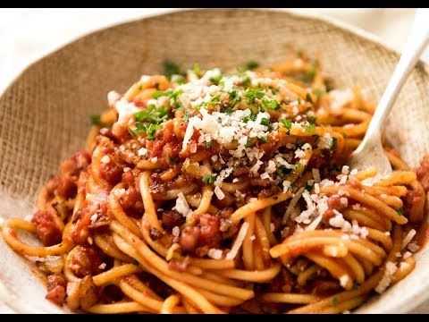

We are given a `pasta.jpg`:


At the end of the image file is a sequence of a/b's (when viewed with `xxd` or a hex editor).

```
baabaaabbbaabaababbababaaaabaabaaaaaabaabaaaaaabaaaaaaaababaababaababaababababbaaaabaabbababbababaababaaaabbaaaabba
```

Using [Dcode.fr's Cipher Identifier](https://www.dcode.fr/cipher-identifier) it identifies it as a Bacon Cipher.

Decoding returns the flag: `THEYWEREREALLLLYCOOKING`

Flag: `KashiCTF{THEYWEREREALLLLYCOOKING}`
