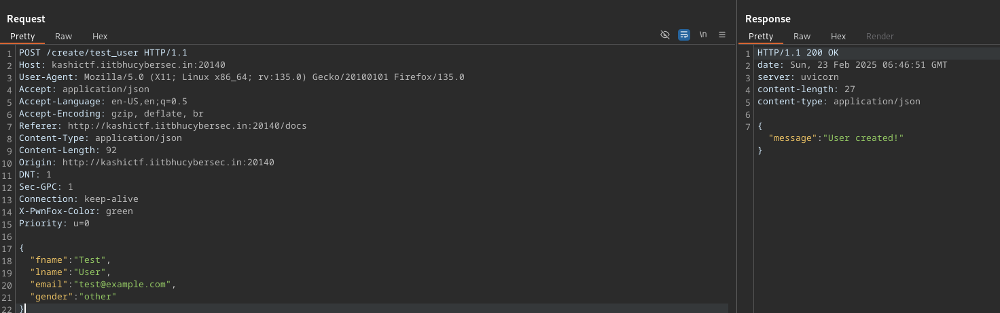
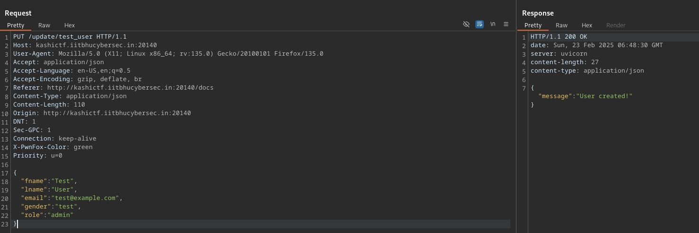
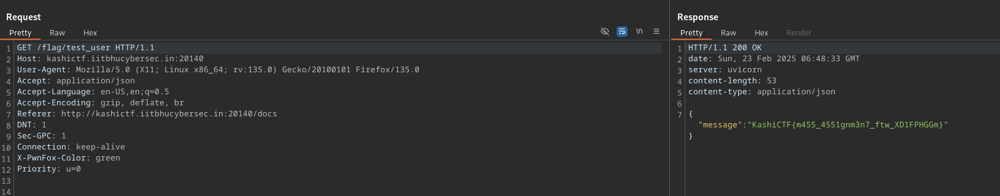

I start by using ffuf and find the `/docs` endpoint using a directory 2.3 medium list from SecLists.

After locating the `/docs` endpoint I see we can:

- Create a user
- Update a user
- Request the flag
- Get a user

If we create a user, trying to request the flag says our role is not an admin (which it isn't)

What we can do is update our user with the 'role' parameter and update our own role.

Flag: `KashiCTF{m455_4551gnm3n7_ftw_XD1FPHGGm}`
