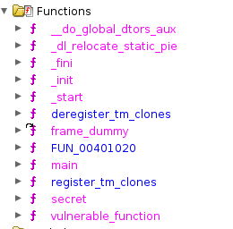

### Secret File

> My friend's company's employees faced some attacks from hackers. Siam is a very close person to the company owner. Every employee knows that if Siam tells our CEO about anything, he can provide assistance without any hesitation. So, all employees made a statement, and here is the statement: "Triggers don't always require a spark. Sometimes, a simple change can set the stage for transformation. Where might such a trigger reside?" And guess what—the CEO granted him permission to hire an ethical hacker. So, he gave me that finding part. Are you able to help me with this issue?

> Note: There are almost six users in their company, so anyone can be a victim. Thank you in advance.

> Findout that One of the user hide some commercial data. Are you able to see that data?

> Flag Format: KCTF{value*here} and replace space with underscore (*)

We are given a Kali `ova` file to use for all the DFIR challenges.

We have like 6 users and we know creds for `siam` (challenge description), `alice`, `bob`, `intruder`, `kali` and `robot`.

Instead of booting the image, I extract the `ova` to a `vmdk` and `ovf` and use the `vmdk` in Autopsy.

Looking through the files I spot a `/home/intruder/.maybef149/m3.ini` which contains the following:

```
0x00000000: 31 6E 66 30  72 6D 61 74   31 6F 6E 20  4E 30 54 20    1nf0rmat1on N0T
0x00000010: 53 34 66 33  0A                                        S4f3.
```

Flag: `KCTF{1nf0rmat1on_N0T_S4f3}`

### Encrypted Data

There is further 'encrypted' data somewhere else on the drive.

I found `/home/robot/Documents/.decrypt.txt.gpg` and we need to decrypt this file with a password.

I use johntheripper's `gpg2john` to get the hash of the file:

```
$gpg$*0*80*6afecb2a567f672ad132c349496469bf2c56a32647b304cac6e6a2bcc74c8aa5b1dc6200efa4a954311d31b06671790857645e7f400be04a9f0a2720656fa833c2ca0723e9c50bc121b25268493316c7*3*18*8*9*58720256*c12797ac5d46785f
```

We can then crack it with johntheripper and it cracks to `letmein`.

I decrypt the file with `gpg`:

```bash
$ gpg -d decrypt.txt.gpg
gpg: AES256.CFB encrypted data
gpg: encrypted with 1 passphrase
Y0U h4v3 D3crypt m3
```

Flag: `KCTF{Y0U_h4v3_D3crypt_m3}`

### Data Scraped

There are two zip's in the `/home/bob/Downloads/` folder: `challenge_final.zip` and `pass.zip`. The `challenge_final.zip` is a passworded zip.

The `pass.zip` has an image `Hacker-family.jpg`.

I check the image with exiftool and there is an interesting entry.

```
Artist                          : PartialPass: Null_
```

I presume this is a portion of the password for the zip.

Looking at the `challenge_final.zip` I try to extract it and notice this:

```
Path = challenge_final.zip
Type = zip
Physical Size = 46857
Comment = V4luE_M3
```

I try the password `Null_V4luE_M3` and it works! We get a `challenge_final.jpg` from the zip.

I look at exiftool and its contents and I can't notice anything so I start looking at it with `stegseek` presuming there is steganography.

```bash
$ stegseek --crack challenge_final.jpg ~/Documents/Hacking/SecLists/Passwords/Leaked-Databases/rockyou.txt
StegSeek 0.6 - https://github.com/RickdeJager/StegSeek

[i] Found passphrase: "password123"
[i] Original filename: "flag.txt".
[i] Extracting to "challenge_final.jpg.out".
```

Reading `challenge_final.jpg.out` gives us the flag.

```
Congrats you have got your flag: KCTF{it_w4s_L0n9_Pr0c3s5}
```

Flag: `KCTF{it_w4s_L0n9_Pr0c3s5}`

### Backdoor File

The challenge description (which I don't have) mentioned a user managing 'Projects' so I look for a Projects folder and find one in `alice`'s home directory. There is a suspicious binary `/home/alice/Projects/vulnerable`.

```bash
$ file vulnerable
vulnerable: ELF 64-bit LSB executable, x86-64, version 1 (SYSV), dynamically linked, interpreter /lib64/ld-linux-x86-64.so.2, BuildID[sha1]=d30039c2184d48f3f659097b8a71b1e4512a6dd0, for GNU/Linux 3.2.0, not stripped
```

I open the ELF in Ghidra and look at the functions:


I check `secret` out of reflex and see this:

```c
void secret(void)
{
  puts("Congratulations! You\'ve accessed the secret function.");
  puts("Here is your flag: KCTF{buff3r_0verfl0w_expl0it3d}");
  system("/bin/sh");
  return;
}
```

Flag: `KCTF{buff3r_0verfl0w_expl0it3d}`

### Find Attacker

> This was solved **after** the CTF but I was _so_ close

We had to find the username and the IP address of the attacker. They have compromised the user `siam`.

I looked into `/var/log` and there are some files of interest and IOC's.

```bash
$ ls
alternatives.log        boot.log          boot.log.2        boot.log.3-slack  btmp-slack      firewall.log        fontconfig.log-slack  lightdm           macchanger.log.1.gz        __pycache__      README        syslog-slack     wtmp        Xorg.0.log.old        Xorg.1.log            Xorg.1.log-slack
alternatives.log-slack  boot.log.1        boot.log.2-slack  boot.log-slack    dpkg.log        firewall.log-slack  f.sh                  macchanger.log    macchanger.log.1.gz-slack  random.py        README-slack  system.sh        wtmp-slack  Xorg.0.log.old-slack  Xorg.1.log.old
apt                     boot.log.1-slack  boot.log.3        btmp              dpkg.log-slack  fontconfig.log      f.sh-slack            journal      macchanger.log.1  macchanger.log-slack       random.py-slack  syslog        system.sh-slack  Xorg.0.log  Xorg.0.log-slack      Xorg.1.log.old-slack
```

`macchanger` is in the log's, and some `.sh` and `.py` files.

`f.sh`

```bash
#!/bin/bash

# Usage: ./comprehensive_generate_logs.sh [log_file] [num_entries] [log_level]

LOG_FILE=${1:-application.log}
NUM_ENTRIES=${2:-10000}
LOG_LEVEL=${3:-INFO}

# Define log levels
LEVELS=("INFO" "DEBUG" "WARN" "ERROR" "FATAL")

# Define message templates
MESSAGES=(
    "Someone trying to breach"
    "firewall has some problem"
    "Someone message you from ip"
    "Someone Given you problem"
    "Unauthorized access attempt detected"
    "Multiple failed login attempts"
    "Suspicious activity from IP"
    "Intrusion attempt blocked"
    "Malware signature detected"
    "Port scanning activity detected"
)

# Function to generate a random log level if not specified
get_log_level() {
    if [[ "$LOG_LEVEL" == "random" ]]; then
        echo "${LEVELS[$RANDOM % ${#LEVELS[@]}]}"
    else
        echo "$LOG_LEVEL"
    fi
}

# Function to generate a random message template
get_random_message() {
    echo "${MESSAGES[$RANDOM % ${#MESSAGES[@]}]}"
}

# Initialize the log file with a starting entry
START_TIME=$(date +"%Y-%m-%d %H:%M:%S")
echo "$START_TIME INFO Starting comprehensive log generation" > "$LOG_FILE"

# Convert start time to Unix epoch seconds for easy incrementation
CURRENT_TIME=$(date -d "$START_TIME" +%s)

# Generate log entries
for ((i=1; i<=NUM_ENTRIES; i++))
do
    # Increment time by 1 second for each log entry
    CURRENT_TIME=$((CURRENT_TIME + 1))

    # Convert back to desired timestamp format
    TIMESTAMP=$(date -d "@$CURRENT_TIME" +"%Y-%m-%d %H:%M:%S")

    # Get log level
    LEVEL=$(get_log_level)

    # Select a random message template
    MESSAGE=$(get_random_message)

    # Generate a random or sequential IP address (last octet)
    IP_LAST_OCTET=$(( (RANDOM % 254) + 1 ))  # Ensures IP ends with 1-254

    # Formulate the log message based on the template
    case "$MESSAGE" in
        "Someone trying to breach")
            LOG_MESSAGE="$MESSAGE 192.168.0.$IP_LAST_OCTET"
            ;;
        "firewall has some problem")
            LOG_MESSAGE="firewall has some problem"
            ;;
        "Someone message you from ip")
            LOG_MESSAGE="$MESSAGE 192.168.0.$IP_LAST_OCTET"
            ;;
        "Someone Given you problem")
            LOG_MESSAGE="$MESSAGE 192.168.0.$IP_LAST_OCTET"
            ;;
        "Unauthorized access attempt detected")
            LOG_MESSAGE="$MESSAGE 192.168.0.$IP_LAST_OCTET"
            ;;
        "Multiple failed login attempts")
            LOG_MESSAGE="$MESSAGE from IP 192.168.0.$IP_LAST_OCTET"
            ;;
        "Suspicious activity from IP")
            LOG_MESSAGE="$MESSAGE 192.168.0.$IP_LAST_OCTET"
            ;;
        "Intrusion attempt blocked")
            LOG_MESSAGE="$MESSAGE from 192.168.0.$IP_LAST_OCTET"
            ;;
        "Malware signature detected")
            LOG_MESSAGE="$MESSAGE on system 192.168.0.$IP_LAST_OCTET"
            ;;
        "Port scanning activity detected")
            LOG_MESSAGE="$MESSAGE from 192.168.0.$IP_LAST_OCTET"
            ;;
        *)
            LOG_MESSAGE="Unknown log message"
            ;;
    esac

    # Write the log entry to the log file
    echo "$TIMESTAMP firewall fw1: $LEVEL $LOG_MESSAGE" >> "$LOG_FILE"
done

# Append a completion entry
END_TIME=$(date -d "@$CURRENT_TIME" +"%Y-%m-%d %H:%M:%S")
echo "$END_TIME INFO Log generation completed" >> "$LOG_FILE"

echo "Log generation completed. Total entries: $NUM_ENTRIES"
```

`system.sh`

```bash
#!/bin/bash

# Usage: ./generate_random_logs.sh [log_file] [num_entries] [log_level]

LOG_FILE=${1:-application.log}
NUM_ENTRIES=${2:-10000}
LOG_LEVEL=${3:-random}  # Allow 'random' or specific levels like INFO, DEBUG, etc.

# Define log levels
LEVELS=("INFO" "DEBUG" "WARN" "ERROR" "FATAL")

# Define message templates
MESSAGES=(
    "Started Session of user"
    "Stopped Session of user"
    "Failed login attempt for user"
    "User logged out"
    "User password changed"
    "User account locked"
    "User account unlocked"
    "User session timed out"
    "User authenticated successfully"
    "User authentication failed"
)

# Define users and their machines
USERS=("intruder" "bob" "siam" "alice" "robot")
MACHINES=("intruder-machine" "bob-machine" "siam-machine" "alice-machine" "robot-machine")

# Function to generate a random log level if 'random' is specified
get_log_level() {
    if [[ "$LOG_LEVEL" == "random" ]]; then
        echo "${LEVELS[$RANDOM % ${#LEVELS[@]}]}"
    else
        echo "$LOG_LEVEL"
    fi
}

# Function to select a random message template
get_random_message() {
    echo "${MESSAGES[$RANDOM % ${#MESSAGES[@]}]}"
}

# Function to select a random user and corresponding machine
get_random_user_machine() {
    INDEX=$((RANDOM % ${#USERS[@]}))
    USER=${USERS[$INDEX]}
    MACHINE=${MACHINES[$INDEX]}
    echo "$USER" "$MACHINE"
}

# Define the time range for log entries
# For example, from 2024-11-15 10:00:00 to 2024-11-15 12:00:00
START_TIME="2024-11-15 10:00:00"
END_TIME="2024-11-15 12:00:00"

# Convert start and end times to epoch seconds
START_EPOCH=$(date -d "$START_TIME" +%s)
END_EPOCH=$(date -d "$END_TIME" +%s)

# Initialize the log file
echo "Log generation started. Generating $NUM_ENTRIES entries in '$LOG_FILE'."
> "$LOG_FILE"  # Truncate the log file if it exists

# Generate log entries
for ((i=1; i<=NUM_ENTRIES; i++))
do
    # Generate a random epoch time within the range
    RANDOM_EPOCH=$((RANDOM % (END_EPOCH - START_EPOCH + 1) + START_EPOCH))

    # Convert epoch to desired timestamp format
    TIMESTAMP=$(date -d "@$RANDOM_EPOCH" +"%Y-%m-%d %H:%M:%S")

    # Get log level
    LEVEL=$(get_log_level)

    # Get random message
    MESSAGE=$(get_random_message)

    # Get random user and machine
    read USER MACHINE <<< $(get_random_user_machine)

    # Formulate the log message
    LOG_MESSAGE="$MESSAGE $USER on $MACHINE."

    # Write the log entry to the log file
    echo "$TIMESTAMP systemd[1]: $LOG_MESSAGE" >> "$LOG_FILE"
done

echo "Log generation completed. Total entries: $NUM_ENTRIES"
```

`random.py`

```python
import random

log = []

random.shuffle(log)

with open(syslog, 'w') as f:
    for entry in log:
        f.write(entry + '\n')
```

These all seem to be AI generated scripts to add randomised entries to the logs, the first script into the `firewall.log` and the second into `syslog`.

**This is where I got stuck in the original CTF, I ran out of time to look :(**

The solution was the username and IP of the user were each in these files, I wrote these neat one-liners to get the info.

```bash
$ cat syslog | grep -Ev '(bob|siam|intruder|alice|robot)-machine'
2024-11-15 11:02:30 systemd[1]: Started Session of user siam on LEO-machine.
$ grep -Eo "[0-9]{1,3}\.[0-9]{1,3}\.[0-9]{1,3}\.[0-9]{1,3}" firewall.log | uniq | grep -v "^192"
203.108.20.803
```

Flag: `KCTF{LEO_203.108.20.803}`
