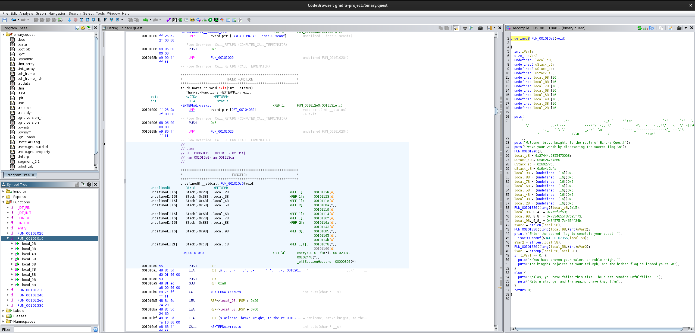

We are given a binary `binary.quest` and I try to decompile it with Ghidra but it fails to...

I check it with DetectItEasy and notice its packed with UPX 4.24 (no screenshot I overwrote the old version oopsie).

I download the [UPX v4.2.4](https://github.com/upx/upx/releases/tag/v4.2.4) and use `upx -d binary.quest` to unpack it.

I can now begin to decompile it with Ghidra and understand its functionality.



There are a few functions but `FUN_001010a0` contains the meat and potatos.

The flag logic check is:

```c
  iVar1 = strcmp(local_58,local_98);
  if (iVar1 == 0) {
    puts("\nYou have proven your valor, oh noble knight!");
    puts("The kingdom rejoices at your triumph, and the hidden flag is indeed yours.\n");
  }
  else {
    puts("\nAlas, you have failed this time. The quest remains unfulfilled...");
    puts("Return stronger and try again, brave knight.\n");
  }
```

Looking at those two variables, `local58` is the user input and `local98` is defined as:

```c
  local_98._8_8_ = 0x7334655f37695f73;
  local_98._0_8_ = 0x34575f7b4654434b;
```

We can decode that hex (with some reordering) to get the flag.

The first line decodes to `s4e_7i_s` and the second line is `4W_{FTCK`. We need to reverse the strings to be `KCTF{_W4` and `s_i7_e4s`.

We are missing a bit of the flag, the variable above `local88` contains the rest:

```c
local_88._0_4_ = 0x7d5f3f59;
```

Hex decoded + reversed = `Y?_}`

Flag: `KCTF{_W4s_i7_e4sY?_}`
