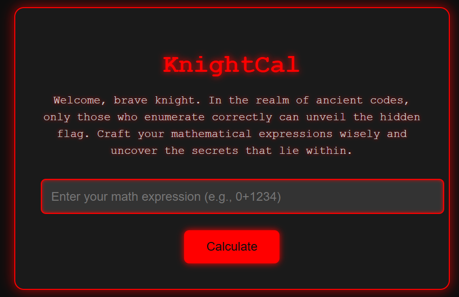
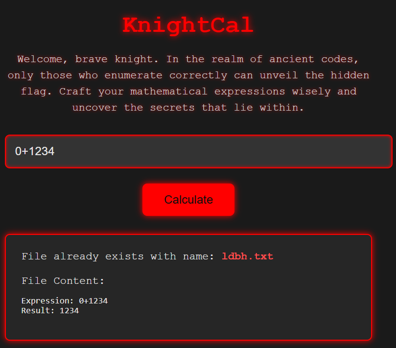
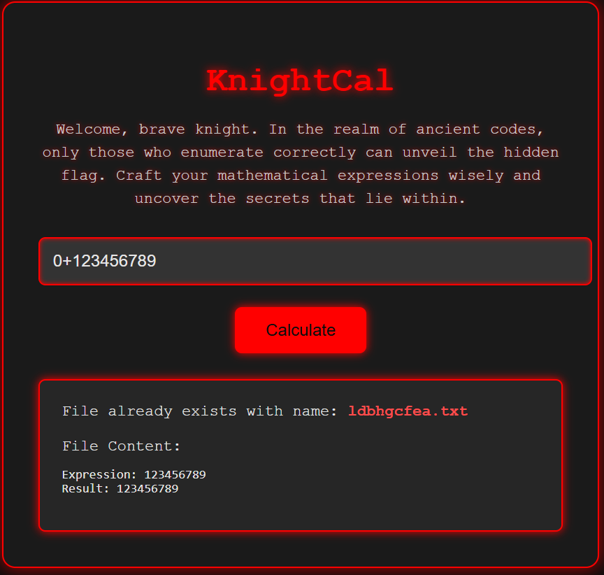
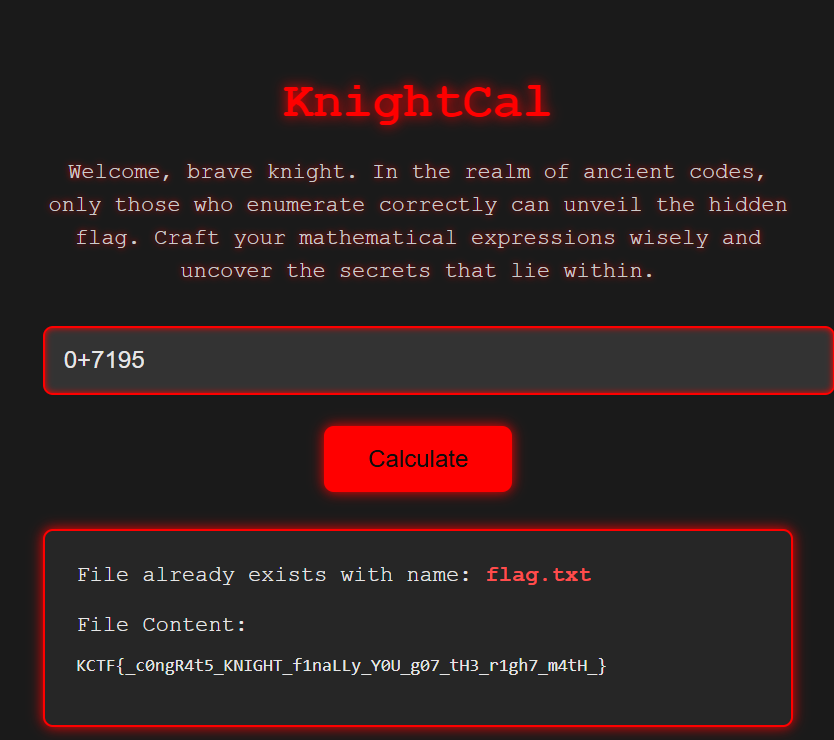

We are given a calculator webpage:

Trying the example payload `0+1234` we get:

Trying all digits, we want to try to reconstruct the word `flag` to read `flag.txt`. Let's try payload `0+123456789`:

If `7=f`, `1=l`, `9=a` and `5=g` we can do `0+7195` to read the flag.

Flag: `KCTF{_c0ngR4t5_KNIGHT_f1naLLy_Y0U_g07_tH3_r1gh7_m4tH_}`
