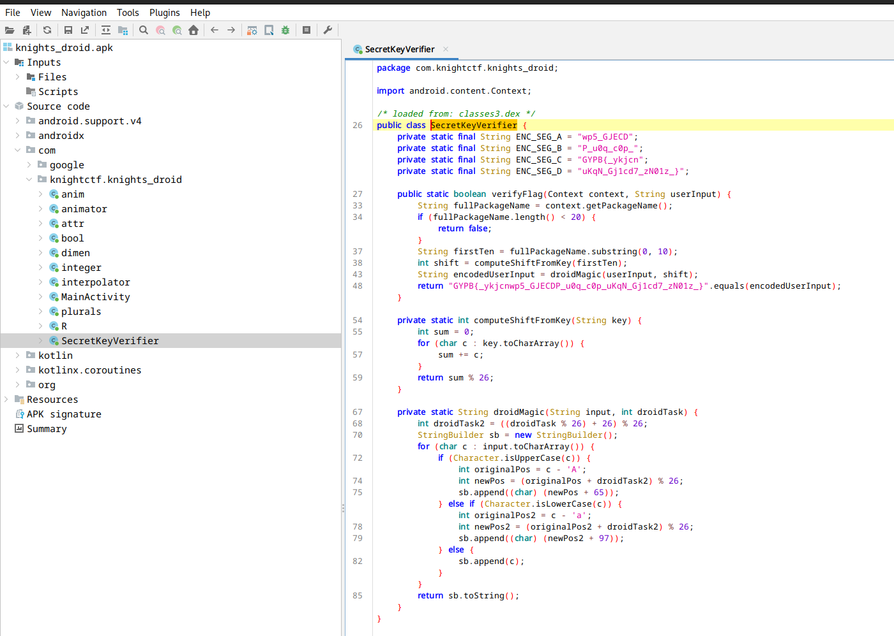
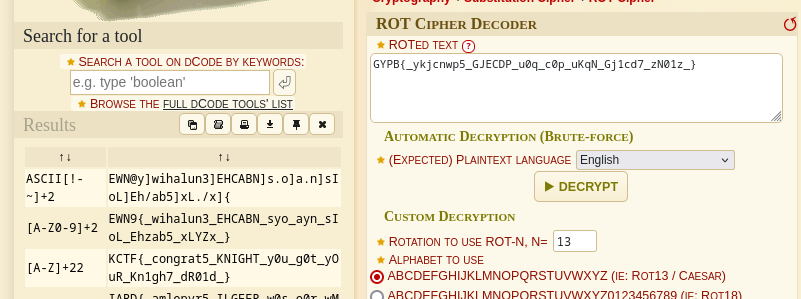

We are given an APK so I open it was jadx-gui to begin investigating its functionality.

Looking in `Source Code > com > knightctf.knights_droid` there are a few functions but `SecretKeyVerifier` catches my eye:



We can see a string `GYPB{_ykjcnwp5_GJECDP_u0q_c0p_uKqN_Gj1cd7_zN01z_}` and some kind of encoding function.

Seeing this snippet:

```java
String fullPackageName = context.getPackageName();
if (fullPackageName.length() < 20) {
    return false;
}
String firstTen = fullPackageName.substring(0, 10);
int shift = computeShiftFromKey(firstTen);
String encodedUserInput = droidMagic(userInput, shift);
```

It seems to be getting a key to 'shift' by which makes me think it's a Caesar Cipher. I use [Dcode.fr](https://dcode.fr/) to check.

The Cipher Identifier thinks it's a ROT Cipher, I decrypt it with a brute force and get the flag.



Flag: `KCTF{_congrat5_KNIGHT_y0u_g0t_yOuR_Kn1gh7_dR01d_}`
