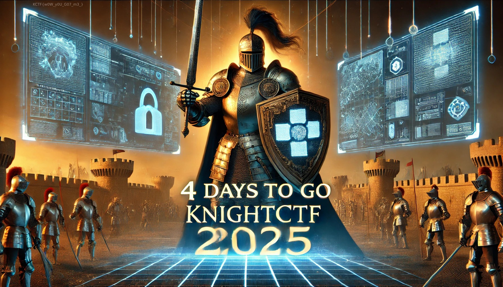

The description hinted at that they had hid the flag somewhere in a recent social's post. I go to the KnightCTF website, and they only have three socials linked [Facebook](https://www.facebook.com/kn16h75qu4d), [Twitter](https://twitter.com/kn16h75qu4d) and [YouTube](https://www.youtube.com/knightsquad).

This challenge was essentially just looking through all recent posts on all socials very carefully, and you will find a [Facebook post](https://www.facebook.com/photo/?fbid=603615618984074&set=ecnf.100080069238184) has a flag in the image in the top left.

Flag: `KCTF{w0W_y0U_G07_m3_}`
