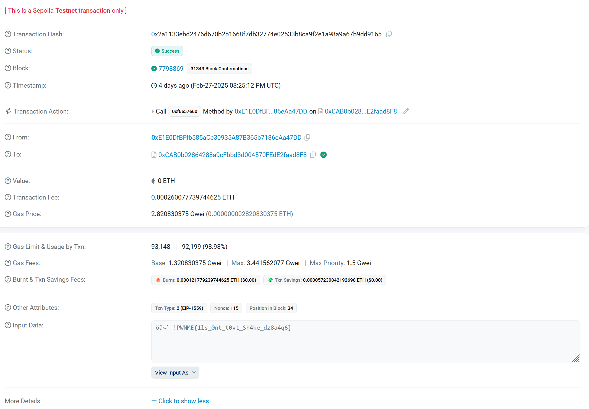

We are provided with a packet capture that contains a range of protocols used for internet communication. Looking through some of the protocols, we can see an IRC protocol. 


Initially I had just filtered the files in WireShark, but my teammate, sealldev, came up with a much better solution - a tshark command that pulled out all the IRC protocol packets: 

```tshark -r darknetmafia_prologue.pcapng -Y "irc" -T fields -e frame.number -e frame.time -e ip.src -e ip.dst -e irc.request -e irc.response -e data.text```

Output: 
```bash
44      May 15, 2024 19:32:41.769656000 EDT     192.168.90.49   85.15.194.71    JOIN #DarkNetMafia
46      May 15, 2024 19:32:41.794460000 EDT     85.15.194.71    192.168.90.49           :npeave!~eave@47-252-8-177.pwn.unpawnables.me JOIN #DarkNetMafia
48      May 15, 2024 19:32:41.814448000 EDT     85.15.194.71    192.168.90.49           :erbium.libera.chat MODE #DarkNetMafia +Cnst,:erbium.libera.chat 353 npeave @ #DarkNetMafia :@npeave,:erbium.libera.chat 366 npeave #DarkNetMafia :End of /NAMES list.
104     May 15, 2024 19:33:09.950916000 EDT     85.15.194.71    192.168.90.49           :Bob42!~Bob@47-252-8-177.pwn.unpawnables.me JOIN #DarkNetMafia
164     May 15, 2024 19:33:57.052268000 EDT     85.15.194.71    192.168.90.49           :Marco!~Marco@47-252-8-177.pwn.unpawnables.me JOIN #DarkNetMafia
253     May 15, 2024 19:34:45.017796000 EDT     85.15.194.71    192.168.90.49           :John885!~John885@47-252-8-177.pwn.unpawnables.me JOIN #DarkNetMafia
260     May 15, 2024 19:34:57.745317000 EDT     85.15.194.71    192.168.90.49           PING :erbium.libera.chat
264     May 15, 2024 19:35:08.152005000 EDT     192.168.90.49   85.15.194.71    PONG PING :erbium.libera.chat
270     May 15, 2024 19:35:22.229443000 EDT     192.168.90.49   85.15.194.71    PONG :erbium.libera.chat
274     May 15, 2024 19:35:34.688066000 EDT     192.168.90.49   85.15.194.71    PONG :erbium.libera.chat
282     May 15, 2024 19:35:58.229602000 EDT     85.15.194.71    192.168.90.49           :Bob42!~Bob@47-252-8-177.pwn.unpawnables.me PRIVMSG #DarkNetMafia :Hi guys, are you there?
286     May 15, 2024 19:36:13.100152000 EDT     85.15.194.71    192.168.90.49           :Marco!~Marco@47-252-8-177.pwn.unpawnables.me PRIVMSG #DarkNetMafia :Yeah, I'm here. What's up?
298     May 15, 2024 19:36:39.491768000 EDT     85.15.194.71    192.168.90.49           :John885!~John885@47-252-8-177.pwn.unpawnables.me PRIVMSG #DarkNetMafia :Present. We got stuff to talk about?
306     May 15, 2024 19:36:53.275272000 EDT     85.15.194.71    192.168.90.49           :Bob42!~Bob@47-252-8-177.pwn.unpawnables.me PRIVMSG #DarkNetMafia :Yeah, we've got a big job to get ready for. It's about the thing we were talking about the other day. 

...

35446   Jun 25, 2024 16:32:50.945271791 EDT     207.148.28.126  10.96.0.33              @time=2024-06-25T20:32:50.678Z :Grace94!~teazer@freenode-f7v.pkh.t6e10e.IP PRIVMSG #chillinglounge :Bye ! I have to go school btw ++
35506   Jun 25, 2024 16:32:58.126220708 EDT     207.148.28.126  10.96.0.33              @time=2024-06-25T20:32:57.848Z :Alice5151!~teazer@freenode-f7v.pkh.t6e10e.IP PRIVMSG #chillinglounge :Byyyyyye guyyys
35580   Jun 25, 2024 16:33:03.296850255 EDT     10.96.0.33      149.28.246.185  PING *.freenode.net
35587   Jun 25, 2024 16:33:04.596752711 EDT     149.28.246.185  10.96.0.33              @time=2024-06-25T20:33:03.879Z :*.freenode.net PONG *.freenode.net :*.freenode.net
35718   Jun 25, 2024 16:33:10.049259640 EDT     10.96.0.33      207.148.28.126  PING *.freenode.net
35726   Jun 25, 2024 16:33:10.486495641 EDT     207.148.28.126  10.96.0.33              @time=2024-06-25T20:33:10.213Z :*.freenode.net PONG *.freenode.net :*.freenode.net

```

The tshark command output showed a clearer version of the messages compared to what WireShark showed. It's ok to use WireShark to filter, but in this case, I think tshark was the better option, as it made the messages easier to understand :D

These messages revealed a few things: 

1. A base64 encrypted link (it was a RickRoll, and yes I fell for it).
2. A [shorturl link](https://shorturl.at/2O8nI) to the chat messages sent on telegram, as mentioned in the messages captured on the pcap.


3. Two addresses to online crypto transactions:
   1. 0x69E881DB5160cc5543b544603b04908cac649D38.
   2. 0xCAB0b02864288a9cFbbd3d004570FEdE2faad8F8.

Going online, we can find a lookup service for the [Sepolia](https://sepolia.etherscan.io/) network, which allows us to view the transactions made at these addresses. 

Next, we looked up these transaction addresses on the Sepolia network. 

The first address rendered a fake flag (when viewing the hash as UTF-8), which had the `PWNME{}` format, but contained another address. In looking up the new address, it led back to the initial fake `PWNME{}` flag. 


After looking at the second address, we can see that multiple transactions have occurred, but, if we look at the transaction from 4 days ago, and go to more details, and view the input as UTF-8, we find the flag!





Flag: `PWNME{1ls_0nt_t0vt_Sh4ke_dz8a4q6}`