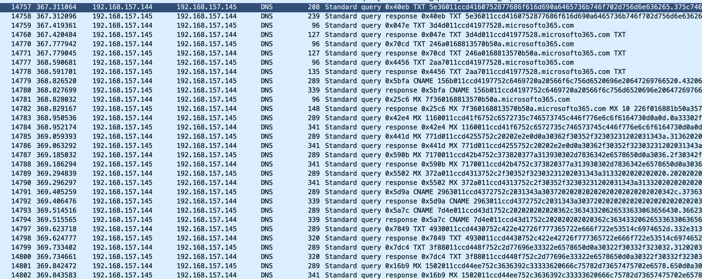
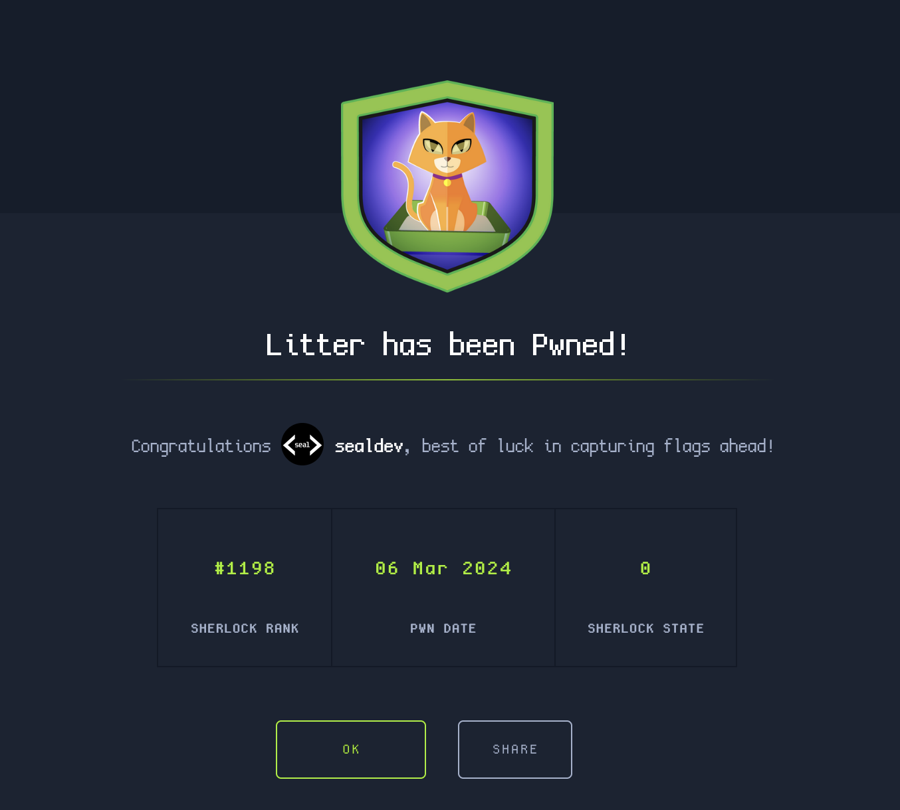

**Challenge created by:** [Broomey28](https://app.hackthebox.com/users/118671)

An initial look at the files, we start with a `suspicious_traffic.pcap`.

## Task 1
> At a glance, what protocol seems to be suspect in this attack?

Opening the pcap with Wireshark and scrolling, there is alot of DNS requests. Once we filter for them there are some very suspicious requests: 



Flag: `DNS`

## Task 2
> There seems to be a lot of traffic between our host and another, what is the IP address of the suspect host?

All of the suspicious looking requests in DNS are going to/from `192.168.157.145`. The source for the responses to the suspicious requests, and the destination for the suspicious requests are all going to/from `192.168.157.145`.

Flag: `192.168.157.145`

## Task 3
> What is the first command the attacker sends to the client?

To do this task, I found that hex decoding the domain for the dns request shows us the commands being run.

I write a script with Python and tshark to decode all of the packets:

```python
import pyshark, sys, string
chars= string.printable
cap = pyshark.FileCapture('./suspicious_traffic.pcap')
count=0
out=b''
for packet in cap:
    count+=1
    if count>12000:
        if 'ip' in packet and 'dns' in packet:
            if packet['ip'].dst == "192.168.157.145" or packet['ip'].src == "192.168.157.145":
                try:
                    xxx=packet['dns'].resp_name
                except:
                    xxx=1
                    continue
                if '.microsofto365.com' in packet['dns'].resp_name:
                    name=packet['dns'].resp_name.replace('.microsofto365.com','').replace('.','')
                    decoded=bytes.fromhex(name)
                    outout=b''
                    for x in decoded:
                        if chr(x) in chars:
                            outout+=chr(x).encode('utf-8')
                    out+=outout
                
                    
    if count%1000 == 0:
        print(f'At: {count}')
with open('out','wb') as f:
    f.write(out)
    f.close()
```

What this script does is select all the DNS packets involving our suspicious IP: `192.168.157.145`. Then it looks for is the response name contains `.microsofto365.com`, and replaces any periods or instances of `.microsofto365.com` with nothing. It then decodes the hex and writes it to a file.

I execute the script:
```
$ python3 litter.py
At: 1000
At: 2000
At: 3000
At: 4000
At: 5000
At: 6000
At: 7000
At: 8000
...
At: 52000
At: 55000
At: 56000
At: 58000
At: 60000
At: 61000
```

Reading through the `out` file, we can see the commands being run!

The first command is visible here:
```
f`
ef`
./cmd.exe (DESKTOP-UMNCBE7)tf`
../Microsoft Windows [Version 10.0.19045.2846]
(c) Microsoft Corporation. All rights reserved.

f`$.0C
C:\Users\test\Downloads>i.0\f`o}.0\of`C.0\.f`.0\5f`F#.0\Of`.0\f`uN.0\,f`4.0\tf`".0\+&f`[/.0\OTf`.0\~8f`h0.0\Kf`I.0\{f`y.0\f`J.0\.0\whoami
desktop-umncbe7\test
```

Flag: `whoami`

## Task 4
> What is the version of the DNS tunneling tool the attacker is using?

We can see the command run in the `out` file:
```
Hu,HHuSren ren dnscat2-v0.07-client-win32.exe
The system cannot find the file specified.
```

Flag: `0.07`

## Task 5
> The attackers attempts to rename the tool they accidentally left on the clients host. What do they name it to?

Again reading `out`:

```
Peuvh5p
Peu.h5p
qPeu^Peuren dnscat2-v0.07-client-win32.exe win_installer.exe

C:\Users\test\Downloads>*PuMh5p
```

Flag: `win_installer.exe`

## Task 6
> The attacker attempts to enumerate the users cloud storage. How many files do they locate in their cloud storage directory?

The attacker pivots into the `OneDrive` folder in the `out` file:
```
\u\ucd OneDrive

C:\Users\test\OneDrive>)E\udir
 Volume in drive C has no label.
 Volume Serial Number is 503A-D127

 Directory of C:\Us]Luers\test\OneDrive

04/06/2021  08:52    <DIR>          .
04/06/2021  08:52    <DIR>         ]u ..
               0 File(s)              0 bytes
               2 Dir(s)  24,470,171,648 bytd=^
ues free
```

Flag: `0`

## Task 7
> What is the full location of the PII file that was stolen?

Reading `out` still, we can see some PII being read from here:
```
`8wb`8h5p
8wbBh5p
'8wbqp8wtype "C:\Users\test\Documents\client data optimisation\user details.csv"
,job,company,ssn,resid5wence,current_location,blood_group,website,username,name,sex,address,mail,birthdate
```

Flag: `C:\Users\test\Documents\client data optimisation\user details.csv`

## Task 8
> Exactly how many customer PII records were stolen?

Reading the PII in `out`, we can assume the first value is the ID.
```
0,Chief Tec=whnology Officer,Bennett Group,725-79-1073,"5021 Mary Glens
Timothyville, TN 14945","(Decimal('5MlUw7.8730225'), Decimal('51.378019'))",A-,['https://www.lamb.org/'],michellelynch,David Davis,M,"5|eh5p
1w82 Hernandez Heights Apt. 177
Hillhaven, SC 87188",belljennifer@hotmail.com,1980-02-21
1,LearnP6wing mentor,"Solis, Burns and Ward",384-57-7026,"097 Caleb Garden Suite 180
Stevenfort, OR 74764Frw","(Decimal('-24.0063365'), Decimal('112.397315'))",A+,['https://www.gutierrez.net/'],sowen,Ver
cwonica Smith,F,"12772 Thompson Mountains
```

The first ID is 0, and the last id is:
```
719,Pathologist,"Cardenas, Booker a;l,Cwnd Nguyen",345-92-8988,"62495 Walker Common Suite 131
Medinaberg, NM 09151","(Decimal('-34.9853}7,w45'), Decimal('145.980617'))",A+,"['https://sloan.com/', 'https://preston.com/', 'http://villar5i-wreal.com/']",brittanybaker,Dr. Victoria Munoz,F,"5119 Susan Wall Apt. 029
Michaelstad, NV 12335W?-`w",maria11@yahoo.com,1992-01-12
720,Ambulance person,"Smith, Collins and Brown",524-80-5753,"229B-w4 Randolph Mountain Suite 809
West Robertmouth, NV 64799","(Decimal('36.515191'), Decimal('-31.Th5p
'(.w158244'))",AB+,"['https://perez-livingston.com/', 'https://hudson.net/']",danielle62,Dalton Munn.}woz,M,"42206 Finley Harbor Apt. 996
Dennisburgh, RI 55546",christophercampbell@hotmail.com,1910-].w09-16

C:\Users\test\Documents\client data optimisation>/wh5p
//wyh5p
/wh5p
```

720, so there are a total of 721 PII leaked.

Flag: `721`

## The End!

