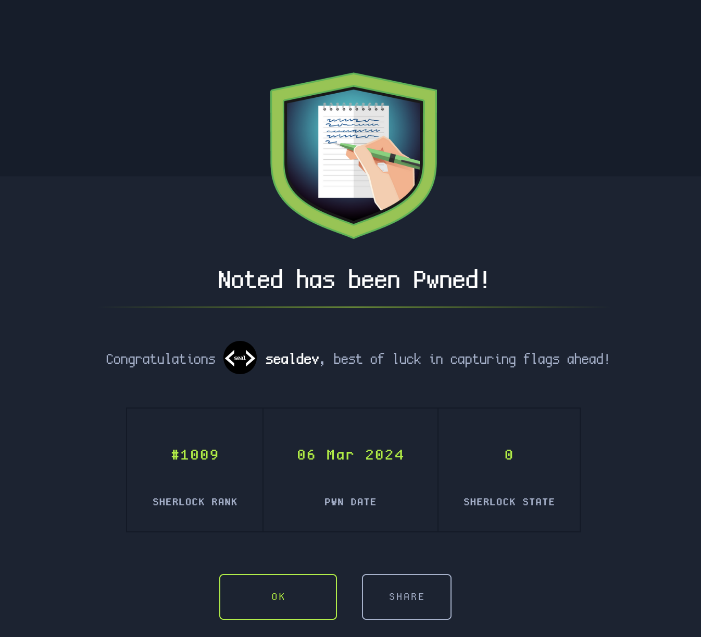

**Challenge created by:** [CyberJunkie](https://app.hackthebox.com/users/468989)

An initial look at the files shows some artifacts from Notepad++.

## Task 1
> What is the full path of the script used by Simon for AWS operations?

Looking inside the `config.xml` file, we can see in the artifact that a `History` object exists, containing some entries:

```xml
<File filename="C:\Program Files\Notepad++\change.log" />
<File filename="C:\Users\Simon.stark\Documents\Internal-DesktopApp\Prototype-Internal_Login.cs" />
<File filename="C:\Users\Simon.stark\Documents\Dev-WebServer-BetaProd\dev2prod_fileupload.php" />
<File filename="C:\Users\Simon.stark\Documents\Internal-DesktopApp\App_init_validation.yml" />
<File filename="C:\Users\Simon.stark\Documents\Dev_Ops\AWS_objects migration.pl" />
```

One of them called 'AWS_objects migration.pl` seems like the way to go

Flag: `C:\Users\Simon.stark\Documents\Dev_Ops\AWS_objects migration.pl`

## Task 2
> The attacker duplicated some program code and compiled it on the system, knowing that the victim was a software engineer and had all the necessary utilities. They did this to blend into the environment and didn't bring any of their tools. This code gathered sensitive data and prepared it for exfiltration. What is the full path of the program's source file?

Inside the 'backup' folder is two files:
```
LootAndPurge.java@2023-07-24_145332
YOU HAVE BEEN HACKED.txt@2023-07-24_150548
```

LootAndPurge seems to contain some source code used to extract data.

Inside `session.xml` contains two 'sessions':

```
<File firstVisibleLine="21" xOffset="0" scrollWidth="848" startPos="1697" endPos="1697" selMode="0" offset="0" wrapCount="1" lang="Java" encoding="-1" userReadOnly="no" filename="C:\Users\Simon.stark\Desktop\LootAndPurge.java" backupFilePath="C:\Users\Simon.stark\AppData\Roaming\Notepad++\backup\LootAndPurge.java@2023-07-24_145332" originalFileLastModifTimestamp="-1354503710" originalFileLastModifTimestampHigh="31047188" tabColourId="-1" mapFirstVisibleDisplayLine="-1" mapFirstVisibleDocLine="-1" mapLastVisibleDocLine="-1" mapNbLine="-1" mapHigherPos="-1" mapWidth="-1" mapHeight="-1" mapKByteInDoc="512" mapWrapIndentMode="-1" mapIsWrap="no" />
<File firstVisibleLine="0" xOffset="0" scrollWidth="1072" startPos="672" endPos="672" selMode="0" offset="0" wrapCount="1" lang="None (Normal Text)" encoding="-1" userReadOnly="no" filename="C:\Users\Simon.stark\Desktop\YOU HAVE BEEN HACKED.txt" backupFilePath="C:\Users\Simon.stark\AppData\Roaming\Notepad++\backup\YOU HAVE BEEN HACKED.txt@2023-07-24_150548" originalFileLastModifTimestamp="1536217129" originalFileLastModifTimestampHigh="31047190" tabColourId="-1" mapFirstVisibleDisplayLine="-1" mapFirstVisibleDocLine="-1" mapLastVisibleDocLine="-1" mapNbLine="-1" mapHigherPos="-1" mapWidth="-1" mapHeight="-1" mapKByteInDoc="512" mapWrapIndentMode="-1" mapIsWrap="no" />
```

LootAndPurge.java is on the Desktop as listed in the first entry!

Flag: `C:\Users\simon.stark\Desktop\LootAndPurge.java`

## Task 3
> What's the name of the final archive file containing all the data to be exfiltrated?

Reading the LootAndPurge backup, a portion of the java code catches my eye:

```java
public static void main(String[] args) {
    String username = System.getProperty("user.name");
    String desktopDirectory = "C:\\Users\\" + username + "\\Desktop\\";
    List<String> extensions = Arrays.asList("zip", "docx", "ppt", "xls", "md", "txt", "pdf");
    List<File> collectedFiles = new ArrayList<>();
    
    collectFiles(new File(desktopDirectory), extensions, collectedFiles);
    
    String zipFilePath = desktopDirectory + "Forela-Dev-Data.zip";
    String password = "sdklY57BLghvyh5FJ#fion_7";
    
    createZipArchive(collectedFiles, zipFilePath, password);
    
    System.out.println("Zip archive created successfully at: " + zipFilePath);
}
```

We can see `zipFilePath` contains the path of the final exfiltrated zip.

Flag: `Forela-Dev-Data.zip`

## Task 4
> What's the timestamp in UTC when attacker last modified the program source file?

To parse out the timestamp I did some research on Notepad++ artifacts, looking for how to parse timestamps I find [this discussion](https://community.notepad-plus-plus.org/topic/22662/need-explanation-of-a-few-session-xml-parameters-values) and a reply says the following:

```
high = 30736076 (from originalFileLastModifTimestampHigh)
low = -386892058 = -X (so X = 386892058) (from originalFileLastModifTimestamp)
2^32 = 4294967296 (yes, exponentiation)
full value = high * 2^32 + (2^32 - X) = 30736076 * 4294967296  + (4294967296 - 386892058)
```

Let's apply this to our values from `session.xml` which should give us our LDAP timestamp.

```python
>>> low = -1354503710
>>> high = 31047188
>>> X = -low
>>> print(high * 2**32 + (2**32 - X))
133346660033227234
```

I convert the timestamp using the [LDAP timestamp converter](https://www.epochconverter.com/ldap) and use the GMT time output.

Flag: `2023-07-24 09:53:23`

## Task 5
> The attacker wrote a data extortion note after exfiltrating data. What is the crypto wallet address to which attackers demanded payment?

Reading the `YOU HAVE BEEN HACKED.txt@2023-07-24_150548` file in `backup`, we can see the ransom note left behind:

```
HEllo

This note is placed in your desktop and copied to other locations too. You have been hacked and your data has been deleted from your
system. We made copies of your sensitive data and uploaded to our servers. The rule is simple

                                                       YOU PAY US
                                                           AND 
                         WE DO NOT RELEASE YOUR COMPANY SECRETS TO PUBLIC AND RETURN YOUR DATA SAFELY TO YOU
						 
						 
Failiure to oblige will result in immediate data leak to the public. 


For detailed information and process , Visit below link

https://pastebin.com/CwhBVzPq	

OR 


https://pastes.io/mvc6sue6cf					 
```

Visitng one of the two paste links, it asks for a password.

Looking in `LootAndPurge.java@2023-07-24_145332`, we can see a password string mentioned:
```java
collectFiles(new File(desktopDirectory), extensions, collectedFiles);

String zipFilePath = desktopDirectory + "Forela-Dev-Data.zip";
String password = "sdklY57BLghvyh5FJ#fion_7";

createZipArchive(collectedFiles, zipFilePath, password);
```

Unlocking the paste we can see the wallet inside:
```
If you are here then you know that you have no other choice than to pay us. Your Sensitive DATA is in our hands and we WILL release it to PUBLIC By midnight if you don't pay us a ransom.
 
We Want 50000 $ in ETH currency by midnight. This amount is very reasonable as we know FORELA is a multi million dollar company, but since we were able to extort small amount of data , this is our final offer. 
 
Ethereum Wallet : 0xca8fa8f0b631ecdb18cda619c4fc9d197c8affca
 
Person of contact : CyberJunkie@mail2torjgmxgexntbrmhvgluavhj7ouul5yar6ylbvjkxwqf6ixkwyd.onion
```

Flag: `0xca8fa8f0b631ecdb18cda619c4fc9d197c8affca`

## Task 6
> What's the email address of the person to contact for support?

Also inside the ransom note from Task 5.

Flag: `CyberJunkie@mail2torjgmxgexntbrmhvgluavhj7ouul5yar6ylbvjkxwqf6ixkwyd.onion`

## The End!

