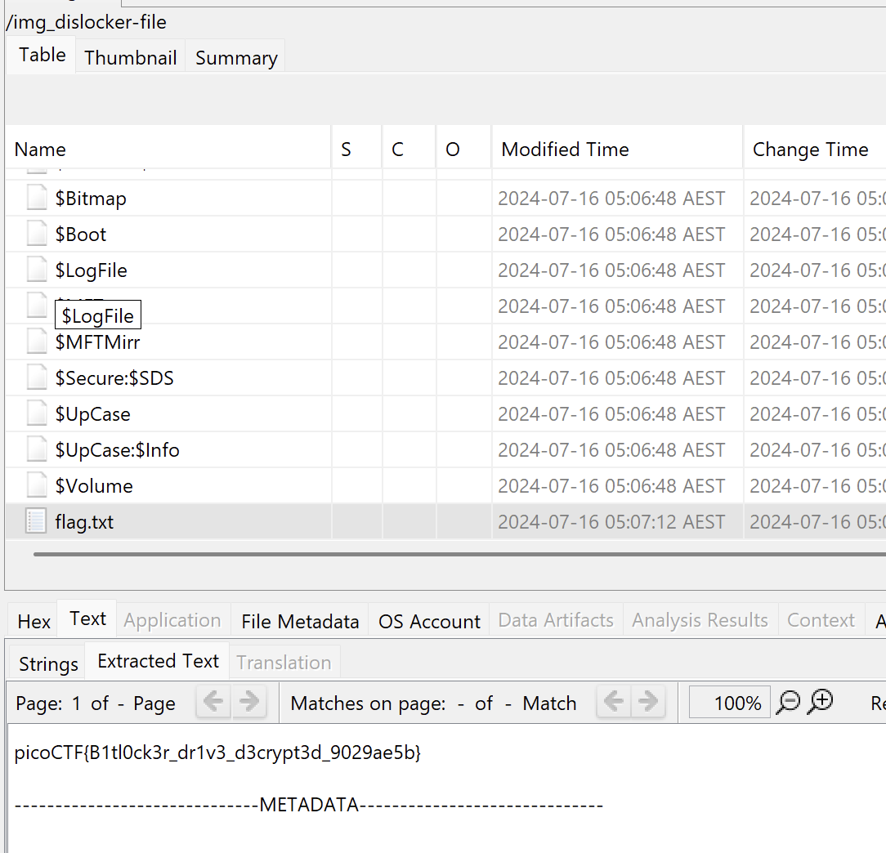

> This is a part 2 to [Bitlocker-1](picoctf-bitlocker1), please read that one first to get context!

We start with a `bitlocker-2.dd` and a `memdump.mem.gz`, let's start by extracting the `memdump.mem.gz` and then we can check both with `file`:
```bash
$ 7z x memdump.mem.gz

7-Zip [64] 17.05 : Copyright (c) 1999-2021 Igor Pavlov : 2017-08-28
p7zip Version 17.05 (locale=utf8,Utf16=on,HugeFiles=on,64 bits,10 CPUs LE)

...

Everything is Ok

Size:       536870912
Compressed: 177489968
$ file bitlocker-2.dd
bitlocker-2.dd: DOS/MBR boot sector, code offset 0x58+2, OEM-ID "-FVE-FS-", sectors/cluster 8, reserved sectors 0, Media descriptor 0xf8, sectors/track 63, heads 255, hidden sectors 124499968, FAT (32 bit), sectors/FAT 8160, serial number 0, unlabeled; NTFS, sectors/track 63, physical drive 0x1fe0, $MFT start cluster 393217, serial number 02020454d414e204f, checksum 0x41462020
$ file memdump.mem
memdump.mem: data
```

Likely the memory dump contains the key we need to decrypt the Bitlocker drive like before, we can start by working with Volatility!

Researching for plugins that work with Bitlocker, we can find [Volatility-BitLocker](https://github.com/breppo/Volatility-BitLocker)!

All it requires is a `bitlocker.py` in the plugins for Volatility 2, and we can start extracting Bitlocker keys.

Volatility is notoriously annoying to install so I use this [Docker Image](https://hub.docker.com/r/oste/volatility2) to use volatility2.

I make a `plugins` directory which contains the `bitlocker.py` from the repo, and I make a `workspace` that contains the `memdump.mem` and `bitlocker-2.dd`.

To start with, I use Volatility 2 to get the image info:
```bash
$ sudo docker run --volume ./plugins:/tmp/plugins --volume ./workspace:/tmp/workspace --rm oste/volatility2:latest volatility --plugins /tmp/plugins imageinfo -f /tmp/workspace/memdump.mem
Volatility Foundation Volatility Framework 2.6.1
INFO    : volatility.debug    : Determining profile based on KDBG search...
          Suggested Profile(s) : Win10x64_19041
                     AS Layer1 : SkipDuplicatesAMD64PagedMemory (Kernel AS)
                     AS Layer2 : FileAddressSpace (/tmp/workspace/memdump.mem)
                      PAE type : No PAE
                           DTB : 0x1ad000L
                          KDBG : 0xf80251217b20L
          Number of Processors : 2
     Image Type (Service Pack) : 0
                KPCR for CPU 0 : 0xfffff8024f52f000L
                KPCR for CPU 1 : 0xffffc301a8c67000L
             KUSER_SHARED_DATA : 0xfffff78000000000L
           Image date and time : 2024-07-15 19:24:38 UTC+0000
     Image local date and time : 2024-07-15 12:24:38 -0700
```

We can see the suggested profile is `Win10x64_19041`, let's use the `Volatility-Bitlocker` plugin with that profile.
```bash
$ sudo docker run --volume ./plugins:/tmp/plugins --volume ./workspace:/tmp/workspace --rm oste/volatility2:latest volatility --plugins /tmp/plugins bitlocker -f /tmp/workspace/memdump.mem --profile Win10x64_19041 --dislocker /tmp/workspace/
Volatility Foundation Volatility Framework 2.6.1

[FVEK] Address : 0x9e8879926a50
[FVEK] Cipher  : AES 128-bit (Win 8+)
[FVEK] FVEK: 5b6ff64e4a0ee8f89050b7ba532f6256
[DISL] FVEK for Dislocker dumped to file: /tmp/workspace/0x9e8879926a50-Dislocker.fvek


[FVEK] Address : 0x9e887496fb30
[FVEK] Cipher  : AES 256-bit (Win 8+)
[FVEK] FVEK: 60be5ce2a190dfb760bea1ece40e4223c8982aecfd03221a5a43d8fdd302eaee
[DISL] FVEK for Dislocker dumped to file: /tmp/workspace/0x9e887496fb30-Dislocker.fvek


[FVEK] Address : 0x9e8874cb5c70
[FVEK] Cipher  : AES 128-bit (Win 8+)
[FVEK] FVEK: 1ed2a4b8dd0290f646ded074fbcff8bd
[DISL] FVEK for Dislocker dumped to file: /tmp/workspace/0x9e8874cb5c70-Dislocker.fvek


[FVEK] Address : 0x9e88779f1a10
[FVEK] Cipher  : AES 128-bit (Win 8+)
[FVEK] FVEK: bccaf1d4ea09e91f976bf94569761654
[DISL] FVEK for Dislocker dumped to file: /tmp/workspace/0x9e88779f1a10-Dislocker.fvek
```

I use the `--dislocker` parameter to export the keys to dislocker compatible files to my workspace, we are given 4 keys.

The first 3 do not extract properly with `dislocker` giving files that are not disk images:
```bash
$ file mnt/dislocker-file
mnt/dislocker-file: data
```

The last key gives me the following:
```bash
$ dislocker -k '/tmp/35QCD/0x9e8879926a50-Dislocker.fvek'  '/tmp/D412T/bitlocker-2.dd' ./mnt
$ file mnt/dislocker-file                                                                   
mnt/dislocker-file: DOS/MBR boot sector, code offset 0x52+2, OEM-ID "NTFS    ", sectors/cluster 8, Media descriptor 0xf8, sectors/track 63, heads 255, hidden sectors 124499968, dos < 4.0 BootSector (0x80), FAT (104799, $MFT start cluster 8533, $MFTMirror start cluster 2, bytes/RecordSegment 2^(-1*246), clusters/index block 1, serial number 0804e24974e2487cc; contains bootstrap BOOTMGR
```

Now we just need to load it into Autopsy like before to find our flag!


Flag: `picoCTF{B1tl0ck3r_dr1v3_d3crypt3d_9029ae5b}`