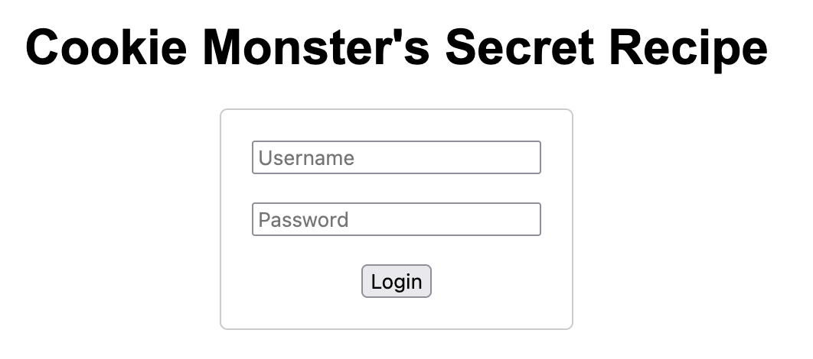
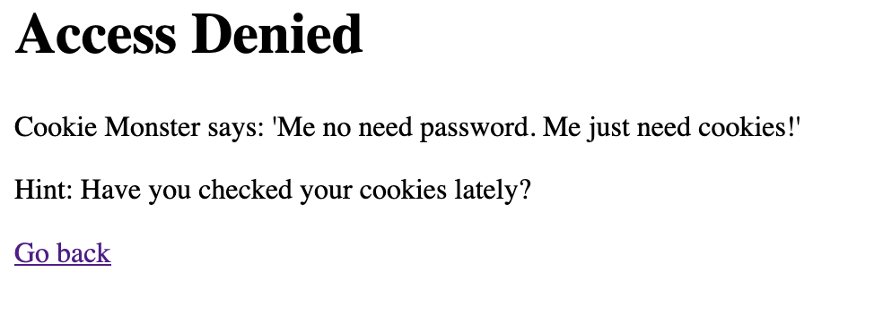
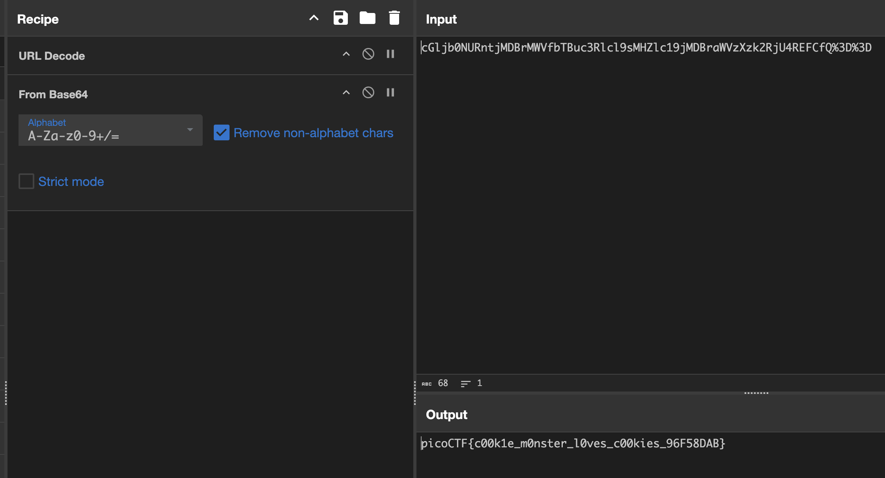

We start with a plain login page:


I try with some default credentials `admin:admin`, and get an error:


With the hint to check my cookies, I use EditThisCookie2 and see a Cookie called `secret_recipe` (You can also view your cookies with a web proxy like Burp Suite, in browser storage, etc):
```
cGljb0NURntjMDBrMWVfbTBuc3Rlcl9sMHZlc19jMDBraWVzXzk2RjU4REFCfQ%3D%3D
```

This is URL encoded (can be seen by the `%3D` which is equal to `=`) and this also looks like Base64!

I do this in CyberChef to decode it. I use URL Decode then From Base64:


Flag: `picoCTF{c00k1e_m0nster_l0ves_c00kies_96F58DAB}`
