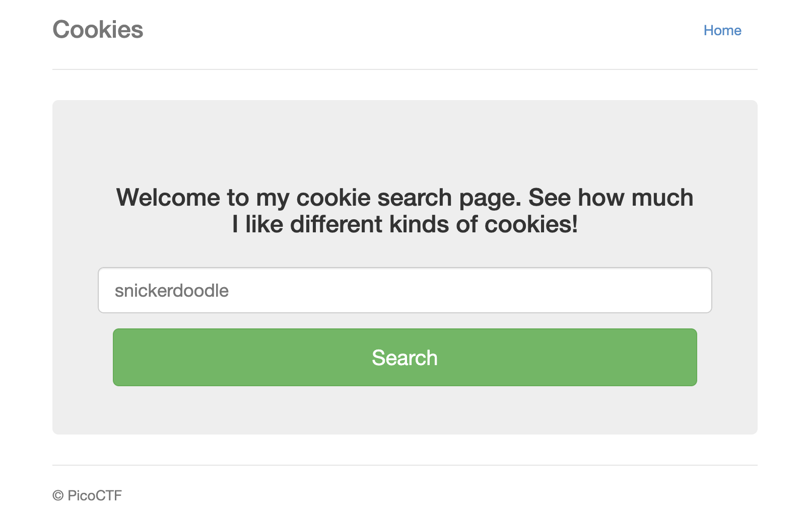
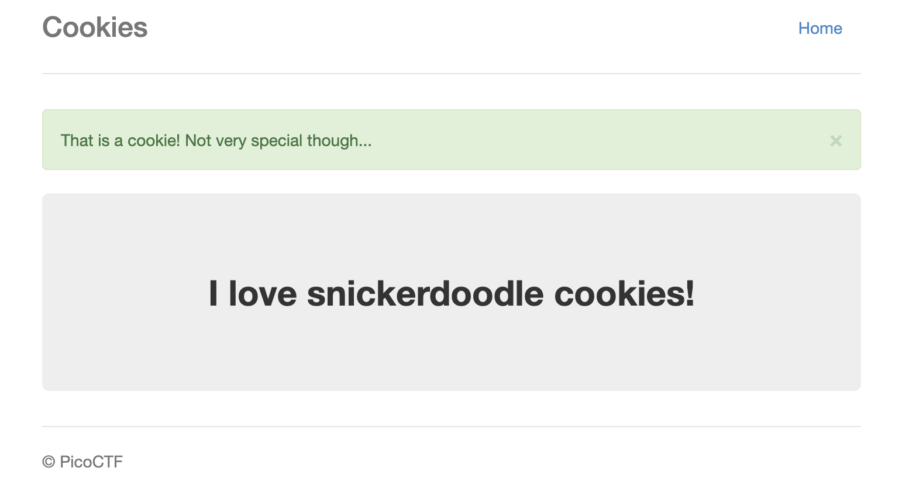
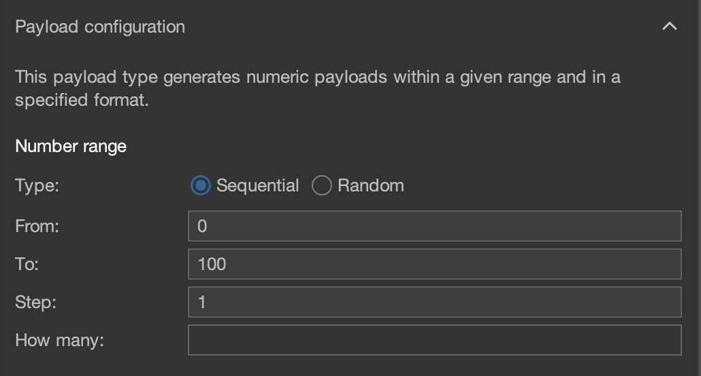
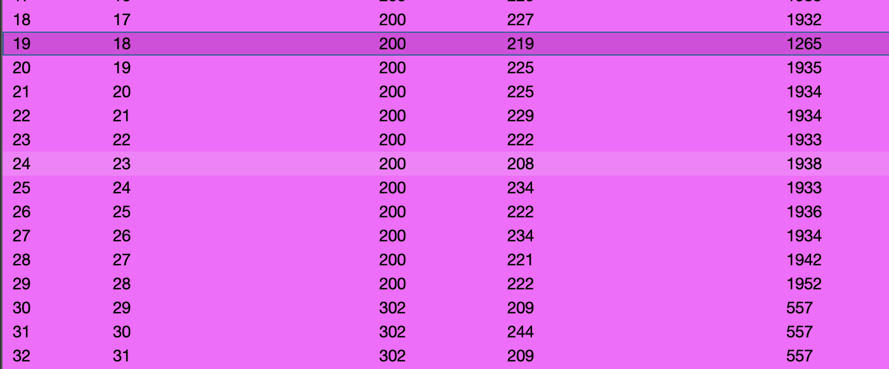

We are supplied a web application that has a 'cookie search page' with an input field:


Before I begin, I set up Burp Suite with PwnFox to intercept my requests, and view what is being transmitted.

The sample input in the field is 'snickerdoodle', I decide to put that into the input box then pressing 'Search'. We are sent to the `/check` endpoint with a new page:


The page mentions 'That is a cookie' which means that it is likely checking contents from a cookie. Let's check Burp Suite!

We send the following POST request when we click 'Search':
```
POST /search HTTP/1.1
Host: mercury.picoctf.net:17781
...
Cookie: name=-1
...

name=snickerdoodle
```

Which contains a cookie, `name=-1`.

The response is then sent from the POST:
```
HTTP/1.1 302 FOUND
...
Set-Cookie: name=0; Path=/

<!DOCTYPE HTML PUBLIC "-//W3C//DTD HTML 3.2 Final//EN">
<title>Redirecting...</title>
<h1>Redirecting...</h1>
<p>You should be redirected automatically to target URL: <a href="/check">/check</a>.  If not click the link.
```

We are sent a 302 (which is a redirect, in this case to `/check`) and it uses a `Set-Cookie` header to change `name` to `0`.

After visiting `/check` we get the contents from the screenshot above!

As the cookie changing determines the content, what if we use the Intruder tool in Burp Suite to iterate numbers in the value of `name` to access other pages?

We send the GET request to `/check` to the Intruder.

```
GET /check HTTP/1.1
Host: mercury.picoctf.net:17781
...
Cookie: name=0
...
```

I then make a selection around the `0` in the Cookie header, and set the Payload Type to Numbers. I do from `0` to `100` with a step of `1`.


We then press 'Start Attack' and after some waiting see that we get responses (with valid content) from numbers 0-28. All higher numbers send a `302` response back to `/`.



Reading through each response (or using a filter in the 'View filter' section for `picoCTF{`) we can see the number '18' has an interesting response:
```html
...
<div class="jumbotron">
    <p class="lead"></p>
    <p style="text-align:center; font-size:30px;"><b>Flag</b>: <code>picoCTF{3v3ry1_l0v3s_c00k135_bb3b3535}</code></p>
</div>
...
```

Flag: `picoCTF{3v3ry1_l0v3s_c00k135_bb3b3535}`

