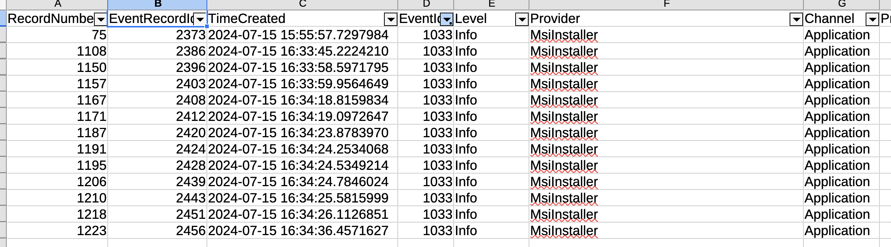
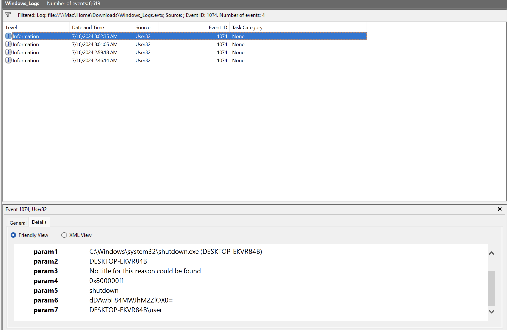

We start with a `Windows_Logs.evtx`, `.evtx` files are usually processed in Windows, so I open a Windows VM.

I start with EricZimmerman's tool EvtxECmd, I use `--out` to export a CSV for parsing:
```powershell
PS > .\EvtxECmd.exe -f ..\..\..\Downloads\Windows_Logs.evtx --out out
EvtxECmd version 1.5.2.0

Author: Eric Zimmerman (saericzimmerman@gmail.com)
https://github.com/EricZimmerman/evtx

Command line: -f ..\..\..\Downloads\Windows_Logs.evtx

Warning: Administrator privileges not found!

Maps loaded: 453

Processing C:\Mac\Home\Downloads\Windows_Logs.evtx...
Chunk count: 99, Iterating records...
Record #: 1817 (timestamp: 2024-07-15 16:46:18.6697512): Warning! Time just went backwards! Last seen time before change: 2024-07-15 16:46:38.9816621
Record #: 4029 (timestamp: 2024-07-15 16:59:21.8229048): Warning! Time just went backwards! Last seen time before change: 2024-07-15 16:59:38.9260830
Record #: 5692 (timestamp: 2024-07-15 17:01:09.3279087): Warning! Time just went backwards! Last seen time before change: 2024-07-15 17:01:44.9951378
Record #: 7070 (timestamp: 2024-07-15 17:02:38.6142607): Warning! Time just went backwards! Last seen time before change: 2024-07-15 17:03:27.2560767

Event log details
Flags: None
Chunk count: 99
Stored/Calculated CRC: 4E111818/4E111818
Earliest timestamp: 2024-07-15 15:55:14.0647632
Latest timestamp:   2024-07-15 17:07:04.7129092
Total event log records found: 8,619

Records included: 8,619 Errors: 0 Events dropped: 0

Metrics (including dropped events)
Event ID        Count
0               2
1               6
3               4
...
51047           4
51057           4

Processed 1 file in 9.1606 seconds
```

The description mentions that an application was installed, looking online they seem to be under Event ID's `1033`/`1034`! I use LibreOffice with the CSV to filter to EventID's of only 1033 (as there are no 1034's).


The PayloadData1 for Record 75 has some interesting info:
```
Name, Version, Lang, Status, Manufacturer: Totally_Legit_Software, 1.3.3.7, 0, 0, cGljb0NURntFdjNudF92aTN3djNyXw==, (NULL)
```

The Base64 string is of particular interest! Let's decode it (You can use CyberChef, Dcode.fr, etc. I use the `base64` utility).
```bash
$ echo "cGljb0NURntFdjNudF92aTN3djNyXw==" | base64 -d
picoCTF{Ev3nt_vi3wv3r_
```

Looks like a partial flag!

Let's now look for the second event, where they run the 'Totally_Legit_Software'. Event ID 4688 is for a creation of a new process but there's not much of interest... 

We could look for part 3 with Event ID 1074 (Shutdown initiated)?

I do a CTRL+F for 'Shutdown' and find record 186, which has a registry change with a suspiscious value:
```
Value Name: Immediate Shutdown (MXNfYV9wcjN0dHlfdXMzZnVsXw==)
```

Decoding the Base64 again:
```bash
$ echo "MXNfYV9wcjN0dHlfdXMzZnVsXw==" | base64 -d
1s_a_pr3tty_us3ful_
```

Seems like we found part 2!

Now considering both of the flag have been encoded with base64, I can bet that the Base64 representation for the end of the flag `}` will be in the string. 
```bash
$ echo "}" | base64
fQo=
```

Let's look for `fQo`... nothing...

Maybe we can use Event Viewer, the default windows tool (ew).

I filter for Event ID 1074 to make sure I didn't miss anything:


For some reason EvtxECmd failed and didn't export the value in `param6` in the CSV but it exported correctly in the full 'Payload' section. I decode it and get the final flag part:
```bash
$ echo "dDAwbF84MWJhM2ZlOX0=" | base64 -d
t00l_81ba3fe9}
```

Flag: `picoCTF{Ev3nt_vi3wv3r_1s_a_pr3tty_us3ful_t00l_81ba3fe9}`
