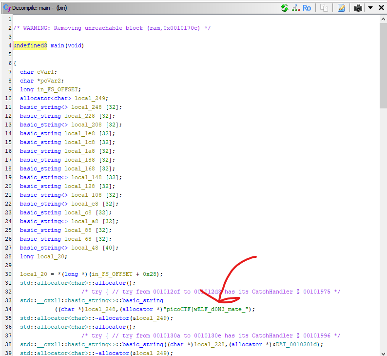

I opened this binary in Ghidra and jumped from the `_start` to the `main` function, and took a look at the decompiled code.

I can see a plaintext string immediately.



So that's part of the flag, where is the rest?

Reading throught the code there is this line towards the end: `operator+=(local_248,'}')`. So I assumed that the flag is likely constructed with the commands between there.

I see they originally assign values to a few `local` variables, which I mapped out by hand:
```
local_228=7
local_208=5
local_1e8=9
local_1c8=3
local_1a8=0
local_188=4
local_168=a
local_148=e
local_128=a
local_108=d
local_e8=b
local_c8=2
local_a8=6
local_88=4
local_68=3
local_48=8
```

Then I converted this all to a C++ script:
```cpp
#include <iostream>
#include <string>

int main() {
    char cVar1;
    char *pcVar2;
    long local_20;

    local_20 = 0;

    std::string local_248 = "picoCTF{wELF_d0N3_mate_";
    std::string local_228 = "7";
    std::string local_208 = "5";
    std::string local_1e8 = "9";
    std::string local_1c8 = "3";
    std::string local_1a8 = "0";
    std::string local_188 = "4";
    std::string local_168 = "a";
    std::string local_148 = "e";
    std::string local_128 = "a";
    std::string local_108 = "d";
    std::string local_e8 = "b";
    std::string local_c8 = "2";
    std::string local_a8 = "6";
    std::string local_88 = "4";
    std::string local_68 = "3";
    std::string local_48 = "8";

    pcVar2 = &local_208[0];
    if (*pcVar2 < 'B') {
        local_248 += local_c8;
    }

    pcVar2 = &local_a8[0];
    if (*pcVar2 != 'A') {
        local_248 += local_68;
    }

    pcVar2 = &local_1c8[0];
    cVar1 = *pcVar2;
    pcVar2 = &local_148[0];
    if ((int)cVar1 - (int)*pcVar2 == 3) {
        local_248 += local_1c8;
    }

    local_248 += local_1e8;
    local_248 += local_188;

    pcVar2 = &local_168[0];
    if (*pcVar2 == 'G') {
        local_248 += local_168;
    }

    local_248 += local_1a8;
    local_248 += local_88;
    local_248 += local_228;
    local_248 += local_128;
    local_248 += "}";

    std::cout << local_248 << std::endl;

    return 0;
}
```

Running the script follows the exact same steps as the program, returning the flag when ran.

Flag: `picoCTF{wELF_d0N3_mate_2394047a}`