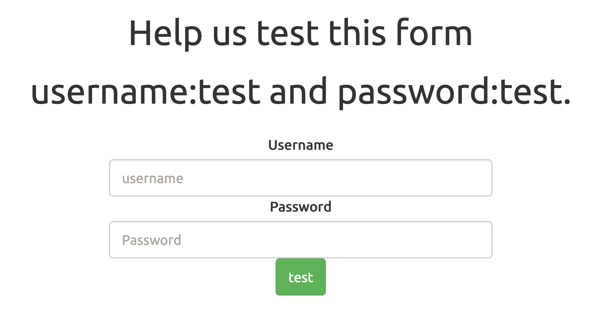
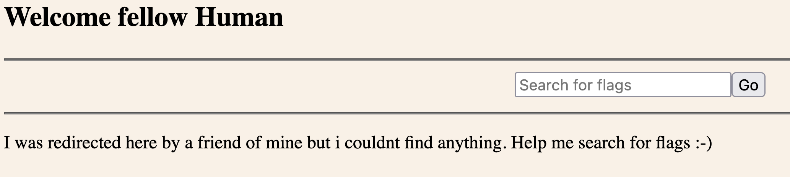
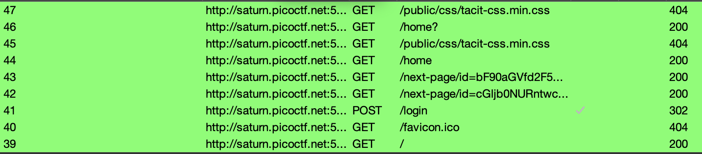
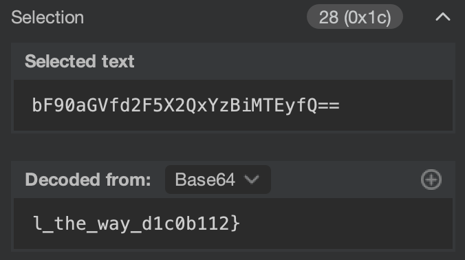
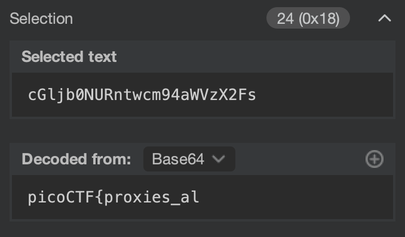

We are supplied a web application with a login page:


Before I begin, I set up Burp Suite with PwnFox to intercept my requests, and view what is being transmitted.

We can use the supplied credentials in the description (and on the page) with username `test` and password `test`.

We are redirected to `/home`:


We can also do inputs on this page, I type 'pico' and press 'Go'. There is no visual changes.

Let's look at our requests in Burp Suite:


Some initial observations:
- We can see in request 46 (that was when we typed 'pico' on the `/home` page and pressed 'Go') that it was a GET request and no POST was sent. There is no URL parameters so likely no data was transmitted.
- Request 43 and 42 seem interesting, as they occur before our redirect to `/home`.

Let's start by checking request 46, in summary there is not much of interest as the `search()` function is fake:
```javascript
function search() {
    const searchResult = document.getElementById("search-result");
    const searchTerm = document.getElementById("search-term");
    const keyword = document.getElementById("keyword");

    const comments = document.getElementById("comments");

    comments.style.visibility = "hidden";

    searchResult.style.display = "block";

    searchTerm.innerHTML = keyword.value;

    //fetching results related to the keyword value from the server

    return false;
}
```

There is no fetching of the data, so let's look at those 43 and 42 requests.

Request 43 has a GET request to the following:
```
GET /next-page/id=bF90aGVfd2F5X2QxYzBiMTEyfQ== HTTP/1.1
Host: saturn.picoctf.net:58761
...
```

That `id` looks like Base64 (identifiable easily because of at `a-zA-Z0-9` character set and the signature ending with `==`)!
 
Let's decode it, we can select it in Burp Suite and the decoder (on the right of the screen) will auto-decode it! (The string can also be decoded with CyberChef, Dcode.fr, the `base64` utility on the command line, etc)


That looks like part of a flag!

Checking request 42:
```
GET /next-page/id=cGljb0NURntwcm94aWVzX2Fs HTTP/1.1
Host: saturn.picoctf.net:58761
...
```

Seems to be a Base64 `id` again, decoding it we get the first part of the flag:


Flag: `picoCTF{proxies_all_the_way_d1c0b112}`