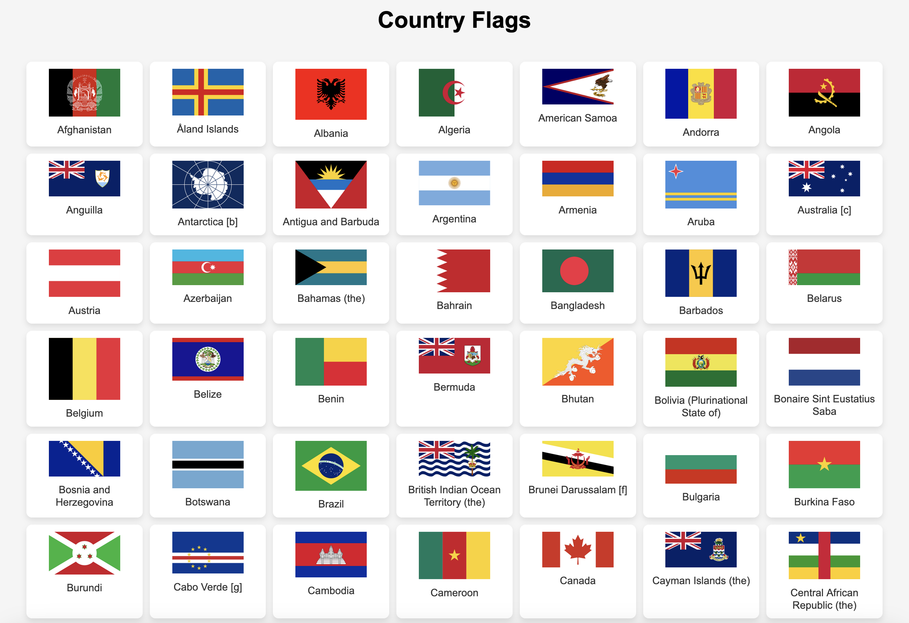

We start with a web instance with a bunch of flags:


Looking at the page source, something catches my eye...
```json
...
{ name: "United Arab Emirates (the)",img: "flags/ae.png"},
{ name: "United Kingdom of Great Britain and Northern Ireland (the)",img: "flags/gb.png"},
{ name: "United States of America (the)",img: "flags/us.png"},
{ name: "Upanzi, Republic The",img: "flags/upz.png", style:"width: 120px!important; height: 90px!important;" },
{ name: "Uruguay",img:"flags/uy.png"},
{ name: "Uzbekistan",img: "flags/uz.png"},
...
```

The country 'Upanzi, Republic The' is highlighted with some unique CSS rules for only that flag. Looking up 'Upanzi' we get refrences to Carnegie Mellon University, the university hosting PicoCTF!


I download the `upz.png` image, and it doesn't have much of interest...


I also try using AperiSolve and some other steganography tools and make no progress...

Eventually I look more at the challenge name, stepic? What's stepic? Kinda reads like a shorthand for 'steganography picture'...

I do a Google dork for stepic with 'site:github.com' expecting a project.


That seems about right!

I install the project with `pip`:
```bash
$ pip install stepic
Collecting stepic
...
Installing collected packages: pillow, stepic
Successfully installed pillow-11.1.0 stepic-0.5.0
```

Then use it!
```bash
$ stepic -d -i ../upz.png
...
picoCTF{fl4g_h45_fl4ga664459a}
```

Flag: `picoCTF{fl4g_h45_fl4ga664459a}`