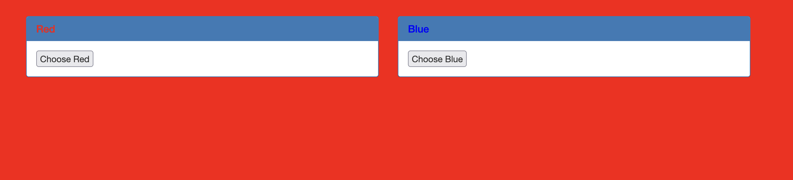

We are supplied a web application that has a red or a blue option to choose from:


Before I begin, I set up Burp Suite with PwnFox to intercept my requests, and view what is being transmitted.

I click 'Choose Red', then 'Choose Blue' and view the requests inside Burp Suite.

'Choose Red' sends this:
```
GET /index.php? HTTP/1.1
Host: mercury.picoctf.net:28916
...
```

Nothing particularly interesting, no data or parameters.

Let's look at 'Choose Blue's request:
```
POST /index.php HTTP/1.1
Host: mercury.picoctf.net:28916
...
```

It's sending a POST (with no data) and that makes the page blue.

Looking at request methods (GET, POST) I use [this list](https://developer.mozilla.org/en-US/docs/Web/HTTP/Methods) to look for any others.

Remembering the title of the challenge, `HEAD` is another!

I send the POST request to the repeater in Burp Suite, and change the method from POST to HEAD.
```
HEAD /index.php HTTP/1.1
Host: mercury.picoctf.net:28916
...
```

The application responds:
```
HTTP/1.1 200 OK
flag: picoCTF{r3j3ct_th3_du4l1ty_70bc61c4}
Content-type: text/html; charset=UTF-8
```

Flag: `picoCTF{r3j3ct_th3_du4l1ty_70bc61c4}`