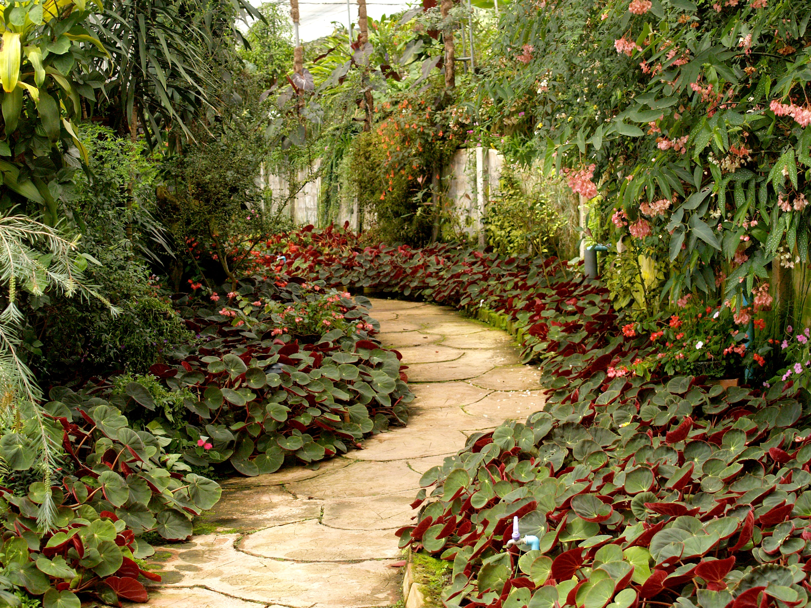

We start with a `garden.jpg`, viewing the contents having a picture of a garden but no flag visually.



I try using exiftool to view for any headers of interest, there are a few results but none that catch my eye as of interest.

I then view the contents of the image using `xxd`, sometimes CTF challenges (especially easier forensics ones) like to hide written data in the image at the end, I check with `tail` and `xxd` and find the flag:
```
$ xxd garden.jpg| tail
00230500: d9f9 9f63 4b2b c1e5 daf2 7b59 db49 4ba3  ...cK+....{Y.IK.
00230510: f43e b881 5e30 1060 8030 47d6 bacb 58cb  .>..^0.`.0G...X.
00230520: 1046 07b5 7216 df7e 5ff7 c576 363f ebab  .F..r..~_..v6?..
00230530: b70d 18ce 3ccd 6a7e 6b8d af56 b579 39ca  ....<.j~k..V.y9.
00230540: eeef 53ae 8620 31b8 751f 9514 f7fb cff5  ..S.. 1.u.......
00230550: a2bb bdac 9687 98e4 d3b2 e87f ffd9 4865  ..............He
00230560: 7265 2069 7320 6120 666c 6167 2022 7069  re is a flag "pi
00230570: 636f 4354 467b 6d6f 7265 5f74 6861 6e5f  coCTF{more_than_
00230580: 6d33 3374 735f 7468 655f 3379 3365 4264  m33ts_the_3y3eBd
00230590: 4264 3263 637d 220a                      Bd2cc}".
```

Flag: `picoCTF{more_than_m33ts_the_3y3eBdBd2cc}`