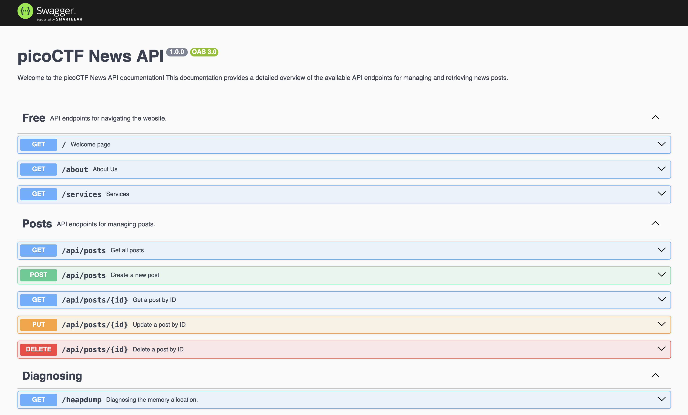
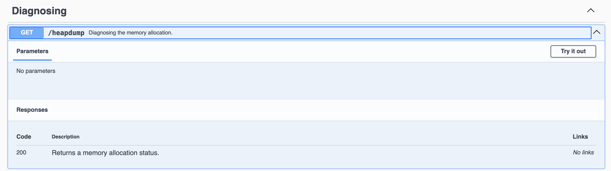

We start with a web instance showing some PicoCTF promo:


Reading through the source code, a specific segment catches my eye:
```html
...
<!-- Message -->
<div class="mb-4">
    <p class="text-gray-800">Explore backend development with us <a href="" class="text-blue-600">#nodejs</a> ,
        <a href="" class="text-blue-600">#swagger UI</a> , <a href="/api-docs" class="text-blue-600 hover:underline">#API Documentation</a> 
    </p>
</div>
...
```

There is a hidden endpoint `/api-docs`!

Visiting it is a Swagger UI:


Inside the docs is a `/heapdump` endpoint!


I then used `strings` and `grep` to look for the flag:
```bash
$ strings ~/Downloads/heapdump-1742275987463.heapsnapshot | grep 'pico'
picoCTF{Pat!3nt_15_Th3_K3y_63fa652c}
...
```

Flag: `picoCTF{Pat!3nt_15_Th3_K3y_63fa652c}`
