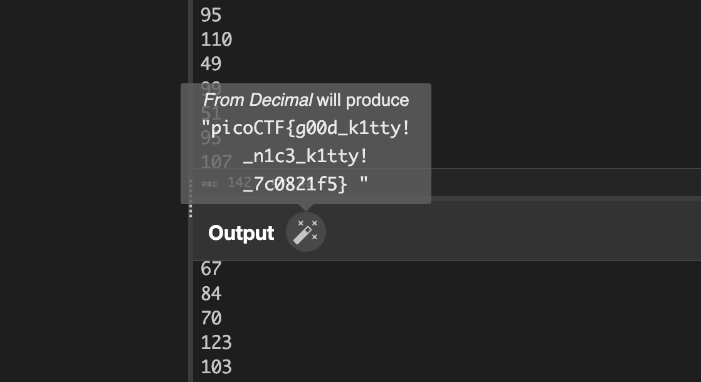

Using the given command to connect with netcat, we can connect and the server responds with a series of numbers:
```bash
$ nc mercury.picoctf.net 43239
112
105
99
111
67
84
70
123
103
48
48
100
95
107
49
116
116
121
33
95
110
49
99
51
95
107
49
116
116
121
33
95
55
99
48
56
50
49
102
53
125
10
```

We can copy those numbers into a tool like CyberChef to get a start!

On CyberChef, pasting the content into the 'Input' section, a small magic wand appears next to the 'Output' box:


We can click it and it will decode as Decimal to the flag.

Flag: `picoCTF{g00d_k1tty!_n1c3_k1tty!_7c0821f5}`