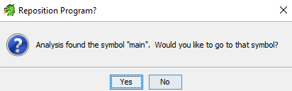
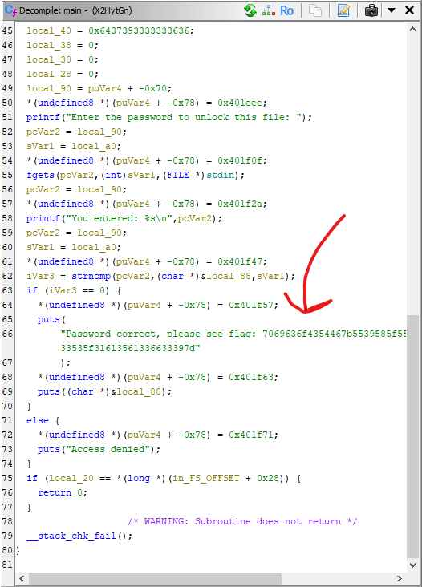

I initially try looking at thie binary in Ghidra but no strings or processes jump out at me, so I take a different angle.

With the name `packer` what seems obvious is the idea the binary may be packed...

I find a [StackOverflow post](https://stackoverflow.com/questions/40459463/how-can-i-detect-the-packer-used-in-elf-file) explaining how to detect if a packer was used with some common strings, I find that 'UPX' has some hits!

```
$ xxd out | grep 'UPX'
000000e0: 1000 0000 0000 0000 8b25 67ae 5550 5821  .........%g.UPX!
0004af60: 6564 2077 6974 6820 7468 6520 5550 5820  ed with the UPX
0004af90: 6e65 7420 240a 0024 4964 3a20 5550 5820  net $..$Id: UPX
0004afc0: 2055 5058 2054 6561 6d2e 2041 6c6c 2052   UPX Team. All R
0004b2b0: 7515 81fe 5550 5821 7511 77c1 bfb7 5e7d  u...UPX!u.w...^}
00052250: 0000 0095 ff00 0000 0055 5058 2100 0000  .........UPX!...
00052260: 0000 0000 5550 5821 0d16 0807 1aa3 24fa  ....UPX!......$.
```

So, let's try and unpack it! I get the latest version of UPX from their [Github](https://github.com/upx/upx) and download the `win64` version to use.

```
> upx.exe -d out
                       Ultimate Packer for eXecutables
                          Copyright (C) 1996 - 2024
UPX 4.2.2       Markus Oberhumer, Laszlo Molnar & John Reiser    Jan 3rd 2024

        File size         Ratio      Format      Name
   --------------------   ------   -----------   -----------
[WARNING] bad b_info at 0x4b718

[WARNING] ... recovery at 0x4b714

    877724 <-    336520   38.34%   linux/amd64   out

Unpacked 1 file.
```

Great! Let's try use this in Ghidra now that we can read it.

After some time analyzing, it finds a `main` function to jump to, which I do.



I immediately spot something in the decompiled code, a hex string!



If we decode the hex string (`7069636f4354467b5539585f556e5034636b314e365f42316e34526933535f31613561336633397d`) we get the flag!

Flag: `picoCTF{U9X_UnP4ck1N6_B1n4Ri3S_1a5a3f39}`