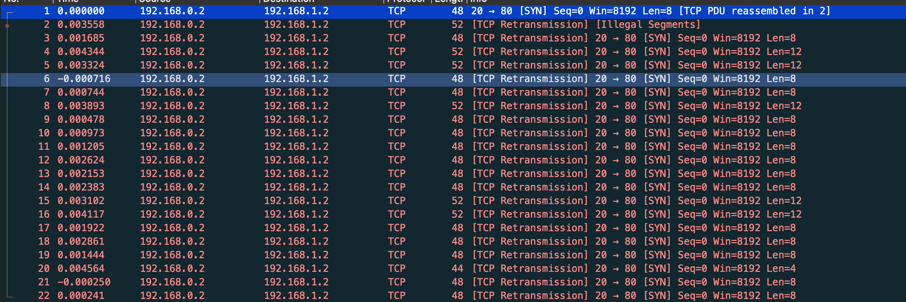
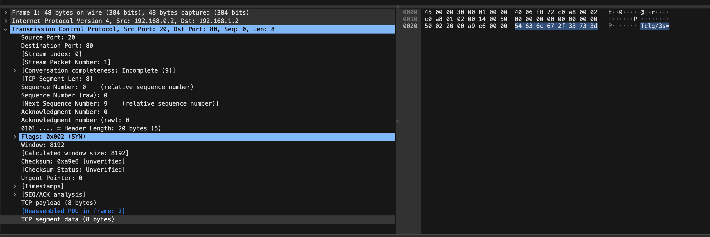

We start with a `myNetworkTraffic.pcap` which can be opened with Wireshark, so let's start there.



There are a total of 22 TCP packets. Selecting a packet we can see what looks to be Base64 data in the `tcp.segment_data`:


Let's use tshark to extract the data:
```bash
$ tshark -r myNetworkTraffic.pcap -T fields -e tcp.segment_data
54636c672f33733d
626e52666447673064413d3d
...
39447049626b413d
514b7a46582b633d
```

Let's decode the hex in bash (This can also be done manually with CyberChef, Dcode.fr, etc):
```bash
$ tshark -r myNetworkTraffic.pcap -T fields -e tcp.segment_data | while read line; do echo $line | xxd -r -p; echo; done
Tclg/3s=
bnRfdGg0dA==
RHxhtS4=
...
9DpIbkA=
QKzFX+c=
```

Let's now decode the Base64 strings!
```bash
$ tshark -r myNetworkTraffic.pcap -T fields -e tcp.segment_data | while read line; do echo $line | xxd -r -p | base64 -d; echo; done
M�`�{
nt_th4t
D|a�.
...
�:Hn@
@��_�
```

Now were getting somewhere, I'm now going to filter it to human readable characters!
```bash
$ tshark -r myNetworkTraffic.pcap -T fields -e tcp.segment_data | while read line; do echo $line | xxd -r -p | base64 -d; echo; done | grep '^[A-Za-z0-9/\{\}\._-]*$'
nt_th4t
66d0bfb
{1t_w4s
_34sy_t
picoCTF
bh_4r_9
}
```

We can now visually reconstruct the flag!

Flag: `picoCTF{1t_w4snt_th4t_34sy_tbh_4r_966d0bfb}`