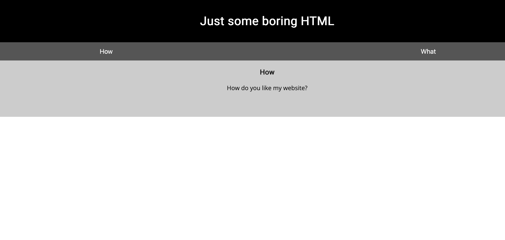

We start with a plain page with not much content:



Checking the source code (Usually CTRL+U) or using inspect element, there is a code comment in the HTML containing flag content!
```html
    <p>I used these to make this site: <br/>
        HTML <br/>
        CSS <br/>
        JS (JavaScript)
    </p>
<!-- Here's the first part of the flag: picoCTF{t -->
    </div>
```

Now we have the first part of the flag: `picoCTF{t`, let's look for the others by checking the other pages.

Attached is a `myjs.js` and a `mycss.css` file on the page:
```html
<head>
<title>Scavenger Hunt</title>
<link href="https://fonts.googleapis.com/css?family=Open+Sans|Roboto" rel="stylesheet">
<link rel="stylesheet" type="text/css" href="mycss.css">
<script type="application/javascript" src="myjs.js"></script>
</head>
```

Visiting `/mycss.css` has a flag!
```css
...
#tabintro { background-color: #ccc; }
#tababout { background-color: #ccc; }

/* CSS makes the page look nice, and yes, it also has part of the flag. Here's part 2: h4ts_4_l0 */
```

Flag part 2: `h4ts_4_l0`, let's check the JS file at `/myjs.js`:
```js
...
window.onload = function() {
    openTab('tabintro', this, '#222');
}

/* How can I keep Google from indexing my website? */
```

Generally the answer to that hint is `robots.txt` which determines how search engines index your website!
Let's check `/robots.txt`.
```
User-agent: *
Disallow: /index.html
# Part 3: t_0f_pl4c
# I think this is an apache server... can you Access the next flag?
```

There is flag part 3: `t_0f_pl4c`. For Apache webservers, a common file is a `.htaccess` file which determines the accessibility of files and folders in that directory.
Let's check `/.htaccess`:
```
# Part 4: 3s_2_lO0k
# I love making websites on my Mac, I can Store a lot of information there.
```

There is flag part 4: `3s_2_lO0k`, Mac _notoriously_ leaves behind these annoying `.DS_Store` files and is incredibly commonly placed in the `.gitignore` of repositories to avoid this.
Let's check `/.DS_Store`:
```
Congrats! You completed the scavenger hunt. Part 5: _7a46d25d}
```

We can now put all our flag parts together!

Flag: `picoCTF{th4ts_4_l0t_0f_pl4c3s_2_lO0k_7a46d25d}`