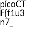

We are given a `flag2of2-final.pdf` which when viewed as a PDF in the browser, gives us part of a flag!


'Polyglot' is an interesting word, let's look up its definition in relation to cybersecurity.

I found an article [Polyglot Files: a Hacker's best friend](https://medium.com/swlh/polyglot-files-a-hackers-best-friend-850bf812dd8a) which has a nice definition:
> Polyglots, in a security context, are files that are a valid form of multiple different file types. For example, a GIFAR is both a GIF and a RAR file. There are also files out there that can be both GIF and JS, both PPT and JS, etc.

Cool, so this file is likely 2 kinds of files at the same time! Let's download it for analysis.

I use `file` to identify what kind of file it is:
```bash
$ file flag2of2-final.pdf
flag2of2-final.pdf: PNG image data, 50 x 50, 8-bit/color RGBA, non-interlaced
```

A PNG! Let's modify the extension from `.pdf` to a `.png` and view it:


Awesome! Let's put those 2 flag components together.

Flag: `picoCTF{f1u3n7_1n_pn9_&_pdf_724b1287}`