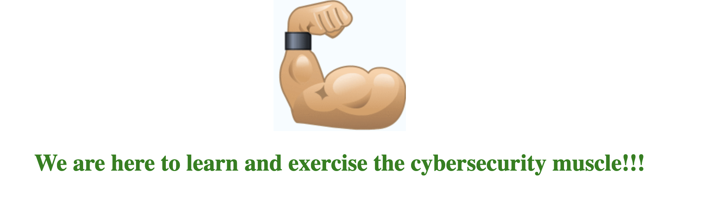
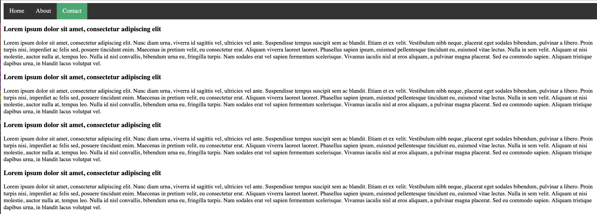
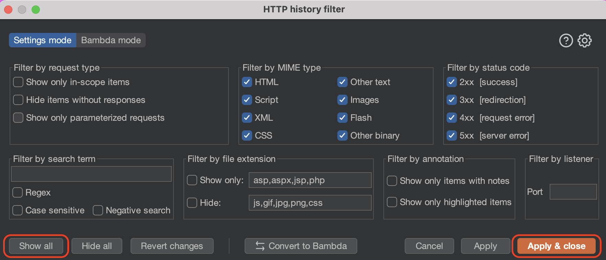
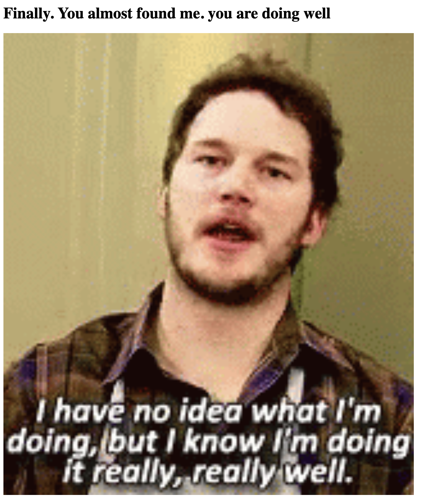
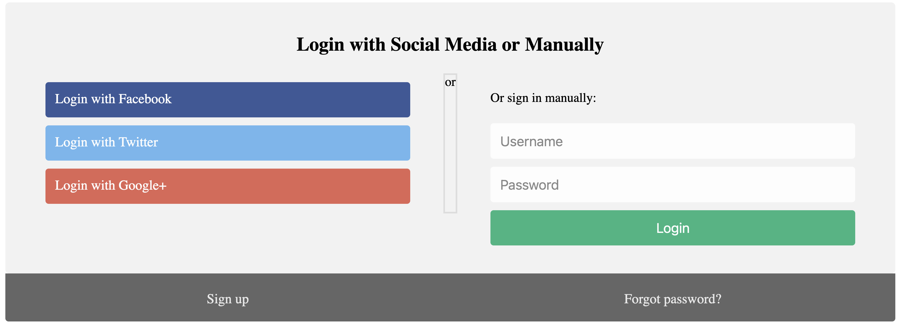
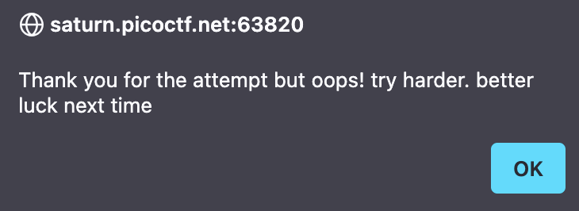
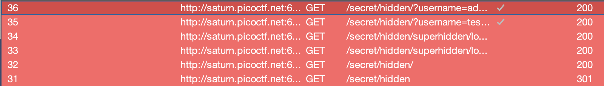
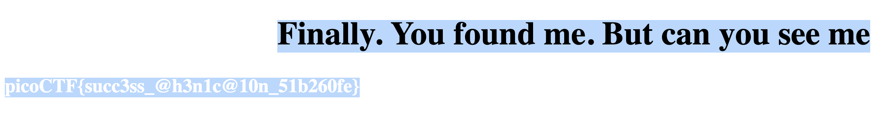

We are supplied a web application that a home page talking about security:


Before I begin, I set up Burp Suite with PwnFox to intercept my requests, and view what is being transmitted.

Now we can browse the application and see the requests, let's view the 'About' and 'Contact' pages.

The 'About' page has nothing interesting:


The 'Contact' page has a lot of example text:


Visually there is, not much...

Let's look at the source code! We can do this with Inspect in our browser but, we just captured the requests in Burp Suite let's look through it there.

> Important Note: Burp Suite (by default in the HTTP History sub-tab) hides images, CSS and styling/asset files. Select the 'Filter Settings' then 'Show All' then 'Apply & close'!
> 

Reading through, there is a request to get the CSS:
```
GET /secret/assets/index.css HTTP/1.1
Host: saturn.picoctf.net:63820
...
```

`/secret`? Let's try access that folder directly.

It redirects to `/secret/` and gives us an indication of progress!



Going back to Burp Suite (as visually there is no content of interest) we can see a new request to another Stylesheet of interest:
```
GET /secret/hidden/file.css HTTP/1.1
Host: saturn.picoctf.net:63820
...
```

Let's visit `/secret/hidden` (which redirects to `/secret/hidden/`):


I try to login with username password combo `admin` but:


It then redirects to `/secret/hidden/?username=admin&password=admin&db=superhidden%2Fxdfgwd.html`. I decide to go investigate the POST request for the login attempt, and it shows that... There's no POST request?


We've been tricked, looking at the `/secret/hidden` page, there is a form redirecting us:
```html
<form method="" action="/secret/assets/popup.js">
...
    <div class="col">
        <div class="hide-md-lg">
        <p>Or sign in manually:</p>
        </div>

        <input
        type="text"
        name="username"
        placeholder="Username"
        required
        />
        <input
        type="password"
        name="password"
        placeholder="Password"
        required
        />
        <input type="hidden" name="db" value="superhidden/xdfgwd.html" />

        <input
        type="submit"
        value="Login"
        onclick="alert('Thank you for the attempt but oops! try harder. better luck next time')"
        />
    </div>
    </div>
</form>
```

The `action` endpoint just contains some JavaScript with an alert:
```html
<script>alert(" Thank you for the attempt but oops! try harder")</script>;
```

Meaning no login is every correct! The same thing happens when we click the 'Login' button!

We can see that the `db` value has a `superhidden/xdfgwd.html`, what if we visit `/secret/hidden/superhidden/`?


There are a few ways to get the flag here, I press CTRL+A (or COMMAND+A on Mac) to select all the text on the page and see the flag:


You can also find it in Inspect element on the page source or on a request response on Burp Suite.

Flag: `picoCTF{succ3ss_@h3n1c@10n_51b260fe}`