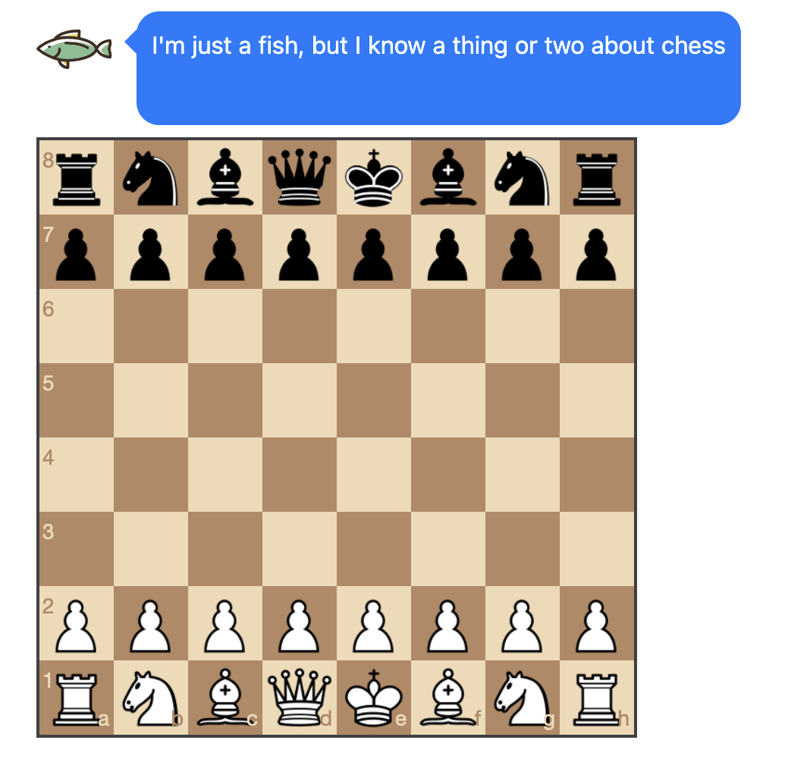
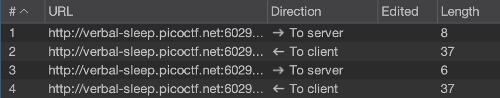

We start with a webserver that has a chess board, and we are playing against Stockfish, a notorious chess engine.


No matter how 'well' we play, we are going to lose as it's a chess engine that is A LOT smarter than us humans. So, let's look at the websocket communications like the description suggests.

I setup Burp Suite with a proxy to intercept the websocket traffic, and I start making some moves:


Looking through the request responses:
- The 'To Server' (request) messages say `eval <num>` with a number that can be negative that seems to be evaluating the position.
- The 'To Client' (response) has a small message the fish says, such as `I think this position is pretty equal`

Generally a positive number is winning for black, while a negative number is winning for white (in this example, in real chess it's usually the opposite).

We can also see this when I lose my queen, my score goes to `720`, which is very favoured for black!

So, what if we make it an impossibly low value for a winning position for us? Such as `eval -999999999`? The server responds:
```
Huh???? How can I be losing this badly... I resign... here's your flag: picoCTF{c1i3nt_s1d3_w3b_s0ck3t5_dc1dbff7}
```

Flag: `picoCTF{c1i3nt_s1d3_w3b_s0ck3t5_dc1dbff7}`